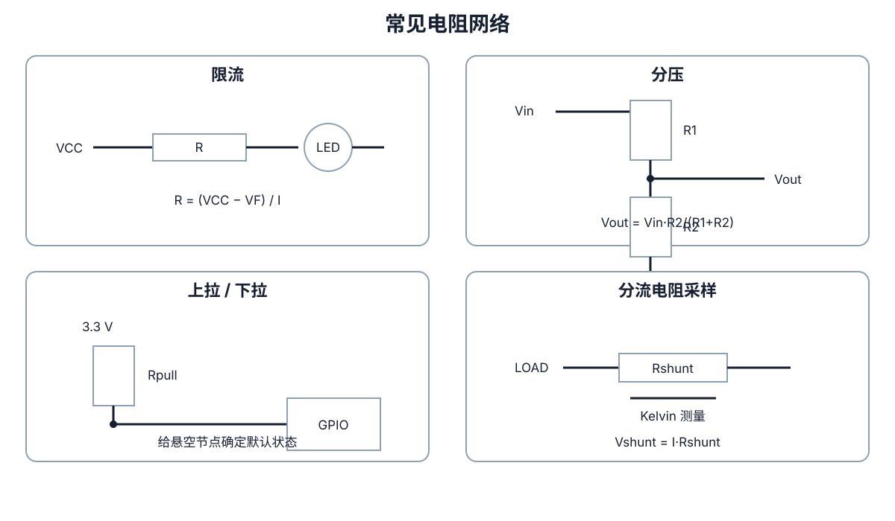
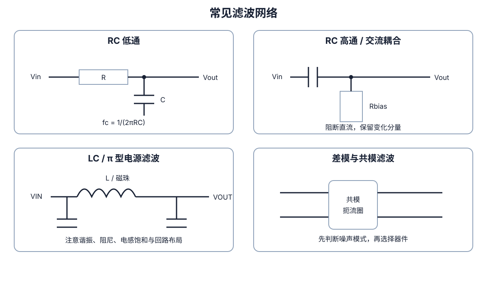
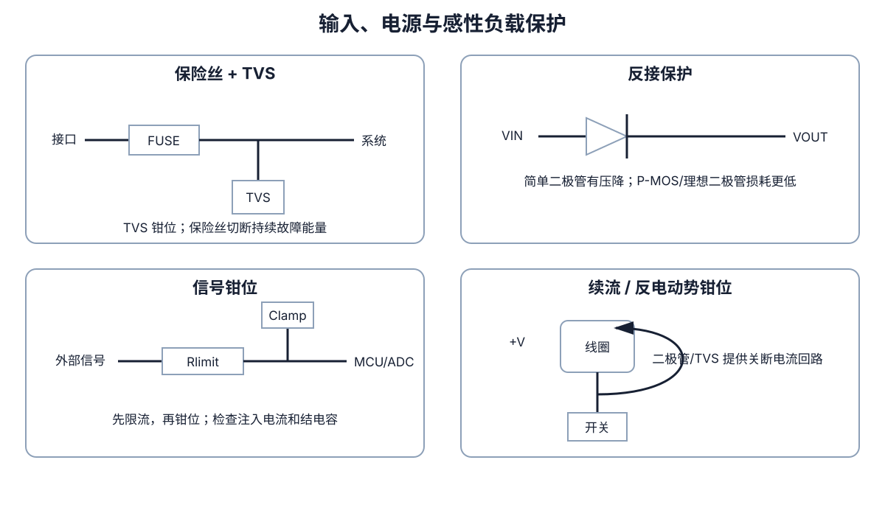
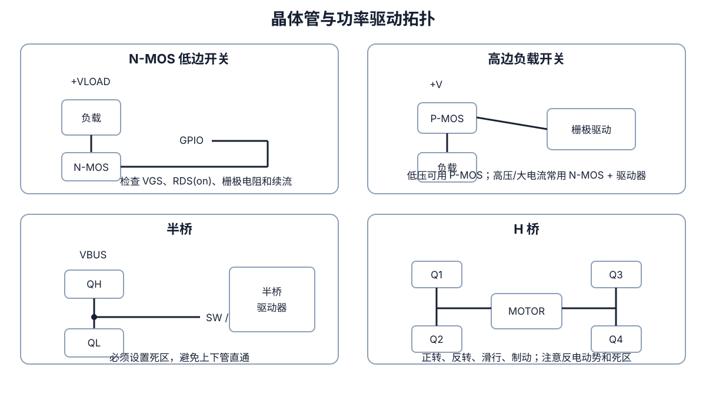
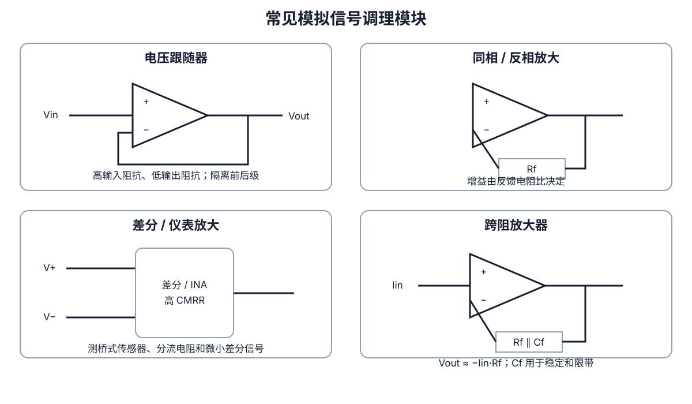
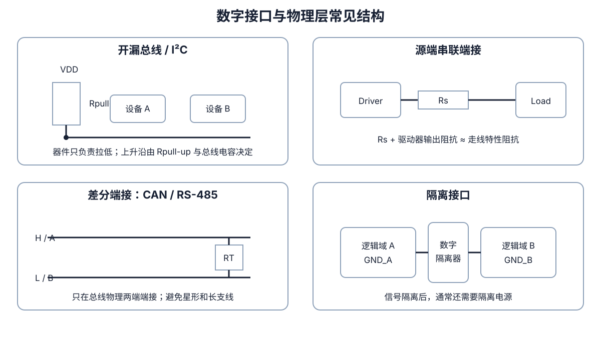
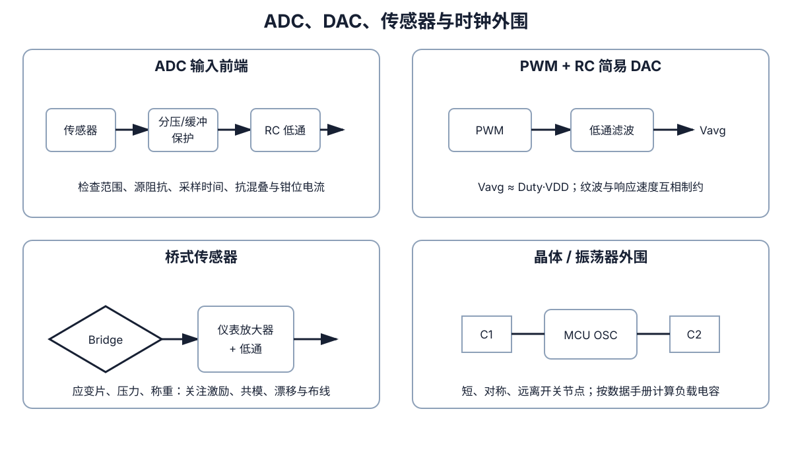
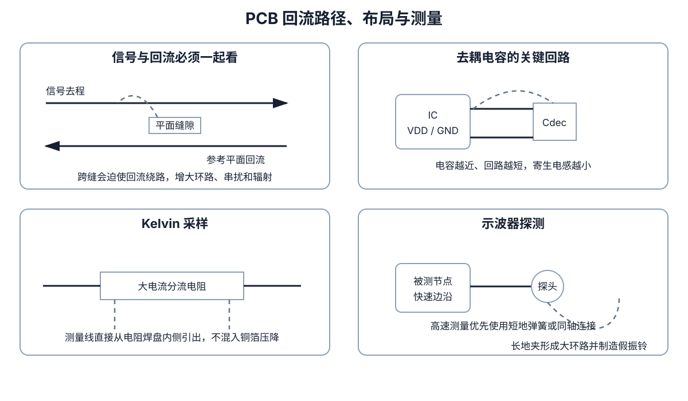

# 常用电路组件与功能模块手册

> 面向已经学过电路、模电和数电，但多年没有系统使用，希望重新建立工程直觉的读者。本文重点不是逐个介绍“电阻、电容是什么”，而是总结它们在原理图中反复组合成的**功能电路模块**：每个模块解决什么问题、为什么有效、怎样选值、容易在哪里出错，以及需要哪些基础知识。
>
> 前置阅读：[《基础电路学习手册》](电路基础.md)。本文适用于低压嵌入式系统、ESP32 / Arduino、传感器、机器人、电机驱动、普通模拟前端、电源和 PCB 设计。市电、高压、大功率逆变器、射频功放等场景还需要专门的安全与行业规范。

---

## 目录

1. [先建立“功能模块”视角](#1-先建立功能模块视角)
2. [理解所有模块所需的基础知识](#2-理解所有模块所需的基础知识)
3. [电阻类模块](#3-电阻类模块)
4. [电容、电感与磁性器件模块](#4-电容电感与磁性器件模块)
5. [滤波、整形与抑制振铃](#5-滤波整形与抑制振铃)
6. [二极管、浪涌与输入保护](#6-二极管浪涌与输入保护)
7. [BJT、MOSFET 与功率驱动](#7-bjtmosfet-与功率驱动)
8. [稳压、变换与电源路径](#8-稳压变换与电源路径)
9. [运放、比较器与模拟信号调理](#9-运放比较器与模拟信号调理)
10. [数字接口、电平转换与端接](#10-数字接口电平转换与端接)
11. [ADC、DAC、传感器与时钟外围](#11-adcdac传感器与时钟外围)
12. [接地、回流、EMC 与 PCB 布局](#12-接地回流emc-与-pcb-布局)
13. [常见项目如何组合这些模块](#13-常见项目如何组合这些模块)
14. [器件选型检查表](#14-器件选型检查表)
15. [按故障现象反查](#15-按故障现象反查)
16. [建议实验路线](#16-建议实验路线)
17. [公式与术语速查](#17-公式与术语速查)

---

# 1. 先建立“功能模块”视角

## 1.1 元件不等于功能

一个 10 kΩ 电阻可能是：

- GPIO 上拉；
- 电阻分压器的一部分；
- MOSFET 栅极下拉；
- 运放反馈网络；
- RC 滤波器中的 R；
- ADC 输入限流；
- 比较器迟滞网络；
- 晶体管偏置电阻。

所以识别电路时，不能只问“这是什么元件”，而要问：

1. 它连接在哪两个节点之间；
2. 直流时电流怎样流；
3. 信号变化时电流又怎样流；
4. 它与周围器件共同实现什么功能；
5. 哪个参数决定增益、截止频率、门限或功率；
6. 异常时它会开路、短路、发热还是进入饱和。

## 1.2 常见元件与常见功能

| 元件 | 核心物理作用 | 常见功能模块 |
|---|---|---|
| 电阻 | 建立电压与电流关系并耗散能量 | 限流、分压、上拉、偏置、采样、反馈、端接 |
| 电容 | 储存电场能量，阻碍电压突变 | 去耦、储能、交流耦合、滤波、延时、保持 |
| 电感 | 储存磁场能量，阻碍电流突变 | 开关电源、LC 滤波、储能、共模抑制 |
| 二极管 | 主要允许单方向导通 | 整流、反接保护、续流、钳位、TVS |
| BJT | 用基极电流控制集电极电流 | 开关、放大、恒流、推挽输出 |
| MOSFET | 用栅源电压控制通道电阻 | 负载开关、半桥、H 桥、同步整流 |
| 运算放大器 | 高增益差分放大并通过反馈实现精确关系 | 缓冲、放大、滤波、求和、跨阻 |
| 比较器 | 判断两个电压的大小关系 | 阈值检测、迟滞、过压/欠压、波形整形 |
| 稳压器 / DC-DC | 改变或稳定电源电压 | LDO、Buck、Boost、Buck-Boost |
| 保险丝 / PTC | 故障过流时提高阻抗或断开 | 短路和持续故障保护 |
| TVS / ESD 阵列 | 吸收短时浪涌并钳位电压 | 连接器、电源入口和外部信号保护 |
| 晶体 / 振荡器 | 提供稳定周期参考 | MCU、通信和时钟系统 |
| 继电器 / 光耦 / 数字隔离器 | 隔离控制侧与被控侧 | 安全隔离、地环路隔离、抗共模 |

## 1.3 阅读陌生原理图的顺序

不要从左到右逐个认元件。建议先划分为：

1. 电源入口、保护与稳压；
2. MCU、时钟、复位和调试；
3. 模拟输入、参考电压和 ADC；
4. 数字接口与电平转换；
5. MOSFET、驱动器和执行器；
6. 去耦、储能、滤波和 EMI；
7. 测试点、0 Ω 电阻和版本配置。

再对每块重复问：输入是什么、输出是什么、电流回路在哪里、主要公式是什么、最容易超额定的器件是什么。

---

# 2. 理解所有模块所需的基础知识

## 2.1 电压、参考点和完整回路

电压总是两个节点之间的差：

$$
V_{AB}=V_A-V_B
$$

电流必须形成闭合回路。调试时不能只看“正极接到了哪里”，还要追踪电流怎样经过负载返回电源。普通单端信号通信通常需要共同参考地；隔离接口则通过专用耦合器跨越不同参考域。

## 2.2 KCL 与 KVL

节点电流守恒：

$$
\sum I_{in}=\sum I_{out}
$$

闭合回路电压代数和为零：

$$
\sum V=0
$$

绝大多数分压、偏置、反馈和驱动电路，最终都可以从这两条定律推导。

## 2.3 阻抗与频率

电阻的理想阻抗为：

$$
Z_R=R
$$

电容和电感的理想阻抗为：

$$
Z_C=\frac{1}{j\omega C}
$$

$$
Z_L=j\omega L
$$

其中 $\omega=2\pi f$。直觉是：

- 频率越高，电容阻抗通常越低；
- 频率越高，电感阻抗通常越高；
- 真实器件还存在 ESR、ESL、自谐振和损耗。

## 2.4 时间常数

一阶 RC 电路的时间常数：

$$
\tau=RC
$$

阶跃响应达到最终值的典型比例：

| 时间 | 比例 |
|---:|---:|
| $1\tau$ | 63.2% |
| $2\tau$ | 86.5% |
| $3\tau$ | 95.0% |
| $5\tau$ | 99.3% |

10% 到 90% 上升时间近似：

$$
t_r\approx2.2RC
$$

## 2.5 源阻抗与负载效应

任何实际信号源都有输出阻抗，任何输入都有输入阻抗、输入电容和漏电流。一个公式在空载时成立，不代表接上负载后仍成立。

常用戴维南等效思想：把复杂线性网络简化为一个电压源 $V_{th}$ 串联一个电阻 $R_{th}$。它能快速判断：

- 分压器是否被负载拉低；
- ADC 采样电容能否及时充满；
- 前一级能否驱动后一级；
- RC 的真实时间常数是多少。

## 2.6 功率、热和安全工作区

$$
P=VI=I^2R=\frac{V^2}{R}
$$

粗略热估算：

$$
T_J\approx T_A+P\theta_{JA}
$$

器件是否安全不能只看电流额定值，还要同时检查：

- 最大电压；
- 连续与脉冲电流；
- 功耗和结温；
- SOA（安全工作区）；
- 启动、堵转、浪涌和短路；
- PCB 铜皮和环境温度。

## 2.7 反馈与稳定性

负反馈用输出纠正输入误差，可获得稳定增益、低输出阻抗和较好线性。代价是环路存在延迟和相移时可能振荡。运放、LDO、DC-DC、PLL 和伺服系统都必须考虑稳定性，而不能只检查静态公式。

## 2.8 数字信号也属于模拟世界

数字接口按 0/1 使用，但导线上的真实量仍是连续电压和电流。是否需要端接，主要看**边沿时间与传播延迟**，而不只是时钟频率。1 MHz 信号若边沿只有 1 ns，仍可能表现为高速传输线问题。

---

# 3. 电阻类模块

## 3.1 串联限流电阻

**用途**：LED 限流、保护 GPIO、限制钳位电流、限制电容充电浪涌、减慢数字边沿。

**原理**：电阻承担一部分电压，并根据欧姆定律限制电流。

LED 场景：

$$
R=\frac{V_{CC}-V_F}{I_{LED}}
$$

例如 3.3 V、红色 LED $V_F=1.9\ \mathrm{V}$、目标 5 mA：

$$
R=\frac{3.3-1.9}{0.005}=280\ \Omega
$$

工程上可选 300 Ω 或 330 Ω，留出器件和温度余量。

**检查项**：电阻功率、GPIO 单脚和总端口电流、LED 最大脉冲电流。

**常见错误**：LED 直接接电源；只算阻值不算功率；把限流电阻误当稳压器。

**基础知识**：欧姆定律、KVL、功率。

## 3.2 电阻分压器

**用途**：ADC 缩放、比较器门限、偏置电压、反馈采样。

空载公式：

$$
V_{out}=V_{in}\frac{R_2}{R_1+R_2}
$$

输出等效电阻：

$$
R_{th}=R_1\parallel R_2
$$

若接入负载 $R_L$，下臂变成 $R_2\parallel R_L$，输出电压会变化。

**选值权衡**：

- 总阻值小：抗漏电和噪声更好，但静态功耗高；
- 总阻值大：功耗低，但容易受 ADC 采样、电路漏电和 PCB 污染影响；
- 高压测量还要检查单个电阻耐压，而不只是功率。

**常见错误**：用分压器给传感器或舵机供电；忽略负载；输入浪涌超过 ADC 绝对额定值。

**基础知识**：串并联、戴维南等效、负载效应、ADC 输入模型。

## 3.3 上拉与下拉

**用途**：防止输入悬空、设置启动状态、配合开漏输出、确保 MOSFET 默认关断。

节点被外部拉到相反电平时：

$$
I=\frac{V}{R}
$$

阻值过大时抗干扰差、边沿慢；过小时功耗和驱动电流增加。普通 GPIO 常见 4.7 kΩ～100 kΩ，但 I²C 必须根据速率和总线电容计算。

**基础知识**：高阻态、逻辑阈值、RC 上升时间、漏电流。

## 3.4 开漏 / 开集电极输出

开漏器件只能主动拉低，释放后由上拉电阻产生高电平。多个器件可并联实现“线与”行为，是 I²C、告警汇总和电平兼容的常见基础。

上升时间近似与 $R_{pull}$ 和总线电容 $C_{bus}$ 成正比。上拉太弱会导致高速通信失败；上拉太强会增加低电平电流。

## 3.5 MOSFET 栅极串联电阻与上下拉

MOSFET 栅极带有电容和栅电荷。串联电阻用于：

- 限制瞬时驱动电流；
- 抑制栅极振铃；
- 控制开关速度和 EMI；
- 隔离多个并联 MOSFET 的寄生振荡。

栅极上下拉保证 MCU 复位或断电时状态确定。串联电阻过大，会让 MOSFET 长时间停留在线性区并发热。

## 3.6 分流电阻电流采样

$$
V_{shunt}=I R_{shunt}
$$

$$
P_{shunt}=I^2R_{shunt}
$$

**低边采样**简单，但抬高负载地；**高边采样**保持负载直接接地，但放大器需要承受较高共模电压。

大电流采样应使用 Kelvin 连接：测量线直接从电阻焊盘内侧引出，不把铜箔和焊点压降算入结果。

## 3.7 运放反馈电阻网络

看到运放输出回到反相输入的电阻，通常是负反馈，不应简单理解为分压。它可能决定：

- 闭环增益；
- 带宽；
- 输入阻抗；
- 偏置电流补偿；
- 滤波零极点。

精密差分放大器更依赖**电阻比匹配**，不只是单个电阻容差。

## 3.8 数字信号串联端接电阻

驱动端附近串 10 Ω～100 Ω，通常用于让：

$$
R_{driver}+R_s\approx Z_0
$$

其中 $Z_0$ 是走线特性阻抗。它可降低过冲、欠冲、反射和 EMI。电阻应靠近驱动端；阻值需要通过驱动器阻抗、走线和实测波形确定。

## 3.9 0 Ω 电阻

用途包括：

- PCB 跨接；
- 硬件版本配置；
- 调试时断开电源域或信号；
- 预留电流测量点；
- 后期替换为电阻、磁珠或电感；
- 选择启动模式。

0 Ω 电阻也有额定电流、寄生电感和封装功率限制。

## 3.10 NTC、PTC 和压敏电阻

- **NTC**：温度升高阻值下降，可测温或限制上电浪涌；
- **PTC**：温度升高阻值上升，可用于自恢复过流保护；
- **MOV 压敏电阻**：浪涌时阻值下降并吸收能量，多见于较高电压入口。

这些器件高度非线性，必须按数据手册的温度、脉冲和寿命曲线选型。

---

# 4. 电容、电感与磁性器件模块

## 4.1 去耦电容

**用途**：在芯片附近提供瞬态电流，并把高频噪声限制在局部回路。

近似压降：

$$
\Delta V\approx\frac{I\Delta t}{C}+I\cdot ESR
$$

常见起点是每个数字电源脚附近 0.1 μF，再按芯片和电源域放 1～10 μF，但真正关键的是布局：

- 电容靠近电源脚；
- 电源脚—电容—地的回路尽量短；
- 地端就近打过孔；
- 不要让高频回流穿过狭长走线。

**常见错误**：只看容量不看位置；所有去耦电容集中放在板边；忽略陶瓷电容直流偏压降容。

## 4.2 储能 / 母线电容

用于应对较慢、能量较大的负载变化，例如舵机启动、电机 PWM、无线发射和继电器吸合。

储能：

$$
E=\frac{1}{2}CV^2
$$

选型需检查额定电压、有效容量、ESR、纹波电流、温度和寿命。小陶瓷去耦与大容量储能不是二选一，而是覆盖不同频段。

## 4.3 交流耦合 / 隔直电容

串联电容阻断直流，并与后级偏置电阻形成高通：

$$
f_c=\frac{1}{2\pi RC}
$$

应用于音频、交流传感器、高速串行链路和不同偏置域之间。后级必须有直流偏置或泄放路径，否则节点会悬空。

## 4.4 RC 延时、上电复位和软启动

电容充放电可形成延时，但门限、漏电和电源上升速度都会影响结果。简单 RC 复位适合要求不高的场景；可靠产品通常使用复位监控器或电源时序芯片，因为它们具有明确门限、迟滞和最小复位脉宽。

## 4.5 保持、采样保持和峰值保持

电容可暂存电压，但真实系统会因输入偏置电流、电容漏电、开关漏电、介质吸收和 PCB 污染产生下垂。保持时间越长、精度越高，越需要专用开关、低漏电电容和缓冲器。

## 4.6 电感储能

$$
v_L=L\frac{di}{dt}
$$

$$
E_L=\frac{1}{2}LI^2
$$

电感电流不能瞬间变化，因此开关关断时必须提供续流或钳位路径。选型要看：电感量、饱和电流、温升电流、DCR、核心损耗、屏蔽结构和自谐振频率。

## 4.7 磁珠

磁珠在直流和低频下阻抗较小，在特定高频范围提供带损耗的阻抗，常用于隔离电源高频噪声。标称“600 Ω @ 100 MHz”不代表所有频率都是 600 Ω，也不代表它能承受任意直流电流。

磁珠与两侧电容可形成滤波网络，但也可能产生谐振。需要检查阻抗曲线、直流偏置和实际噪声频段。

## 4.8 共模扼流圈

差分电流方向相反，磁通大多抵消；共模电流方向相同，磁通叠加，因此共模扼流圈可在不显著影响差分信号的情况下抑制共模噪声。

常见于 USB、以太网、CAN、电源线和长线接口。必须匹配速率、差分阻抗、插入损耗和额定电流。

## 4.9 变压器与隔离电源

变压器用于：

- 隔离能量；
- 升降交流电压；
- 阻抗变换；
- 共模隔离；
- 隔离式 DC-DC。

它只能通过变化的磁通传递能量，不能直接传递稳定直流。设计还涉及匝比、磁芯饱和、漏感、绝缘、爬电距离和安规。

---

# 5. 滤波、整形与抑制振铃

## 5.1 RC 低通

传递函数：

$$
H(j\omega)=\frac{1}{1+j\omega RC}
$$

截止频率：

$$
f_c=\frac{1}{2\pi RC}
$$

**用途**：传感器降噪、ADC 抗混叠、PWM 平滑、边沿减速、参考电压滤波。

**直觉**：低频时电容阻抗高，输出跟随输入；高频时电容阻抗低，高频电流流向地。

**常见错误**：忽略信号源和负载阻抗；电阻过大导致 ADC 采样电容充不满；认为截止频率以上信号会被“一刀切掉”。一阶低通在远高于截止频率后约按 −20 dB/dec 衰减。

## 5.2 RC 高通

$$
H(j\omega)=\frac{j\omega RC}{1+j\omega RC}
$$

用途包括交流耦合、去除直流漂移、边沿检测和带通滤波的一部分。后级偏置决定输出的直流工作点。

## 5.3 RC 积分和微分近似

在特定频率范围：

- 低通可近似积分；
- 高通可近似微分。

这只是工作区间内的近似。真实电路受到幅度、带宽、源负载阻抗和噪声限制。

## 5.4 多级 RC 与有源滤波

直接级联两级 RC 时，级间会互相加载。需要更精确的二阶响应时，可使用：

- 缓冲后级联；
- Sallen-Key；
- 多重反馈；
- 状态变量滤波器。

二阶滤波不仅有截止频率，还需要考虑品质因数 $Q$、阻尼、元件容差和运放带宽。

## 5.5 LC 与 π 型滤波

理想谐振频率：

$$
f_0=\frac{1}{2\pi\sqrt{LC}}
$$

LC 滤波损耗可较低，适合电源和较大电流，但可能产生谐振峰。应检查：

- 电感饱和；
- 电容 ESR；
- 阻尼；
- 与稳压器控制环路的相互作用；
- 启动和负载阶跃振铃。

π 型网络通常是 C–L–C 或 C–磁珠–C。输入侧和输出侧高频回路在 PCB 上应尽量分开。

## 5.6 抗混叠滤波

ADC 采样前，高于奈奎斯特频率的信号会折叠到低频：

$$
f_{signal}<\frac{f_s}{2}
$$

实际设计需要给滤波器留过渡带，不能把截止频率直接放在 $f_s/2$。高精度系统还要考虑 ADC 输入采样网络与滤波器输出阻抗。

## 5.7 按键去抖

机械触点在数毫秒内会多次弹跳。常见方案：

- 软件定时确认；
- RC + 施密特触发器；
- SR 锁存器；
- 专用去抖芯片。

只有 RC 而没有迟滞输入时，慢边沿可能使普通数字门在阈值附近反复翻转。

## 5.8 RC Snubber

串联 RC 并在开关节点、二极管或变压器绕组附近，用于耗散寄生 LC 振铃能量。它不是凭经验随便放 100 Ω + 1 nF：应先测振铃频率，再通过改变测试电容估算寄生参数，最后兼顾抑制效果和损耗。

## 5.9 RCD 钳位

RCD 网络可限制反激、继电器或其他感性开关的尖峰。相比单纯续流二极管，它允许更高钳位电压，从而更快释放磁能，但器件承受电压和损耗更高。

## 5.10 EMI 滤波的基本原则

先判断：

1. 噪声源是什么；
2. 传播路径是什么；
3. 受扰对象是什么；
4. 噪声是差模还是共模；
5. 频率范围在哪里。

没有这个分析，盲目增加电容、磁珠或共模扼流圈可能无效，甚至引发谐振和稳定性问题。

---

# 6. 二极管、浪涌与输入保护

## 6.1 普通整流二极管

主要允许正向电流，反向阻断。需要检查：

- 反向耐压；
- 平均和浪涌电流；
- 正向压降；
- 反向恢复时间；
- 漏电；
- 结温。

高频开关场景不能随便使用慢恢复整流管。

## 6.2 肖特基二极管

优点是正向压降较低、恢复快，适合低压整流、OR-ing 和钳位。缺点是反向漏电通常较大，耐压较低，且高温漏电明显增加。

## 6.3 齐纳二极管

反向击穿区提供近似稳定电压，可用于简单参考和钳位。它需要串联限流，并且动态电阻、工作电流、温漂和功耗都会影响实际钳位电压。

齐纳适合能量较小、精度要求不高的场景；高精度参考应使用专用基准源。

## 6.4 TVS 二极管

TVS 用于吸收短时浪涌。关键参数不是只有“击穿电压”，还包括：

- 反向工作电压 $V_{RWM}$；
- 击穿电压；
- 指定脉冲电流下的钳位电压；
- 峰值脉冲功率；
- 脉冲波形；
- 结电容；
- 单向或双向。

TVS 应靠近连接器，浪涌回流路径要短且不能穿过敏感电路。

## 6.5 ESD 保护阵列

用于 USB、HDMI、按键、UART、I²C、CAN 等外部接口。高速接口必须关注结电容和布线支线；保护器件太远或接地路径太长，会让 ESD 电流先经过芯片再到保护器件。

## 6.6 输入串联电阻 + 钳位

常见 ADC/GPIO 保护结构：

> 外部信号 → 串联电阻 → 节点 → 钳位到电源轨或专用钳位器件 → 输入

串联电阻限制钳位电流。必须检查芯片允许的注入电流、未上电状态、钳位二极管漏电和输入带宽。

## 6.7 续流二极管

线圈关断后，电感试图维持原电流。反并联二极管提供回路，避免开关节点产生很高电压。

优点：简单、钳位低、保护强。缺点：线圈电流衰减较慢，继电器释放或电磁阀关断速度较慢。需要更快释放时，可使用二极管 + 齐纳、TVS 或主动钳位。

## 6.8 反接保护

### 串联二极管

简单可靠，但有压降和功耗：

$$
P\approx V_F I
$$

### P-MOSFET 反接保护

正常极性下导通损耗约为：

$$
P\approx I^2R_{DS(on)}
$$

低压大电流系统效率更高，但必须确认体二极管方向、栅极最大电压、浪涌和热插拔行为。

### 理想二极管控制器

适合更高电流、OR-ing 和电源路径管理，可控制 N-MOSFET 获得更低损耗。

## 6.9 保险丝和自恢复 PTC

它们处理的是**持续故障能量**，而 TVS 处理的是短时浪涌。保险丝选型需看额定电流、时间—电流曲线、分断能力和浪涌；PTC 还要看保持电流、动作电流、环境温度和冷却后的恢复特性。

## 6.10 Crowbar 过压保护

检测过压后用 SCR 等器件把电源短路，迫使前级保险丝熔断。它适合必须避免负载承受过压的场景，但要确保上游限流和分断能力足以安全处理故障。

## 6.11 浪涌、EFT 与 ESD 的区别

- **ESD**：上升极快、能量相对有限；
- **EFT**：快速重复脉冲群；
- **Surge**：持续更长、能量更大；
- **反接/过压**：可能是长期故障。

不同故障需要不同器件和布局，不能只放一个 TVS 就认为全部解决。

---

# 7. BJT、MOSFET 与功率驱动

## 7.1 BJT 低边开关

GPIO 经基极电阻驱动 NPN，负载接在电源与集电极之间。

设计为开关时，应让 BJT 充分饱和，不能只用数据手册的典型 $\beta$ 估算。基极电流近似：

$$
I_B=\frac{V_{GPIO}-V_{BE}}{R_B}
$$

适合小电流继电器、蜂鸣器和指示灯。电流更大时通常 MOSFET 效率更高。

## 7.2 MOSFET 低边开关

负载接电源，N-MOSFET 接在负载与地之间。GPIO 只提供栅极充放电能量，负载功率来自外部电源。

导通损耗：

$$
P_{cond}\approx I_{RMS}^2R_{DS(on)}
$$

必须注意：$V_{GS(th)}$ 只是开始出现很小电流的阈值，不代表完全导通。应查看目标栅压下保证的 $R_{DS(on)}$。

检查：

- $V_{DS}$ 余量和感性尖峰；
- $V_{GS,max}$；
- 逻辑电平导通能力；
- 栅电荷和驱动速度；
- 线性区 SOA；
- PCB 散热；
- 负载启动/堵转电流；
- 续流路径。

## 7.3 高边开关

负载一端保持接地，更适合给整个模块断电。

- 低压系统可用 P-MOSFET；
- 高压或大电流常用 N-MOSFET + 高边驱动器；
- 专用 Load Switch 还可集成限流、软启动、反向阻断和故障状态。

高边设计必须检查栅源电压，而不能只看“GPIO 输出了几伏”。

## 7.4 半桥

上下两个 MOSFET 交替导通，让中点在电源和地之间切换。用于 Buck、同步整流、无刷电机相线、D 类功放和 H 桥的一半。

关键问题：

- 上下管不能同时导通；
- 必须设置死区；
- 高边 N-MOS 需要自举或隔离驱动；
- 开关环路必须很小；
- Miller 耦合可能导致误导通。

## 7.5 H 桥

由两组半桥组成，可控制负载两端极性，实现直流电机：

- 正转；
- 反转；
- 滑行；
- 动态制动；
- PWM 调速。

必须理解每种状态下的电流回路，特别是 PWM 关断期间的续流路径。成品 H 桥驱动器通常集成死区、过流、过温和欠压保护，适合入门与可靠设计。

## 7.6 栅极驱动器

MOSFET 栅极总电荷为 $Q_g$，平均驱动电流近似：

$$
I_{gate,avg}=Q_g f_s
$$

驱动器提供较大的峰值充放电电流，以减少开关过渡时间和损耗。选型关注：

- 高低边结构；
- 峰值源/灌电流；
- 传播延迟和匹配；
- UVLO；
- Miller Clamp；
- 自举工作范围；
- 隔离和 CMTI；
- 负压关断需求。

## 7.7 继电器、接触器和电磁阀驱动

GPIO 通常不能直接驱动线圈，需要 BJT/MOSFET、续流或钳位、线圈电源和必要的隔离。

机械触点侧还要考虑：

- 触点额定电压和电流；
- 直流与交流分断能力不同；
- 感性负载电弧；
- 触点抖动；
- 继电器寿命；
- RC Snubber 或 MOV。

## 7.8 推挽输出级

NPN+PNP 或 NMOS+PMOS 组成推挽级，一个负责拉高、一个负责拉低。用于增强驱动、音频输出、栅极驱动和数字缓冲。需处理交越失真或直通电流。

## 7.9 恒流源与电流镜

恒流电路让电流对负载电压变化不敏感，用于 LED、偏置和传感器激励。简单 BJT 电流镜依赖器件匹配和温度；高精度常使用运放 + MOSFET + 采样电阻闭环控制：

$$
I\approx\frac{V_{ref}}{R_s}
$$

还必须保证电路有足够顺从电压（compliance voltage）。

---

# 8. 稳压、变换与电源路径

## 8.1 LDO / 线性稳压器

LDO 把较高输入变为较低、较稳定的输出。损耗近似：

$$
P_{loss}\approx(V_{in}-V_{out})I_{out}
$$

效率近似：

$$
\eta\approx\frac{V_{out}}{V_{in}}
$$

优点：简单、低噪声、外围少。缺点：压差大或电流大时发热严重。

检查：输入范围、压差、静态电流、输出电容范围、PSRR、噪声、热阻、限流和启动行为。某些 LDO 对输出电容 ESR 有稳定性要求。

## 8.2 Buck 降压

开关管、电感、电容和控制环路把高电压高效降为低电压。理想连续导通近似：

$$
V_{out}\approx D V_{in}
$$

其中 $D$ 是占空比。实际设计要检查电感纹波、饱和电流、MOSFET/二极管损耗、输入输出电容、补偿、最小导通时间、轻载模式、EMI 和布局。

## 8.3 Boost 升压

理想连续导通近似：

$$
V_{out}\approx\frac{V_{in}}{1-D}
$$

输入电流可能显著大于输出电流。普通 Boost 在开关关闭时仍可能通过二极管形成输入到输出路径，因此不一定能真正断开负载。

## 8.4 Buck-Boost

当输入可能高于也可能低于输出时使用。可分反相、SEPIC、四开关非反相等拓扑。选型要特别检查输入输出范围交叉区、效率、开关电流和控制模式切换。

## 8.5 电荷泵

通过开关改变飞跨电容连接，实现倍压、反相或小功率升降压。适合电流较小、无需电感的场景。输出阻抗、纹波和开关噪声通常高于 LDO。

## 8.6 同步整流

用受控 MOSFET 替代二极管，降低压降和损耗。控制时序错误会产生反向电流或直通，因此通常由专用控制器完成。

## 8.7 电源 OR-ing 与理想二极管

用于 USB、电池和适配器多电源选择，防止电源互相倒灌。简单肖特基 OR-ing 有压降；理想二极管控制器 + MOSFET 损耗更低，并可实现优先级和反向阻断。

## 8.8 Load Switch

专用负载开关用于给某个模块上电/断电，通常集成：

- 受控上升时间；
- 浪涌限制；
- 反向电流阻断；
- 快速输出放电；
- 限流；
- 过温保护。

比 GPIO 直接控制裸 MOSFET 更容易获得可预测行为。

## 8.9 软启动和浪涌限制

大电容上电时近似短路，会产生浪涌。方案包括：

- 串联 NTC；
- 电阻预充 + 继电器/MOSFET 旁路；
- MOSFET 受控上升；
- Hot-Swap 控制器；
- DC-DC 自带软启动。

必须同时检查 MOSFET 在线性区的 SOA，而不仅是稳态 $R_{DS(on)}$。

## 8.10 电源监控、复位与时序

常见模块：

- 欠压锁定 UVLO；
- 过压保护 OVP；
- Power-Good；
- 复位监控器；
- 多电源 Sequencer；
- 看门狗；
- Brownout 检测。

复杂 MCU、FPGA、传感器和功率器件往往对上电、掉电顺序有要求。不能只依赖不同 RC 随机形成时序。

## 8.11 电源树设计

先列出每条电源轨：

| 电源轨 | 电压范围 | 平均/峰值电流 | 噪声要求 | 启动顺序 | 故障行为 |
|---|---:|---:|---|---|---|
| 逻辑 | 例如 3.3 V | MCU + IO | 中等 | 先/后 | Brownout |
| 模拟 | 例如 3.3 V_A | ADC/传感器 | 低噪声 | 随逻辑 | 不可被数字倒灌 |
| 舵机 | 例如 5～6 V | 峰值很大 | 压降优先 | 可分组 | 堵转限流 |
| 电机 | 例如 6～24 V | 启动/堵转大 | EMI 高 | 独立使能 | 过流/过温 |

然后再选择 Buck、LDO、滤波和负载开关，而不是先买稳压模块再猜能否使用。

---

# 9. 运放、比较器与模拟信号调理

## 9.1 理想运放与真实运放

负反馈条件下常用两个近似：

1. 输入电流近似为零；
2. 在线性区内 $V_+\approx V_-$。

真实运放还受输入共模范围、输出摆幅、GBW、压摆率、失调、偏置电流、噪声、负载和稳定性限制。

## 9.2 电压跟随器

输出直接反馈到反相端：

$$
V_{out}\approx V_{in}
$$

用途：缓冲高阻信号、驱动 ADC、隔离分压器与负载。单位增益跟随器要求运放“单位增益稳定”，也要检查输出驱动电容负载时是否振荡。

## 9.3 同相放大器

$$
A_v=1+\frac{R_f}{R_g}
$$

优点是输入阻抗高。单电源系统中，交流信号通常需要偏置到中点参考，而不是以真实地为中心上下摆动。

## 9.4 反相放大器

$$
A_v=-\frac{R_f}{R_{in}}
$$

输入阻抗近似为 $R_{in}$。多个输入电阻可构成求和器。

## 9.5 差分放大器

理想匹配条件下放大两个输入的差值并抑制共模。共模抑制高度依赖电阻比匹配。高精度、小信号和高共模场景更适合仪表放大器或专用电流检测放大器。

## 9.6 仪表放大器

特点：高输入阻抗、高 CMRR、增益可精确设置。用于应变桥、压力、称重、热电偶和生物电信号。需要检查共模范围、参考脚、电源范围、输入保护和输入偏置回路。

## 9.7 跨阻放大器 TIA

把输入电流转换为电压：

$$
V_{out}\approx-I_{in}R_f
$$

常用于光电二极管。反馈电容 $C_f$ 用于限制带宽和提高稳定性。传感器结电容、运放输入电容和布局寄生都会影响稳定性。

## 9.8 求和、加权与偏置

反相求和器：

$$
V_{out}=-R_f\left(\frac{V_1}{R_1}+\frac{V_2}{R_2}+\cdots\right)
$$

可用于混合信号、添加直流偏置和简单 DAC。必须检查输出摆幅和总噪声。

## 9.9 有源滤波器

运放与 R、C 可实现二阶及更高阶低通、高通、带通和陷波。设计参数包括：

- 截止/中心频率；
- 增益；
- 阶数；
- $Q$；
- Butterworth、Bessel、Chebyshev 等响应；
- 运放 GBW 和压摆率；
- 元件容差。

## 9.10 比较器

比较器输出表示两个输入谁高。与运放不同，比较器为快速饱和翻转设计。常见输出是开漏，需要上拉。

必须检查：输入共模范围、传播延迟、输出结构、输入过驱、上电行为和输入差分最大值。

## 9.11 施密特触发器 / 迟滞比较器

通过正反馈设置两个不同门限：

- 上升门限 $V_{TH+}$；
- 下降门限 $V_{TH-}$。

迟滞宽度：

$$
V_H=V_{TH+}-V_{TH-}
$$

它能防止慢信号或噪声在单一门限附近反复翻转，适合按键、霍尔传感器、零速信号和波形整形。

## 9.12 精密整流和峰值检测

普通二极管正向压降会让小信号整流失真。运放精密整流器通过反馈补偿二极管压降。峰值检测则用二极管/开关给电容充电，再由高阻缓冲读取。

## 9.13 积分器和微分器

理想运放积分器：

$$
V_{out}=-\frac{1}{RC}\int V_{in}\,dt
$$

理想微分器：

$$
V_{out}=-RC\frac{dV_{in}}{dt}
$$

实际设计会增加限带元件，否则直流失调会让积分器饱和，高频噪声会让微分器失控。

## 9.14 虚拟地 / 中点基准

单电源模拟电路常需产生 $V_{CC}/2$ 作为信号中心。简单分压器只适合高阻节点；需要吸收和提供电流时，应使用运放缓冲、专用 Rail Splitter 或双向参考缓冲。

虚拟地不是保护地，也不一定能承担大电流回流。

## 9.15 555 定时器和 RC 振荡器

555 内部包含分压器、比较器、锁存器和放电管，可实现单稳态、无稳态振荡、延时和 PWM。精度受 R/C 容差、温漂和门限影响；高精度时钟应使用晶体、振荡器或 MCU 定时器。

## 9.16 运放选型清单

- 供电范围；
- Rail-to-Rail 输入/输出的真实范围；
- 输入共模范围；
- 输出摆幅与负载；
- GBW 和闭环增益；
- 压摆率；
- 输入失调及温漂；
- 输入偏置电流；
- 电压/电流噪声；
- CMRR、PSRR；
- 单位增益稳定性；
- 容性负载稳定性；
- 输入过压和相位反转；
- 静态电流和封装。

---

# 10. 数字接口、电平转换与端接

## 10.1 逻辑电平兼容

“都是 3.3 V”并不自动代表兼容。必须检查：

- 发送端 $V_{OH}$、$V_{OL}$；
- 接收端 $V_{IH}$、$V_{IL}$；
- 输入是否 5 V tolerant；
- 未上电时输入是否允许有电压；
- 输出结构是推挽还是开漏；
- 上升下降时间和负载电容。

## 10.2 单向电平转换

从高电压到低电压：

- 电阻分压，适合低速高阻输入；
- 串联电阻 + 钳位，需核对注入电流；
- 专用缓冲器，适合高速和可靠设计。

从低电压到高电压：

- 需要接收端低阈值兼容；
- 或使用晶体管、逻辑缓冲器、专用电平转换器。

## 10.3 双向 MOSFET 电平转换

常见单 NMOS 结构适合开漏总线，如 I²C。它不适合所有推挽、高速或方向快速变化接口。SPI、SDIO 和高速 GPIO 应选择具有方向控制或自动方向检测的专用器件，并验证带宽和负载。

## 10.4 I²C

总线由开漏器件和上拉组成。上升时间近似与：

$$
t_r\propto R_{pull-up}C_{bus}
$$

相关。设计时检查：

- 总线速度；
- 总电容；
- 多块模块上并联的上拉；
- 低电平灌电流；
- 电平转换；
- 掉电器件反向供电；
- 地址冲突；
- 时钟拉伸；
- 外部长线的 ESD 和地参考。

## 10.5 SPI

SPI 通常是推挽单端高速接口。常见硬件问题：

- SCLK 反射和振铃；
- 多从机 MISO 未高阻导致总线冲突；
- 长支线；
- CPOL/CPHA 时序裕量；
- 电平转换器太慢；
- 回流路径不连续。

时钟、MOSI、片选常在驱动端串小电阻；MISO 电阻应放在实际驱动 MISO 的从机端。

## 10.6 UART、RS-232 和 RS-485

- MCU UART 是逻辑电平，不等于 RS-232；
- RS-232 使用正负电压并需要收发器；
- RS-485 是差分多点总线，适合长距离和较强干扰环境。

RS-485 需要关注端接、偏置、方向控制、总线空闲状态、共模范围、地线和浪涌保护。

## 10.7 CAN

完整 CAN 节点通常包括：

> MCU CAN 控制器 → CAN 收发器 → 可选共模扼流圈 → TVS → 连接器

总线物理两端通常使用 120 Ω 端接。还需检查待机/唤醒、共模范围、故障保护、隔离、分裂端接和线缆拓扑。

## 10.8 USB

USB 是受控阻抗差分接口。常见外围：

- ESD 阵列；
- 按参考设计决定是否串联小电阻；
- VBUS 检测和限流；
- Type-C CC 电阻；
- 短、等长、连续参考面的差分走线。

不要在 D+/D− 上随意加大电容或长支线。

## 10.9 差分端接

接收端并联端接：

$$
R_T\approx Z_{diff}
$$

用于 CAN、RS-485、LVDS 等。端接只放在物理总线两端，而不是每个节点。星形、长支线和错误端接会造成反射与幅度下降。

## 10.10 数字隔离

数字隔离器、光耦或隔离收发器用于：

- 消除地环路；
- 跨越高共模；
- 安全隔离；
- 保护控制器。

信号隔离后通常还需要隔离电源。选型要看隔离耐压、爬电距离、传播延迟、数据率、CMTI、失效状态和认证等级。

## 10.11 复位、使能和启动配置脚

这些引脚通常在上电早期被采样，必须有确定默认状态。常见模块：

- 上拉/下拉；
- RC 延时；
- 复位监控器；
- 开漏复位汇总；
- 跳帽或 0 Ω 配置。

注意外部调试器、USB-UART、其他芯片可能通过保护二极管改变启动电平。

---

# 11. ADC、DAC、传感器与时钟外围

## 11.1 ADC 输入完整链路

典型链路：

> 传感器 → 保护 → 分压/偏置 → 缓冲/放大 → 抗混叠低通 → ADC

要依次检查：

1. 最大最小输入是否在绝对额定值内；
2. 是否覆盖 ADC 有效量程；
3. 源阻抗能否在采样时间内给内部采样电容充电；
4. 输入噪声和带宽；
5. 参考电压稳定性；
6. 校准、偏置和增益误差；
7. 多通道切换残留。

## 11.2 ADC 分辨率与有效精度

理想 LSB：

$$
LSB=\frac{V_{ref}}{2^N}
$$

但标称位数不等于有效位数。噪声、非线性、参考、地弹、源阻抗和布局都会降低 ENOB。

## 11.3 ADC 参考电压

参考源直接决定测量比例。需要关注：

- 初始精度；
- 温漂；
- 输出噪声；
- 负载瞬态；
- 去耦；
- ADC 参考输入的动态电流；
- 是否需要缓冲。

比率测量可让传感器激励与 ADC 参考使用同一来源，从而抵消电源变化。

## 11.4 PWM + RC 简易 DAC

平均输出近似：

$$
V_{avg}\approx D V_{DD}
$$

低截止频率可减小纹波，但响应变慢。需要更好性能时，可采用二阶滤波、提高 PWM 频率、运放缓冲或专用 DAC。

## 11.5 R-2R 电阻梯形 DAC

只使用 R 和 2R 两种阻值，可把数字码转换为模拟电压。精度高度依赖电阻比匹配、开关导通电阻、参考源和输出缓冲。

## 11.6 桥式传感器

应变片、压力和称重传感器常形成惠斯通电桥，输出是叠加在较大共模上的微小差分信号。典型链路：

> 稳定激励 → 电桥 → 仪表放大器 → 低通 → 高分辨率 ADC

需考虑导线电阻、温漂、零点、共模范围、激励噪声和机械蠕变。

## 11.7 电流传感器

常见方法：

- 分流电阻 + 放大器；
- 霍尔传感器；
- 电流互感器；
- Rogowski 线圈。

分流法直流精度高但有损耗；霍尔可隔离且能测直流；电流互感器不能测稳定直流；Rogowski 适合快速大电流但需要积分。

## 11.8 温度传感器

- NTC：便宜、非线性，需要分压和查表；
- RTD：精度和稳定性好，需要恒流激励与四线测量；
- 热电偶：输出很小，需要低漂移放大和冷端补偿；
- 数字温度计：使用方便，但仍要注意热耦合和自发热。

## 11.9 晶体与负载电容

晶体外围看似只有两个电容，但值不能随便抄。近似负载电容：

$$
C_L\approx\frac{C_1C_2}{C_1+C_2}+C_{stray}
$$

布局要求：短、对称、远离开关节点和高速线，参考地连续。错误负载电容会引起频偏、启动慢或不起振。

## 11.10 有源振荡器与时钟缓冲

有源振荡器直接输出时钟，启动和精度更明确。一个源驱动多个器件时，可使用时钟缓冲器，避免简单树状分叉产生反射和负载过重。高速时钟还要关注抖动、相位噪声、电平标准和端接。

## 11.11 PLL 与时钟发生器

PLL 用相位比较、环路滤波和压控振荡器生成与参考相关的频率。系统设计关注：

- 参考频率；
- 倍频/分频；
- 环路带宽；
- 锁定时间；
- 抖动清理；
- 输出格式；
- 电源噪声和布局。

---

# 12. 接地、回流、EMC 与 PCB 布局

## 12.1 GND 不是“电流消失的地方”

GND 是参考节点，也是电流返回路径的一部分。铜皮和走线都有电阻与电感，大电流经过后会产生压降和地弹。因此“原理图都连到 GND”并不代表 PCB 上它们电位完全相同。

## 12.2 高频回流路径

低频电流倾向走低电阻路径；高频回流倾向紧贴信号线下方的参考平面，以减小环路电感。信号跨越地平面缝隙时，回流被迫绕路，会增加辐射、串扰和波形失真。

## 12.3 地平面还是分割地

多数混合信号板优先使用完整连续地平面，通过布局控制电流路径，而不是随意切割“模拟地/数字地”。分割不当会让信号跨缝。

确实需要隔离的电源域、强功率回路或安规隔离，应在系统级明确边界和跨域器件。

## 12.4 去耦布局

原则：先放芯片，再放去耦，再布电源和地。去耦电流回路面积比“看起来离芯片很近”更重要。BGA、FPGA 和高速器件还需考虑封装电源平面、过孔电感和目标阻抗。

## 12.5 开关电源关键回路

Buck 最关键的高 $di/dt$ 回路通常包括输入电容、上管/下管和地。SW 节点高 $dv/dt$，铜皮不能无目的铺得很大，也应远离反馈、晶体和模拟输入。

遵循芯片数据手册参考布局通常比自己“画得整齐”更重要。

## 12.6 模拟前端布局

- 小信号输入远离 PWM、时钟和电感；
- 差分线成对、对称；
- 参考与传感器回流明确；
- 高阻节点短且清洁；
- TIA 反馈环路极短；
- 分流采样使用 Kelvin；
- 屏蔽环和 Guard 适用于极高阻节点。

## 12.7 连接器处保护布局

保护器件应尽量靠近能量进入点：

> 连接器 → 保护/滤波 → 内部电路

ESD/浪涌到地或机壳的回路应短、宽、低电感，不能先穿过敏感芯片区域。

## 12.8 差分走线

关注：

- 差分阻抗；
- 对内间距一致；
- 参考平面连续；
- 避免不必要过孔和支线；
- 蛇形补偿不过度；
- 连接器和 ESD 器件引入的不连续。

“等长”只是众多条件之一，并非唯一目标。

## 12.9 热设计

PCB 铜皮、热过孔、风流和外壳共同决定温升。多个热源靠近时会相互加热。应在最坏环境温度、输入电压和负载下验证，而不是只在开放桌面、室温下短时测试。

## 12.10 测试点与可调试设计

建议预留：

- 每条电源轨；
- Reset、Boot、Enable；
- UART/JTAG/SWD；
- 关键模拟输入；
- MOSFET 栅极与开关节点；
- 分流电阻两端；
- 0 Ω 隔离位；
- 电流测量跳线；
- 可替换 RC/Snubber 封装。

## 12.11 示波器探测

长地夹形成大环路，可能制造本不存在的尖峰和振铃。高速或开关节点测量应使用：

- 短地弹簧；
- 同轴引出；
- 差分探头；
- 正确带宽限制；
- 合适探头衰减和额定电压。

台式示波器地夹通常与保护地相连，不能随意夹到非隔离市电或高边节点。

---

# 13. 常见项目如何组合这些模块

## 13.1 ESP32 模拟传感器输入

推荐链路：

> 传感器 → 串联限流 → 必要的分压/钳位 → RC 低通 → ADC

检查：

- 最大电压；
- ESP32 ADC 衰减和有效范围；
- 源阻抗；
- 采样时间和校准；
- 传感器地与 MCU 地；
- Wi-Fi 发射和数字噪声；
- 是否需要运放缓冲。

## 13.2 直流电机控制

功能链：

> 电机电源 → 储能/去耦 → MOSFET 或 H 桥 → 电机
>
> MCU → 栅极驱动/驱动芯片 → 功率器件

还需要：续流/反电动势处理、电流检测、过流/过温、栅极默认关断、短而宽的大电流回路。

电源和驱动器按**堵转电流**而不是空载电流设计。

## 13.3 多舵机控制板

推荐电源树：

> 主电源 → 保险/反接 → 大电流 Buck 或专用 5～6 V 电源 → 舵机总线

逻辑信号可由 MCU 或 PWM 驱动器提供，但舵机能量不能从 MCU 板载 5 V 小电源获取。多个舵机同时启动需要足够峰值电流、粗线、连接器额定和分布式储能。

## 13.4 I²C 传感器总线

> MCU SDA/SCL ↔ 上拉 ↔ 传感器

长线或外部接口再考虑 ESD、小串联电阻、总线缓冲、降低速率或差分延长器。调试先看模拟波形的高低电平和上升时间，再看逻辑分析仪解码。

## 13.5 机械按键输入

稳健结构：

> 上拉 → 按键接地 → 可选 RC → 施密特输入 → 软件去抖

外部长线按键还应增加 ESD、限流和更强抗干扰设计。

## 13.6 模拟麦克风或交流传感器

> 传感器偏置 → 交流耦合 → 中点偏置 → 低噪声放大 → 抗混叠低通 → ADC

重点是动态范围、噪声、工频干扰、运放输入输出范围和 ADC 参考。

## 13.7 电池供电控制器

> 电芯/电池组 → 保护/BMS → 保险与反接 → 电源路径 → Buck-Boost/LDO → 各负载

需要同时考虑：充电时带载、欠压关机、睡眠电流、大负载启动压降、电量检测、USB 与电池 OR-ing。

## 13.8 外部 24 V 数字输入

典型链路：

> 端子 → TVS → 限流/分压 → 滤波 → 比较器/施密特或光耦 → MCU

要按实际工业高低电平、电流、反接、EFT、浪涌和隔离需求设计，而不是只用两个电阻分到 3.3 V。

## 13.9 编码器输入

长线增量编码器可使用：

- 差分接收器；
- 端接；
- ESD；
- 施密特整形；
- 适量 RC/数字滤波；
- 屏蔽双绞线；
- 隔离。

滤波过重会延迟边沿并引入计数和相位误差。

## 13.10 CAN 节点

> MCU CAN → 收发器 → 可选共模扼流圈 → TVS → 连接器

物理总线两端端接。电源和信号地策略、线缆、屏蔽、隔离与待机唤醒都要一起考虑。

## 13.11 通用低压电源入口

一种常见顺序：

> 连接器 → 保险丝/PTC → TVS → 反接保护 → EMI 滤波 → 输入储能 → DC-DC/LDO

实际顺序要根据能量路径分析。大电容本身也可能造成插拔浪涌，需要预充或软启动。

---

# 14. 器件选型检查表

## 14.1 电阻

- 阻值与容差；
- 功率和脉冲功率；
- 最大工作电压；
- 温度系数；
- 电阻比匹配；
- 封装寄生；
- 高频和高阻场景噪声。

## 14.2 电容

- 标称值与直流偏压后的有效值；
- 额定电压和降额；
- 介质：C0G、X7R、X5R、电解、聚合物等；
- ESR、ESL、自谐振；
- 漏电；
- 纹波电流；
- 温度、寿命和极性。

## 14.3 电感

- 电感量；
- 饱和电流；
- 温升电流；
- DCR；
- 核心损耗；
- 屏蔽；
- 自谐振和容差。

## 14.4 二极管 / TVS

- 反向耐压；
- 平均、峰值与浪涌电流；
- 正向压降；
- 反向恢复；
- 漏电和结电容；
- TVS 的工作、击穿和钳位电压；
- 指定脉冲波形下的额定能力。

## 14.5 MOSFET

- $V_{DS}$、$V_{GS,max}$；
- 目标栅压下的 $R_{DS(on)}$；
- 栅电荷和 Miller 电荷；
- 连续/脉冲电流；
- SOA；
- 体二极管与反向恢复；
- 热阻和 PCB 铜皮条件；
- 雪崩能力不能替代正常钳位设计。

## 14.6 运放 / 比较器

- 供电和输入共模范围；
- 输出摆幅和负载；
- GBW、压摆率和传播延迟；
- 失调、偏置、噪声和温漂；
- CMRR、PSRR；
- 稳定性和输出结构；
- 输入过压与掉电行为。

## 14.7 稳压器 / DC-DC

- 输入输出范围；
- 连续与峰值电流；
- 效率曲线和静态电流；
- 外部电感、电容和补偿；
- 启动、软启动和最小负载；
- OCP、OVP、UVLO、OTP；
- 热；
- 数据手册布局要求。

## 14.8 连接器和线材

- 额定电流与温升；
- 接触电阻；
- 线径；
- 防呆、锁止和插拔寿命；
- 屏蔽和阻抗；
- 热插拔顺序；
- 爬电距离和间隙。

---

# 15. 按故障现象反查

## 15.1 一上电电源进入限流

优先检查：

1. 极性和芯片方向；
2. 电源对地短路；
3. TVS、二极管、电解电容方向；
4. MOSFET 引脚定义；
5. 焊锡桥；
6. 负载启动电流；
7. 实验电源限流设置。

不要一味调高限流，应先断电测阻值并分段隔离。

## 15.2 MCU 随舵机或电机动作复位

高概率原因：电源压降、地弹、储能不足、续流错误、大电流共用细线、复位脚受干扰。应在 MCU 电源脚处测最小电压，并同时观察 Reset 和电机电流。

## 15.3 ADC 读数跳动

可能原因：输入悬空、参考噪声、源阻抗过大、采样时间短、多通道残留、数字噪声耦合、接地差、无抗混叠滤波。

排查顺序：用稳定电压替代传感器 → 降低源阻抗 → 增加采样时间 → 观察 VREF/AVDD → 比较噪声与 PWM/无线活动的相关性。

## 15.4 MOSFET 很热

检查：

- 栅压是否足够；
- 是否把阈值电压当成完全导通电压；
- 启动/堵转电流；
- PWM 频率和开关过渡时间；
- 栅极驱动能力；
- 半桥直通；
- 高温下 $R_{DS(on)}$；
- 线性区 SOA；
- 感性尖峰和雪崩；
- PCB 散热。

## 15.5 I²C 偶发 NACK 或锁死

检查上拉等效值、上升时间、总线电容、地址冲突、掉电器件倒灌、设备一直拉低总线、时钟拉伸和复位恢复流程。

## 15.6 SPI 低速正常、高速错误

重点看 SCLK/MOSI/MISO 的模拟波形、回流路径、长支线、源端串联电阻、MISO 冲突、电平转换器带宽和采样边沿裕量。

## 15.7 运放输出卡在电源轨

检查输入共模、输出摆幅、反馈方向、单电源偏置、输入失调被高增益放大、输出负载和运放是否振荡。

## 15.8 波形振铃或过冲

先排除探测伪影：换短地弹簧，在源端和负载端分别测量。再检查端接、走线长度、回流平面、开关回路和 Snubber。

## 15.9 电源纹波很大

检查电容有效容量和 ESR、电感饱和、负载是否超限、稳压器工作模式、控制环路稳定性、关键回路布局和测量方法。

## 15.10 只有接上示波器才正常

探头可能提供了地参考、泄放电阻或十几 pF 电容。重点检查悬空节点、偏置路径、高阻反馈和边缘稳定性。

## 15.11 通信插上长线后失败

优先考虑：参考地、共模范围、线缆阻抗、端接、支线、ESD 器件电容、屏蔽、共模噪声和电源跌落，而不是先修改协议软件。

---

# 16. 建议实验路线

所有实验使用安全低压电源，并先设置合理限流。

1. **LED 限流**：改变电阻，测电流、LED 压降和电阻功率。
2. **分压负载效应**：空载测量，再并联负载，最后加运放缓冲。
3. **RC 充放电**：方波驱动，验证 $\tau=RC$ 和上升时间。
4. **RC 频率响应**：扫频记录幅值和相位，观察 −3 dB 点。
5. **按键去抖**：逻辑分析仪观察弹跳，比较软件与 RC+施密特。
6. **MOSFET 低边驱动**：观察栅极、漏极、续流和温升。
7. **去耦与储能**：周期性切换负载，比较不同电容和探测方法。
8. **运放跟随与放大**：逐步接近电源轨，提高频率观察限制。
9. **比较器迟滞**：三角波输入，测上升和下降门限。
10. **PWM DAC**：改变 PWM 频率与 RC，观察纹波和响应时间。
11. **I²C 上拉**：改变上拉和线长，测 SDA/SCL 上升时间。
12. **串联端接**：长线快速方波，比较 0/22/33/47 Ω 振铃。
13. **分流采样**：比较普通两线与 Kelvin 测量。
14. **LDO 热损耗**：在安全功率内验证 $(V_{in}-V_{out})I$ 与温升。

---

# 17. 公式与术语速查

## 17.1 常用公式

| 名称 | 公式 |
|---|---|
| 欧姆定律 | $V=IR$ |
| 功率 | $P=VI=I^2R=V^2/R$ |
| 分压 | $V_{out}=V_{in}R_2/(R_1+R_2)$ |
| 电容电流 | $i=C\,dv/dt$ |
| 电感电压 | $v=L\,di/dt$ |
| 电容能量 | $E_C=\tfrac12CV^2$ |
| 电感能量 | $E_L=\tfrac12LI^2$ |
| RC 时间常数 | $\tau=RC$ |
| RC 截止频率 | $f_c=1/(2\pi RC)$ |
| LC 谐振频率 | $f_0=1/(2\pi\sqrt{LC})$ |
| 同相运放增益 | $A_v=1+R_f/R_g$ |
| 反相运放增益 | $A_v=-R_f/R_{in}$ |
| 跨阻放大 | $V_{out}\approx-I_{in}R_f$ |
| MOS 导通损耗 | $P\approx I^2R_{DS(on)}$ |
| LDO 损耗 | $P\approx(V_{in}-V_{out})I$ |
| ADC LSB | $LSB=V_{ref}/2^N$ |
| 结温估算 | $T_J\approx T_A+P\theta_{JA}$ |

## 17.2 常用缩写

| 缩写 | 含义 |
|---|---|
| ADC / DAC | 模数 / 数模转换器 |
| BJT / MOSFET | 双极型晶体管 / 场效应晶体管 |
| LDO | 低压差线性稳压器 |
| TVS / ESD | 瞬态电压抑制 / 静电放电 |
| EMI / EMC | 电磁干扰 / 电磁兼容 |
| ESR / ESL | 等效串联电阻 / 电感 |
| DCR | 电感直流电阻 |
| SOA | 安全工作区 |
| CMRR / PSRR | 共模 / 电源抑制比 |
| GBW / SR | 增益带宽积 / 压摆率 |
| UVLO / OVP / OCP / OTP | 欠压、过压、过流、过温保护 |
| POR / PGOOD | 上电复位 / 电源正常 |
| CMTI | 共模瞬态抗扰度 |
| TIA | 跨阻放大器 |
| PLL | 锁相环 |
| PWM | 脉宽调制 |

## 17.3 原理图快速识别

| 原理图特征 | 高概率功能 |
|---|---|
| 信号串电阻，节点接电容到地 | RC 低通 / 边沿限制 |
| 信号串电容，节点有偏置电阻 | 交流耦合 / RC 高通 |
| 两电阻上下串联，中点引出 | 分压 / 偏置 / 反馈采样 |
| 输入脚经电阻接 VDD/GND | 上拉 / 下拉 |
| MOS 栅极到地有大电阻 | 默认关断 |
| 线圈两端反向并二极管 | 续流 |
| 连接器旁有到地小器件 | ESD / TVS |
| 芯片电源脚旁小电容 | 去耦 |
| 运放输出回反相端 | 负反馈放大 / 缓冲 |
| 比较器输出回同相端 | 正反馈迟滞 |
| 差分线末端跨一个电阻 | 差分端接 |
| 高速驱动端串小电阻 | 源端端接 / 边沿控制 |
| 电源串磁珠且两侧有电容 | π 型高频滤波 |
| 大电流电阻有独立细测量线 | Kelvin 电流采样 |

---

# 结语

真正看懂原理图的标志，不是能说出每个符号的名字，而是能把十几个零散元件识别成：

- 一个 RC 低通；
- 一个 ADC 保护前端；
- 一个运放缓冲器；
- 一个 MOSFET 低边驱动；
- 一个带浪涌、反接和滤波的电源入口；
- 一个具有明确去程与回流路径的接口。

以后遇到陌生电路，始终按以下顺序分析：

1. 找电源和地；
2. 找完整电流回路；
3. 区分能量路径和信息路径；
4. 识别功能模块；
5. 用一阶公式估算；
6. 检查非理想因素和额定值；
7. 用万用表、示波器和逻辑分析仪验证，而不是靠猜。
