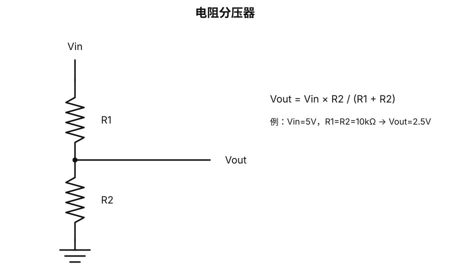
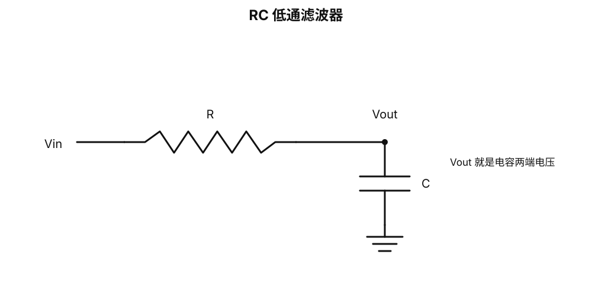
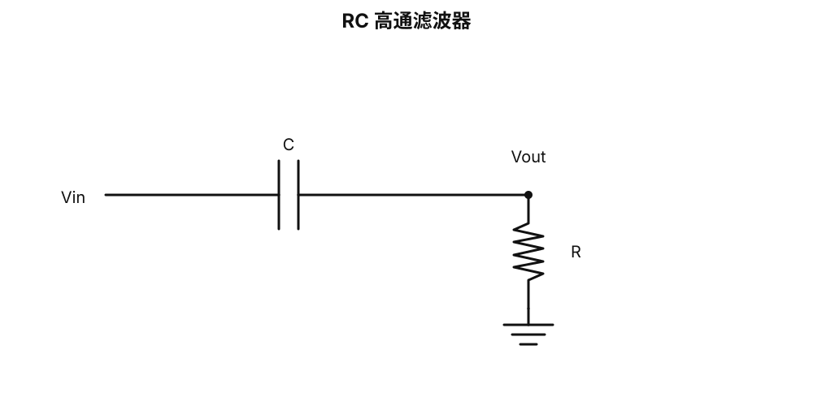
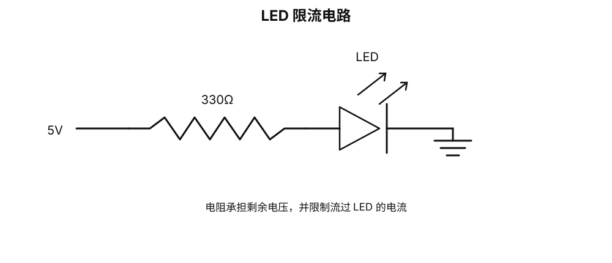
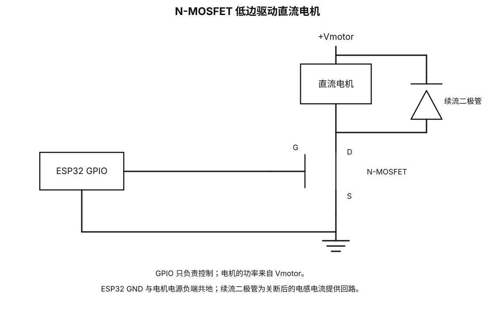
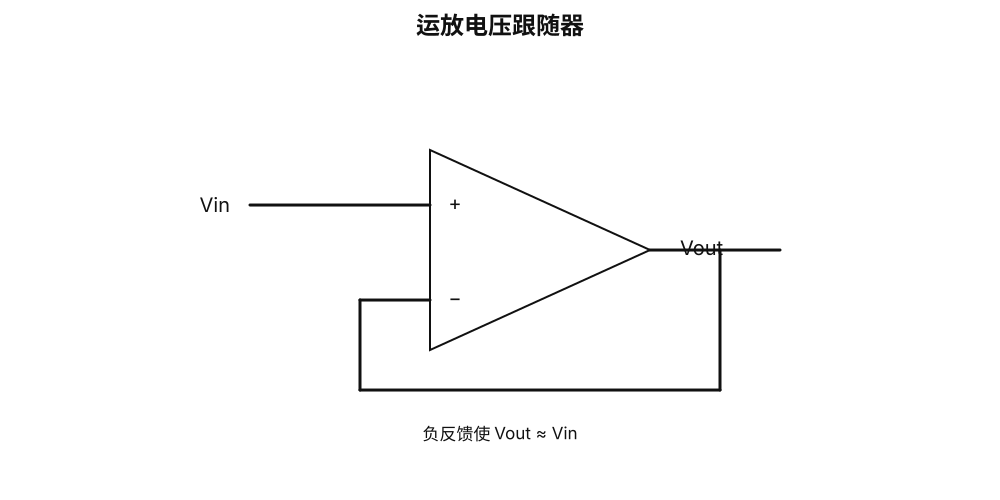
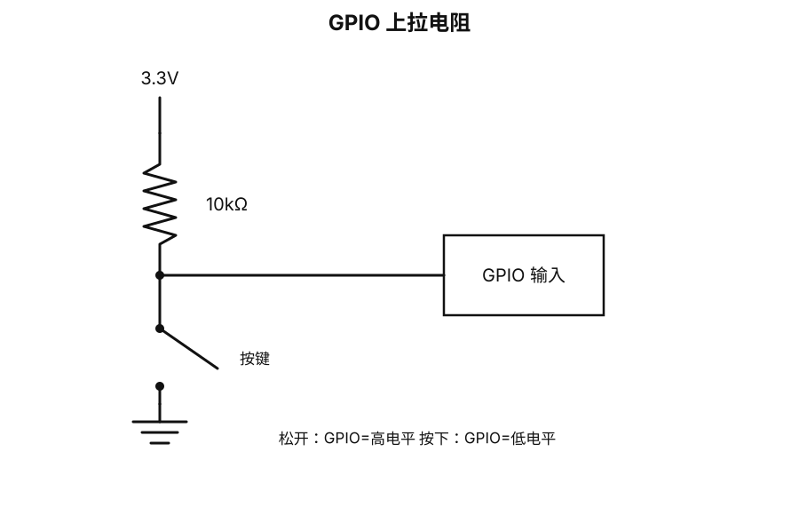

# 基础电路学习手册：从零重建电路直觉

> 适合以前学过电路、现在基本只记得 `U = I × R` 的情况。  
> 本文档不依赖 LaTeX 公式渲染，所有公式都用普通字符书写；所有真实电路都使用原理图 SVG，不再用流程图冒充电路。

---

## 0. 学电路时先抓住两条主线

真实电子系统同时处理两件事：

- **能量**：电源、电压、电流、功率、负载。
- **信息**：波形、频率、相位、模拟量、数字 0/1。

以后看到任何电路，优先问：

1. 电源在哪里？
2. 电流完整回路在哪里？
3. 哪个节点的电压代表信息？
4. 这个器件主要是在处理能量，还是处理信息？

---

# 第一部分：电压、电流、电阻、功率

## 1. 电压是什么

电压永远是**两个点之间的差**。

普通写法：

`U_AB = V_A - V_B`

所以“GPIO 是 3.3V”的完整含义通常是：

`V_GPIO - V_GND = 3.3V`

### GND 是什么

GND 首先是人为选定的**参考节点**。

它不是“电流消失的地方”，也不一定等于大地。

两个设备通信时经常需要共地，是因为双方必须对“3.3V”“0V”使用同一个参考。

---

## 2. 电流是什么

电流描述单位时间内通过某个截面的电荷量：

`I = Q / t`

常见单位：

- 1A = 1000mA
- 1mA = 1000μA

一个重要直觉：

> 电流不会在普通元件里凭空消失。没有分叉的串联支路中，各处电流相同。

---

## 3. 电阻和欧姆定律

最重要的基础关系：

`U = I × R`

变形：

`I = U / R`

`R = U / I`

### 例子

5V 加在 1kΩ 电阻上：

`I = 5V / 1000Ω = 0.005A = 5mA`

如果换成 10kΩ：

`I = 5V / 10000Ω = 0.5mA`

所以在相同电压下，电阻越大，电流越小。

---

## 4. 功率

功率表示单位时间内消耗或传递多少能量。

`P = U × I`

结合欧姆定律：

`P = I² × R`

`P = U² / R`

### 例子

1kΩ 电阻直接接 5V：

`P = 5² / 1000 = 0.025W = 25mW`

这就是为什么电阻除了阻值，还必须看额定功率。

---

# 第二部分：串联、并联、分压、KCL、KVL

## 5. 串联

几个元件首尾相连、中间没有分叉，属于串联。

核心性质：

> 同一串联支路中的电流相同。

电阻串联：

`R_total = R1 + R2 + ...`

---

## 6. 并联

多个元件的两端分别接到同样两个节点，就是并联。

核心性质：

> 并联元件两端电压相同。

两个电阻并联：

`R_eq = (R1 × R2) / (R1 + R2)`

---

## 7. 分压器

公式：

`Vout = Vin × R2 / (R1 + R2)`

例如：

- Vin = 5V
- R1 = 10kΩ
- R2 = 10kΩ

得到：

`Vout = 2.5V`

### 为什么分压器不能随便当电源

如果 Vout 后面接一个较重的负载，这个负载会和 R2 形成并联，改变原来的比例。

这叫**负载效应**。

---

## 8. KCL：基尔霍夫电流定律

KCL 中文：

**基尔霍夫电流定律**

核心：

`流入节点的总电流 = 流出节点的总电流`

也可以写：

`ΣI_in = ΣI_out`

本质是**电荷守恒**。

例如一个节点流入 10mA，两个支路流出 3mA 和 2mA，那么第三支路必须流出：

`10 - 3 - 2 = 5mA`

---

## 9. KVL：基尔霍夫电压定律

KVL 中文：

**基尔霍夫电压定律**

核心：

> 沿一个闭合回路走一圈，所有电压升高和降低相加为 0。

简写：

`ΣU = 0`

它可以理解成能量守恒。

例如一个 5V 电源串两个器件：

- 第一个器件压降 2V
- 第二个器件就必须承担剩下的 3V

---

# 第三部分：电容

## 10. 电容内部是什么

最基本的电容由两块彼此靠近、但中间绝缘的导体组成。

充电时：

- 一块极板电子变多；
- 另一块极板电子变少；
- 两块极板之间形成电场；
- 能量存储在电场中。

理想情况下，电子并没有直接穿过中间的绝缘层。

---

## 11. 电容量

电荷、电容量、电压的关系：

`Q = C × U`

C 越大，在相同电压下能储存的电荷越多。

常见单位：

- F
- μF
- nF
- pF

换算：

- 1μF = 1000nF
- 1nF = 1000pF

常见标记：

- 104 = 100nF = 0.1μF
- 103 = 10nF
- 102 = 1nF
- 101 = 100pF

---

## 12. 电容最重要的直觉

> **电容两端的电压不能瞬间改变。**

描述电容的关系：

`I_C = C × dU/dt`

先不要把 `dU/dt` 当成可怕的数学。

它只是在说：

> 电压变化越快，需要的充放电电流越大。

---

## 13. RC 充电

这张图最关键的地方：

> **Vout 就是电容两端的电压。**

如果 Vin 从 0V 突然跳到 5V：

- 电容原来是 0V；
- 电容电压不能瞬间变成 5V；
- 电源通过 R 给电容充电；
- Vout 逐渐从 0V 上升到 5V。

### 时间常数

`τ = R × C`

例如：

- R = 1kΩ
- C = 1μF

则：

`τ = 1ms`

大约：

- 1τ：达到最终值约 63%
- 2τ：约 86%
- 3τ：约 95%
- 5τ：约 99%

---

# 第四部分：频率、周期和相位

## 14. 频率

频率表示每秒重复多少次。

`f = 1 / T`

例如：

- 1Hz：每秒 1 次
- 1kHz：每秒 1000 次
- 1MHz：每秒 100 万次

1kHz 的周期：

`T = 1 / 1000s = 1ms`

---

## 15. 相位

两个同频率信号即使频率、幅度相同，也可能在时间上错开。

一个完整周期：

`360°`

半周期：

`180°`

四分之一周期：

`90°`

相位以后会直接出现在：

- 电容
- 电感
- 滤波器
- 波特图
- 通信
- 高速信号

---

# 第五部分：阻抗

## 16. 阻抗是什么

电阻 R 只够描述理想电阻。

但电容和电感对不同频率的信号表现不同，所以需要一个更一般的概念：

> **阻抗 Z：交流电路中的广义电阻。**

它同时描述：

1. 电流有多难通过；
2. 电压与电流之间的相位关系。

---

## 17. 电阻的阻抗

理想电阻：

`Z_R = R`

它基本不随频率变化。

---

## 18. 电容的阻抗

电容阻抗大小：

`|Z_C| = 1 / (2πfC)`

只看趋势就够了：

> 频率越高，电容阻抗越小。

原因：

- 变化很慢：电容充完后几乎不再持续有电流；
- 变化很快：电容不断充放电，外部交流电流更明显。

---

# 第六部分：RC 滤波器

## 19. RC 低通

这个电路中：

- R 在输入和输出节点之间；
- C 从输出节点接到 GND；
- Vout 就是电容两端的电压。

### 输入变化慢

电容有足够时间跟随。

所以：

`Vout ≈ Vin`

### 输入变化快

电容自身电压来不及快速改变。

所以 Vout 中快速变化的部分被压低。

于是：

> 低频容易保留，高频被衰减。

### 截止频率

`f_c = 1 / (2πRC)`

例如：

- R = 1kΩ
- C = 1μF

得到：

`f_c ≈ 159Hz`

注意：159Hz 不是一道“墙”。

滤波器的衰减是逐渐发生的。

---

## 20. RC 高通

这里电容位于串联路径。

低频时：

- 电容阻抗大；
- 信号不容易传到输出。

高频时：

- 电容阻抗小；
- 高频更容易传到输出。

所以它是高通滤波器。

---

# 第七部分：电感

## 21. 电感是什么

电感最常见的形式是线圈。

电流流过线圈会产生磁场。

当电流变化时，磁场也变化，电感会产生一个电压来反抗这种变化。

最重要的直觉：

> **电容不喜欢电压突变；电感不喜欢电流突变。**

关系：

`U_L = L × dI/dt`

---

## 22. 电感阻抗

`|Z_L| = 2πfL`

趋势：

> 频率越高，电感阻抗越大。

和电容相反：

| 器件 | 频率升高时 |
|---|---|
| 电阻 | 基本不变 |
| 电容 | 阻抗下降 |
| 电感 | 阻抗上升 |

---

## 23. 为什么电机断电时会产生高压

电机绕组本身就是电感。

MOSFET 突然关断时，电流试图从某个值瞬间变为 0。

但电感不允许电流瞬间改变，于是会产生较高电压来继续推动电流。

这可能击穿 MOSFET。

所以直流电机和继电器旁边经常需要**续流二极管**。

---

# 第八部分：二极管与 LED

## 24. 二极管

最基础的直觉：

> 二极管主要允许电流朝一个方向通过。

真实二极管还需要考虑：

- 正向压降
- 反向漏电
- 最大反向耐压
- 最大电流
- 开关速度

---

## 25. LED 为什么需要限流

假设：

- 电源 5V
- LED 正向压降约 2V
- 目标电流 10mA

电阻承担：

`U_R = 5V - 2V = 3V`

需要的电阻：

`R = 3V / 0.01A = 300Ω`

实际可以选标准值 330Ω。

---

# 第九部分：晶体管与 MOSFET

## 26. 晶体管为什么存在

ESP32 GPIO 能输出 3.3V，但不能直接驱动很大的负载。

例如：

- 电机
- 大功率 LED
- 加热器
- 大继电器

这些负载需要独立的功率通路。

---

## 27. 晶体管没有创造能量

正确理解：

> **小信号控制大能量，但大能量来自外部电源。**

GPIO 只是控制 MOSFET 是否导通。

真正给电机供电的是 `Vmotor`。

---

## 28. BJT

BJT 三个主要端子：

- B：Base，基极
- C：Collector，集电极
- E：Emitter，发射极

初学时可以先理解为：

> 用较小的输入控制更大的集电极电流。

---

## 29. MOSFET

MOSFET 常见端子：

- G：Gate，栅极
- D：Drain，漏极
- S：Source，源极

关键控制量：

`V_GS = V_G - V_S`

这就是为什么 ESP32 和独立电机电源通常需要共地：

> 只有共同参考，GPIO 的 3.3V 才能形成明确的 V_GS。

用 3.3V MCU 驱动时，优先选真正适合低栅极电压的 Logic-Level MOSFET。

---

# 第十部分：运算放大器

## 30. 运放是什么

运放有：

- 同相输入 `V+`
- 反相输入 `V-`
- 输出 `Vout`

理想开环关系可以写：

`Vout = A × (V+ - V-)`

其中 A 非常大。

实际电路通常依靠**负反馈**工作。

---

## 31. 电压跟随器

负反馈工作正常时，可以近似：

`V+ ≈ V-`

所以：

`Vout ≈ Vin`

它虽然没有明显放大电压，但可以：

- 隔离前后级；
- 减轻负载效应；
- 提高驱动能力。

---

# 第十一部分：数字信号

## 32. 数字 0/1 本质上还是电压

PCB 上不存在真正抽象的“0”和“1”。

它们仍然是模拟电压。

芯片只是规定：

- 某个较低电压范围 → 逻辑 0
- 某个较高电压范围 → 逻辑 1

具体门限要看 datasheet。

所以：

> 数字电路底层仍然是模拟物理世界。

---

## 33. 上拉和下拉

数字输入如果悬空，可能被噪声干扰而随机变化。

### 上拉

按键松开时：

- 10kΩ 把 GPIO 拉到 3.3V。

按键按下时：

- GPIO 被直接接到 GND。

为什么需要电阻？

因为如果直接把 GPIO 同时硬接 3.3V 和 GND，就会形成短路。

---

# 第十二部分：ADC、DAC、PWM

## 34. ADC

ADC = Analog to Digital Converter。

作用：

> 把模拟电压转换成数字数值。

12 位 ADC：

`2¹² = 4096`

如果量程是 0~3.3V：

`每个理论量化步长 ≈ 3.3V / 4095 ≈ 0.806mV`

真实 ADC 还会受到：

- 噪声
- 参考电压误差
- 非线性
- 采样时间
- 输入阻抗

影响。

---

## 35. DAC

DAC = Digital to Analog Converter。

作用：

> 把数字值转换为模拟电压或电流。

---

## 36. PWM

PWM 实际上不断在两个电平之间切换，例如：

- 0V
- 3.3V

通过改变高电平所占时间比例来控制平均效果。

这个比例叫**占空比**。

例如：

- 0%：一直低
- 25%：四分之一时间为高
- 50%：一半时间为高
- 100%：一直高

PWM 后接 RC 低通，可以得到较平滑的平均电压。

---

# 第十三部分：去耦与电源

## 37. 为什么芯片旁边总有 100nF

数字芯片内部晶体管快速翻转时，会突然需要电流。

真实 PCB 走线有电阻和电感，远处电源无法瞬间提供完美响应。

于是芯片电源脚旁边放一个小电容：

> 让电容就地提供瞬时电荷。

常见组合：

- 100nF：处理更高频、更局部的变化；
- 1μF / 10μF：提供更大的局部储能。

---

## 38. 5V / 2A 电源是什么意思

它通常表示：

> 电源正常工作时输出约 5V，允许负载最多取约 2A。

它不会无条件把 2A 强行灌入负载。

负载需要 100mA，就大约取 100mA。

---

# 第十四部分：测量工具

## 39. 万用表

适合：

- 稳定直流电压
- 电阻
- 通断
- 稳定电流

通常给你一个数值。

---

## 40. 示波器

示波器显示：

> **电压随时间如何变化。**

横轴：时间  
纵轴：电压

适合看：

- 方波
- PWM
- RC 充放电
- 毛刺
- 振铃
- 电源纹波
- UART / SPI / I²C

示波器探头测量的是：

`V_probe - V_ground`

所以地夹的位置非常重要。

---

## 41. 逻辑分析仪

逻辑分析仪主要判断：

- 什么时候是 0
- 什么时候是 1

然后按照协议解释。

例如：

- UART → 字节
- I²C → 地址、ACK、数据
- SPI → MOSI、MISO 数据

---

# 第十五部分：真实 PCB 为什么越来越复杂

## 42. PCB 走线不是理想导线

真实走线同时存在：

- 电阻 R
- 电感 L
- 对附近导体的电容 C

低频时可以近似忽略。

频率越来越高后，走线本身就成为电路的一部分。

于是出现：

- 特性阻抗
- 反射
- 终端匹配
- 回流路径
- 差分线
- 眼图
- 信号完整性

---

## 43. 为什么高速接口偏爱串行

很多并行线速度变高以后，会遇到：

- 各线到达时间不一致；
- 串扰；
- 引脚数量巨大；
- PCB 布线困难。

因此高速接口大量使用高速差分串行链路，例如：

- PCIe
- SGMII
- 高速 Ethernet
- SerDes

---

# 第十六部分：电机和舵机

## 44. 电机不是纯电阻

电机同时具有：

- 电阻
- 电感
- 反电动势
- 启动大电流
- 机械惯量
- 噪声

所以常见系统需要：

- 独立电源
- MOSFET / H 桥
- 续流路径
- 大电容
- 去耦
- 合理接地

---

## 45. 为什么多个舵机会让电源掉压

舵机内部通常有：

- 电机
- 减速齿轮
- 位置传感器
- 控制电路

启动或堵转时电流会明显增加。

如果电源能力不够，可能出现：

- 输出电压下降；
- 进入限流/恒流；
- MCU 重启；
- 舵机抖动。

---

# 第十七部分：UART、I²C、SPI

## 46. UART

常见：

- TX
- RX
- GND

本质仍然是高低电平随时间变化。

协议规定：

- 起始位
- 数据位
- 校验位
- 停止位
- 波特率

---

## 47. I²C

常见：

- SDA
- SCL

I²C 常采用开漏输出。

设备主要负责把总线拉低，高电平依靠上拉电阻恢复。

所以“上拉电阻”不是教材里的孤立概念，而是真正用于通信总线。

---

## 48. SPI

常见：

- SCLK
- MOSI
- MISO
- CS

协议规定：

- 时钟边沿
- 数据方向
- 比特顺序
- 片选

本质仍然是：

> 数字电压波形 + 时间规则。

---

# 第十八部分：建议实际做的实验

## 实验 1：欧姆定律

准备：

- 5V 电源
- 1kΩ 电阻
- 万用表

理论：

`I = 5V / 1kΩ = 5mA`

实测电压、电流，然后反算：

`R = U / I`

---

## 实验 2：分压与负载效应

使用：

- 5V
- 10kΩ
- 10kΩ

理论中点：

`Vout = 2.5V`

然后再从 Vout 到 GND 并联一个 10kΩ，重新测量。

你会直接看到：

> 接入负载本身就会改变电路。

---

## 实验 3：RC 充放电

使用：

- ESP32 / Arduino
- 1kΩ
- 1μF
- 示波器

让 GPIO 输出低频方波：

- CH1 看 Vin
- CH2 看 Vout

观察：

> Vin 可以快速跳变，但电容电压会弯曲地上升和下降。

然后分别改变：

- R
- C
- 输入频率

---

## 实验 4：RC 低通

继续用 RC 低通。

逐渐提高输入频率：

1. 低频时输出基本跟随；
2. 频率升高后边沿变圆；
3. 再升高，输出振幅下降；
4. 高频 PWM 时，输出趋向平均值。

---

## 实验 5：MOSFET 控制负载

先用 LED，不要一上来就接大电机。

目的是理解：

> GPIO 负责信息和控制；外部电源负责能量。

---

# 第十九部分：如何看真实原理图

## 49. 第一步：先找电源树

寻找：

- VIN
- 12V
- 5V
- 3V3
- 1V8
- 1V0
- GND

先搞清楚能量怎么进入整块板。

---

## 50. 第二步：找核心芯片

例如：

- CPU
- MCU
- FPGA
- PHY
- DDR
- Flash
- PMIC

---

## 51. 第三步：按功能块看

先划分：

- 电源
- 时钟
- 复位
- CPU
- DDR
- Ethernet
- PCIe
- SPI Flash
- JTAG

不要一开始就追每根线。

---

## 52. 第四步：最后分析单根信号

再问：

- 电压域是多少？
- 谁驱动谁？
- 有没有上拉？
- 有没有串联电阻？
- 有没有 AC 耦合？
- 是单端还是差分？
- 时钟在哪里？
- 回流路径在哪里？

---

# 第二十部分：最值得记住的 20 条直觉

1. 电压一定是两点之间的差。
2. GND 首先是参考节点。
3. 电流必须形成完整回路。
4. 电阻把电压与电流联系起来。
5. `U = I × R` 是最基本关系之一。
6. `P = U × I` 决定能量和发热。
7. 串联支路电流相同。
8. 并联器件两端电压相同。
9. KCL 本质是电荷守恒。
10. KVL 本质是能量守恒。
11. 电容储存电场能量。
12. 电容两端电压不能瞬间改变。
13. 电感储存磁场能量。
14. 电感中的电流不能瞬间改变。
15. 阻抗是交流世界里的广义电阻。
16. 频率越高，理想电容阻抗越低。
17. 频率越高，理想电感阻抗越高。
18. 晶体管不创造能量，只控制能量。
19. 数字信号底层仍然是模拟电压。
20. 频率越高，PCB 走线越不能当理想导线。

---

# 附录：当前阶段最值得掌握的公式

欧姆定律：

`U = I × R`

功率：

`P = U × I`

`P = I² × R`

`P = U² / R`

分压：

`Vout = Vin × R2 / (R1 + R2)`

电容：

`Q = C × U`

`I_C = C × dU/dt`

电感：

`U_L = L × dI/dt`

RC 时间常数：

`τ = R × C`

RC 截止频率：

`f_c = 1 / (2πRC)`

电容阻抗：

`|Z_C| = 1 / (2πfC)`

电感阻抗：

`|Z_L| = 2πfL`

这些公式不应该一次背下来。

更好的顺序是：

> **先观察现象 → 建立物理直觉 → 再用公式把这个现象定量化。**

---

# 结语

重新学习电路，最重要的是重新建立这条链：

> 电源建立电压 → 电压推动电流 → R/C/L 决定电压和电流如何变化 → 波形携带信息 → 晶体管/运放处理能量或信号 → ADC 和数字电路把它变成数字信息 → MCU 按协议解释这些信息。

以后看到陌生电路，先问三个问题：

1. 电源在哪里？
2. 电流回路在哪里？
3. 我关心的节点电压随时间怎样变化？

这三个问题比死背几十个公式更重要。
