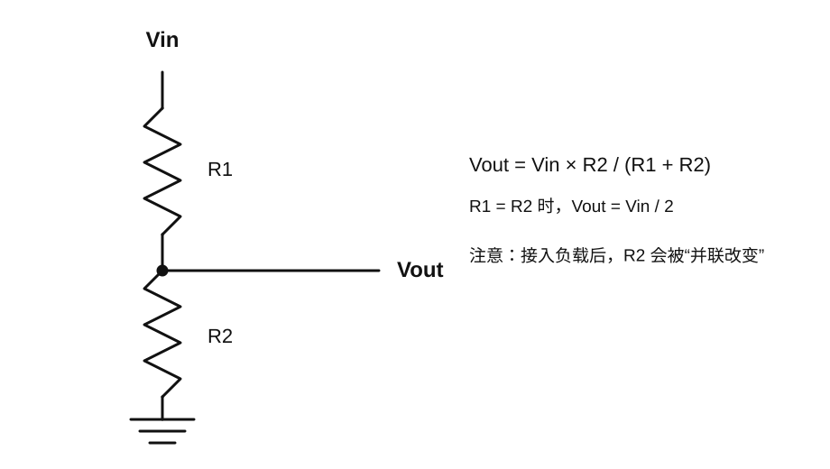
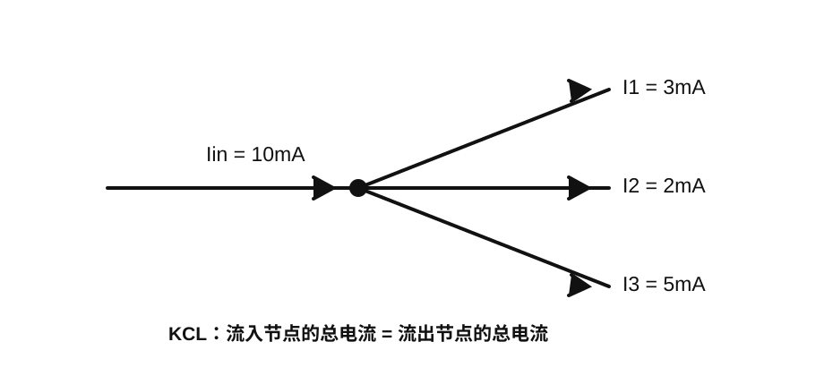
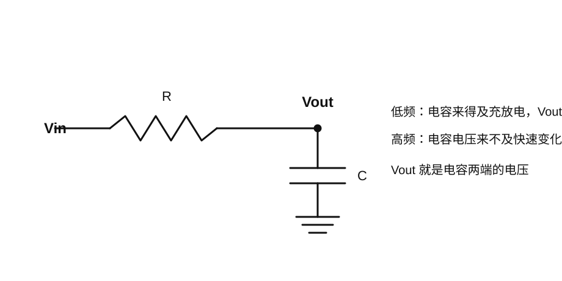
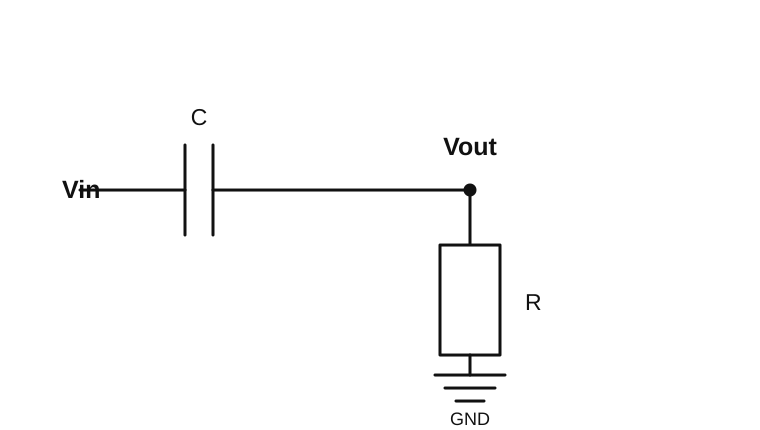

# 基础电路学习手册：从零重新建立电路直觉

> 这份文档面向这样一种状态：十几年前学过《电路》《模电》《数电》，现在大部分公式和概念已经忘了，只依稀记得欧姆定律。目标不是重新应付考试，而是重新建立一套**能看懂原理图、能解释示波器波形、能做 ESP32/Arduino/电机/PCB 项目**的直觉体系。

---

## 目录

1. [先建立整体模型](#1-先建立整体模型)
2. [电荷、电场、电压](#2-电荷电场电压)
3. [电流与完整回路](#3-电流与完整回路)
4. [电阻与欧姆定律](#4-电阻与欧姆定律)
5. [功率与能量](#5-功率与能量)
6. [串联、并联和分压](#6-串联并联和分压)
7. [KCL 与 KVL](#7-kcl-与-kvl)
8. [电容：为什么能充放电](#8-电容为什么能充放电)
9. [RC 电路与时间常数](#9-rc-电路与时间常数)
10. [频率、周期与相位](#10-频率周期与相位)
11. [阻抗到底是什么](#11-阻抗到底是什么)
12. [RC 低通与高通](#12-rc-低通与高通)
13. [电感](#13-电感)
14. [二极管和 LED](#14-二极管和-led)
15. [BJT 与 MOSFET](#15-bjt-与-mosfet)
16. [运算放大器](#16-运算放大器)
17. [数字信号、上拉和下拉](#17-数字信号上拉和下拉)
18. [ADC、DAC 与 PWM](#18-adcdac-与-pwm)
19. [电源、去耦与共地](#19-电源去耦与共地)
20. [示波器和逻辑分析仪](#20-示波器和逻辑分析仪)
21. [为什么高速 PCB 是另一种世界](#21-为什么高速-pcb-是另一种世界)
22. [推荐实验路线](#22-推荐实验路线)
23. [以后如何看陌生原理图](#23-以后如何看陌生原理图)

---

# 1. 先建立整体模型

电路并不是一堆公式。真实电子系统同时在处理两件事情：

- **能量**：谁在供电、谁在消耗功率、哪里会发热、哪里需要大电流。
- **信息**：电压波形代表什么、什么时候是 0/1、频率是多少、数据怎么传输。

例如 ESP32 控制一个电机：

- ESP32 GPIO 主要传递的是**控制信息**；
- MOSFET 负责根据控制信息决定功率通路是否导通；
- 外部电源给电机提供真正的**能量**。

所以以后看到任何电路，先问四个问题：

1. 电源从哪里来？
2. 电流的完整回路在哪里？
3. 哪个节点的电压携带信息？
4. 哪个器件在处理能量，哪个器件在处理信息？

这四个问题比一开始背公式更重要。

---

# 2. 电荷、电场、电压

## 2.1 电荷是什么

物质内部存在带电粒子。电子带负电，质子带正电。

在金属导体中，有大量可以移动的自由电子。电源并不是“制造电子”，而是建立一个电场，使导体中的自由电子产生有方向的漂移。

工程上通常不需要追踪某一个电子，而是关心：

- 某两个点之间有多大的电压；
- 某条支路流过多大的电流；
- 某个器件消耗了多少功率。

## 2.2 电压不是“某一点自己的属性”

电压永远是**两个点之间的电势差**。

$$
U_{AB}=V_A-V_B
$$

所以工程上说“A 点是 3.3V”，完整含义其实是：

> A 点相对于约定参考点的电压是 3.3V。

如果参考点是 GND：

$$
V_A - V_{GND}=3.3\text{ V}
$$

这也是为什么示波器测电压时一定有：

- 探头尖端；
- 地夹。

示波器真正测的是：

$$
V_{measured}=V_{probe}-V_{ground}
$$

## 2.3 GND 到底是什么

GND 首先是**电路人为选定的参考节点**。

把这个节点定义为：

$$
V_{GND}=0\text{ V}
$$

并不意味着这个点在宇宙中绝对是 0V。

GND 也不一定等于保护地 PE，更不一定等于真正的大地。

在很多小型直流电路里，GND 只是：

> “大家统一拿这个节点当 0V 参考。”

### 为什么两个模块通信经常必须共地

假设 ESP32 输出 3.3V 高电平。

ESP32 的含义其实是：

$$
V_{GPIO}-V_{GND,ESP32}=3.3\text{ V}
$$

如果另一个模块的 GND 和 ESP32 的 GND 完全没有关系，它就不知道这个 3.3V 应该相对什么来判断。

因此普通单端数字通信通常要有共同参考地。

---

# 3. 电流与完整回路

## 3.1 电流是什么

电流表示单位时间内通过某个截面的电荷量。

$$
I=\frac{Q}{t}
$$

其中：

- $I$：电流，单位 A（安培）；
- $Q$：电荷量，单位 C（库仑）；
- $t$：时间，单位 s（秒）。

常见单位换算：

$$
1\text{ A}=1000\text{ mA}
$$

$$
1\text{ mA}=1000\text{ }\mu\text{A}
$$

## 3.2 电流必须形成完整回路

这是重新学习电路时最重要的直觉之一。

假设电源正极通过一个电阻连接到负极。电流路径必须是完整闭合的。

如果中间断开：

> 没有完整回路，就没有稳定直流电流。

所以以后看到电路不要只问“正极接哪了”，还要问：

> 电流最后是怎么回到电源另一端的？

## 3.3 电流不会被元件“吃掉”

一条没有分叉的串联支路中，任意位置的电流相同。

如果一个电阻前面流 5mA，那么它后面也还是 5mA。

元件可能消耗**能量**，但不会把电荷凭空吃掉。

---

# 4. 电阻与欧姆定律

## 4.1 欧姆定律

你最熟悉的公式：

$$
U=IR
$$

三个等价形式：

$$
U=IR
$$

$$
I=\frac{U}{R}
$$

$$
R=\frac{U}{I}
$$

## 4.2 例子：5V 加到 1kΩ 电阻上

$$
I=\frac{5\text{ V}}{1000\ \Omega}=0.005\text{ A}=5\text{ mA}
$$

换成 10kΩ：

$$
I=\frac{5\text{ V}}{10000\ \Omega}=0.5\text{ mA}
$$

所以在相同电压下：

> 电阻越大，电流越小。

## 4.3 电阻不是单纯“把电流挡住”

更准确的理解是：

> 电阻建立了电压和电流之间的比例关系。

正因为有这个关系，我们才能用它做：

- 限流；
- 分压；
- 上拉 / 下拉；
- 电流采样；
- 设置晶体管偏置；
- 设置运放增益；
- 与电容组成滤波器；
- 高速传输线终端匹配。

---

# 5. 功率与能量

## 5.1 功率

功率描述单位时间内转换多少能量。

$$
P=UI
$$

结合欧姆定律：

$$
P=I^2R
$$

或者：

$$
P=\frac{U^2}{R}
$$

## 5.2 例子：1kΩ 电阻直接接 5V

$$
P=\frac{5^2}{1000}=0.025\text{ W}=25\text{ mW}
$$

如果是一只额定功率 0.25W 的电阻，那么 25mW 明显低于额定值。

## 5.3 为什么功率很重要

一个电路即使逻辑上“接对了”，也可能因为功率问题烧毁。

例如 MOSFET 导通电阻为 $R_{DS(on)}$，流过电流 $I$，它大致会产生：

$$
P_{MOS}=I^2R_{DS(on)}
$$

电流翻倍，导通损耗变成四倍。

所以大电流设计里，功率和散热是核心问题。

---

# 6. 串联、并联和分压

## 6.1 串联

多个器件首尾相连，中间没有分叉，就是串联。

串联电阻总阻值：

$$
R_{total}=R_1+R_2+\cdots+R_n
$$

最重要的性质：

> 串联支路中，各元件流过同一个电流。

## 6.2 并联

多个器件的两端分别连接到同样两个节点，就是并联。

最重要的性质：

> 并联器件两端电压相同。

两个电阻并联：

$$
R_{eq}=\frac{R_1R_2}{R_1+R_2}
$$

如果两个电阻相同，都是 $R$：

$$
R_{eq}=\frac{R}{2}
$$

## 6.3 分压器

分压公式：

$$
V_{out}=V_{in}\frac{R_2}{R_1+R_2}
$$

如果：

$$
R_1=R_2
$$

那么：

$$
V_{out}=\frac{V_{in}}{2}
$$

例如 $V_{in}=5\text{ V}$：

$$
V_{out}=2.5\text{ V}
$$

## 6.4 为什么分压器不能随便当电源

这是非常常见的误区。

分压器公式成立有一个隐含条件：

> Vout 后面的负载几乎不取电流。

如果负载电阻为 $R_L$，它会与 $R_2$ 并联：

$$
R_{down}=R_2\parallel R_L
$$

这时真正的输出变成：

$$
V_{out}=V_{in}\frac{R_{down}}{R_1+R_{down}}
$$

所以一接负载，电压可能马上发生变化。

这叫**负载效应**。

---

# 7. KCL 与 KVL

## 7.1 KCL：基尔霍夫电流定律

KCL 全称：**Kirchhoff's Current Law，基尔霍夫电流定律**。

核心：

> 一个节点中，流入的总电流等于流出的总电流。

数学形式：

$$
\sum I_{in}=\sum I_{out}
$$

或者统一符号以后：

$$
\sum I=0
$$

例如流入 10mA，已经知道两条支路分别流出 3mA 和 2mA：

$$
I_3=10-3-2=5\text{ mA}
$$

KCL 本质上来自：

> **电荷守恒。**

## 7.2 KVL：基尔霍夫电压定律

KVL 全称：**Kirchhoff's Voltage Law，基尔霍夫电压定律**。

沿一个闭合回路走一圈：

$$
\sum U=0
$$

例如一个 5V 电源串两个器件：

$$
5\text{ V}-U_1-U_2=0
$$

如果：

$$
U_1=2\text{ V}
$$

那么：

$$
U_2=3\text{ V}
$$

KVL 可以理解为：

> **能量守恒在电路中的表现。**

---

# 8. 电容：为什么能充放电

## 8.1 电容内部是什么

最基础的电容可以理解成两块彼此靠近、但互相绝缘的导体。

两块导体之间没有正常的直流导电通路。

当电源接上以后：

- 一块极板聚集更多电子；
- 另一块极板失去部分电子；
- 两块极板之间形成电场；
- 能量储存在电场中。

## 8.2 电容量 $C$

电容储存的电荷与电压关系：

$$
Q=CU
$$

其中：

- $Q$：电荷量；
- $C$：电容量；
- $U$：电容两端电压。

所以在相同电压下：

> $C$ 越大，能储存的电荷越多。

单位：

$$
1\text{ F}=10^6\ \mu\text{F}=10^9\text{ nF}=10^{12}\text{ pF}
$$

常见关系：

$$
1\ \mu\text{F}=1000\text{ nF}
$$

$$
1\text{ nF}=1000\text{ pF}
$$

## 8.3 常见电容编码

三位数编码中，前两位是有效数字，第三位是乘以多少个 10，单位通常按 pF 理解。

例如：

- 101 = $10\times10^1$ pF = 100pF；
- 102 = $10\times10^2$ pF = 1000pF = 1nF；
- 103 = 10nF；
- 104 = 100nF = 0.1μF。

## 8.4 最重要的公式

$$
I_C=C\frac{dV_C}{dt}
$$

这个公式不要先背微积分，先读它表达的物理意思。

$\dfrac{dV_C}{dt}$ 表示：

> 电容电压变化得有多快。

所以：

> 想让电容电压变化得越快，就需要越大的电流。

## 8.5 为什么说“电容电压不能瞬间改变”

如果电压要在零时间内从 0V 瞬间跳到 5V，那么：

$$
\frac{dV}{dt}\rightarrow\infty
$$

于是根据：

$$
I=C\frac{dV}{dt}
$$

需要：

$$
I\rightarrow\infty
$$

真实电路中不可能提供无限电流。

所以理想电容的重要性质是：

> **电容两端电压不能瞬间突变。**

---

# 9. RC 电路与时间常数

## 9.1 RC 充电电路

假设电容一开始完全没电：

$$
V_C(0)=0
$$

然后 Vin 突然从 0V 变成一个固定电压 $V_{in}$。

刚开始：

- 电容电压还是 0V；
- R 两端几乎承受全部输入电压；
- 因此充电电流最大。

随着电容慢慢充电：

- $V_C$ 越来越高；
- R 两端压降越来越小；
- 充电电流越来越小。

最终：

$$
V_C\rightarrow V_{in}
$$

而：

$$
I\rightarrow0
$$

## 9.2 充电公式

$$
V_C(t)=V_{in}\left(1-e^{-t/RC}\right)
$$

这条公式现在不需要背。

真正重要的是知道：

> R 和 C 共同决定“充电到底有多快”。

## 9.3 时间常数

定义：

$$
\tau=RC
$$

如果：

$$
R=1\text{ k}\Omega
$$

$$
C=1\ \mu\text{F}
$$

那么：

$$
\tau=1000\times10^{-6}=1\text{ ms}
$$

充电过程中：

| 时间 | 电容电压达到最终值的大约比例 |
|---|---:|
| $1\tau$ | 63.2% |
| $2\tau$ | 86.5% |
| $3\tau$ | 95.0% |
| $4\tau$ | 98.2% |
| $5\tau$ | 99.3% |

工程上经常把 $5\tau$ 当成“基本充满”。

---

# 10. 频率、周期与相位

## 10.1 周期和频率

如果一个波形每隔 $T$ 秒重复一次，那么频率为：

$$
f=\frac{1}{T}
$$

反过来：

$$
T=\frac{1}{f}
$$

例如：

$$
f=1\text{ kHz}
$$

则：

$$
T=\frac{1}{1000}=1\text{ ms}
$$

## 10.2 交流不只是 220V 市电

只要电压或电流随时间变化，都可以用交流/时变信号的方法分析。

例如：

- 正弦波；
- 方波；
- PWM；
- UART；
- SPI 时钟；
- 音频；
- 无线载波。

## 10.3 相位

两个同频率信号即使幅度一样，也可能在时间上有错位。

一个完整周期定义为：

$$
360^\circ
$$

半个周期：

$$
180^\circ
$$

四分之一周期：

$$
90^\circ
$$

相位以后会直接出现在电容、电感、滤波器、通信和高速电路中。

---

# 11. 阻抗到底是什么

## 11.1 为什么只讲电阻不够

直流稳态里，电阻很好理解：

$$
R=\frac{U}{I}
$$

但电容和电感不一样，它们对不同频率的信号表现不同。

因此交流分析引入：

> **阻抗（Impedance）**。

符号：

$$
Z
$$

可以先把它理解成：

> **交流世界里的广义电阻。**

但阻抗比普通电阻多了一层：它还能描述电压与电流之间的相位关系。

## 11.2 电阻的阻抗

理想电阻：

$$
Z_R=R
$$

基本与频率无关。

## 11.3 电容阻抗

完整形式：

$$
Z_C=\frac{1}{j\omega C}
$$

其中：

$$
\omega=2\pi f
$$

如果暂时只看阻抗大小：

$$
|Z_C|=\frac{1}{2\pi fC}
$$

所以非常重要的结论：

> **频率越高，电容阻抗越小。**

### 数值例子

假设：

$$
C=1\ \mu\text{F}
$$

当 $f=10\text{ Hz}$：

$$
|Z_C|\approx15.9\text{ k}\Omega
$$

当 $f=1\text{ kHz}$：

$$
|Z_C|\approx159\ \Omega
$$

同一个电容，仅仅因为频率变高了 100 倍，阻抗就下降了 100 倍。

这正是滤波器的基础。

---

# 12. RC 低通与高通

## 12.1 RC 低通

非常关键：

> Vout 不是“从电阻后面偷偷取出来的一根线”。

Vout 是一个**节点电压**。

而这个节点同时连接：

- 电阻 R；
- 电容 C；
- 后续负载。

所以整个网络共同决定 Vout。

### 低频时

低频意味着变化很慢。

电容有足够时间充电和放电，因此：

$$
V_{out}\approx V_{in}
$$

### 高频时

频率升高后：

$$
|Z_C|=\frac{1}{2\pi fC}
$$

会变小。

于是 Vout 节点越来越容易通过电容形成交流电流通路到 GND，高频分量被压低。

### 传递函数

RC 低通：

$$
H(j\omega)=\frac{V_{out}}{V_{in}}
=\frac{1}{1+j\omega RC}
$$

现在不用背，但以后学波特图时会再次遇到。

### 截止频率

$$
f_c=\frac{1}{2\pi RC}
$$

如果：

$$
R=1\text{ k}\Omega,\qquad C=1\ \mu\text{F}
$$

则：

$$
f_c\approx159\text{ Hz}
$$

截止频率不是“159Hz 以下全通过、160Hz 以上全消失”。

在截止频率处，输出幅度为低频值的：

$$
\frac{1}{\sqrt{2}}\approx0.707
$$

对应功率下降：

$$
-3\text{ dB}
$$

## 12.2 RC 高通

高通把电容放在串联路径。

低频时：

$$
|Z_C|\text{ 很大}
$$

所以低频不容易到输出。

高频时：

$$
|Z_C|\text{ 变小}
$$

所以快速变化更容易通过。

高通传递函数：

$$
H(j\omega)=\frac{j\omega RC}{1+j\omega RC}
$$

截止频率同样是：

$$
f_c=\frac{1}{2\pi RC}
$$

---

# 13. 电感

## 13.1 电感是什么

最常见的电感就是线圈。

电流通过线圈时产生磁场。

电流变化时，磁场也变化，并产生一个电压反抗电流变化。

核心关系：

$$
V_L=L\frac{dI}{dt}
$$

## 13.2 最重要的直觉

> **电容不喜欢电压突然变化。**

> **电感不喜欢电流突然变化。**

如果想让电感电流在极短时间内剧烈变化，就需要很大的电压。

## 13.3 电感阻抗

$$
Z_L=j\omega L
$$

只看大小：

$$
|Z_L|=2\pi fL
$$

所以：

> **频率越高，电感阻抗越大。**

与电容正好相反。

## 13.4 为什么电机突然关断会产生高压

电机绕组本身就是电感。

假设原来有电流：

$$
I=1\text{ A}
$$

MOSFET 突然关断，如果试图让电流瞬间变成 0：

$$
\frac{dI}{dt}\text{ 非常大}
$$

于是：

$$
V_L=L\frac{dI}{dt}
$$

可能产生很高的电压。

这就是为什么感性负载常需要：

- 续流二极管；
- TVS；
- RC Snubber；
- 合理的 MOSFET 耐压余量。

---

# 14. 二极管和 LED

## 14.1 二极管的核心行为

最基础的理解：

> 二极管主要允许电流向一个方向流动。

真实二极管不是理想开关，还需要考虑：

- 正向压降；
- 反向漏电；
- 最大反向耐压；
- 最大正向电流；
- 反向恢复时间。

## 14.2 LED 为什么必须限流

LED 本质是发光二极管。

不能直接把“5V”简单理解成“LED 自己会只取需要的电流”。

假设：

- 电源：$5\text{ V}$；
- LED 正向压降：约 $2\text{ V}$；
- 目标电流：$10\text{ mA}$。

电阻需要承担：

$$
V_R=5-2=3\text{ V}
$$

所以：

$$
R=\frac{3\text{ V}}{10\text{ mA}}
=300\ \Omega
$$

实际可以选择标准值：

$$
330\ \Omega
$$

这样电流约为：

$$
I\approx\frac{3}{330}=9.1\text{ mA}
$$

---

# 15. BJT 与 MOSFET

## 15.1 为什么 MCU 还需要晶体管

ESP32 GPIO 能输出 0/3.3V 控制信号，但不能直接驱动：

- 电机；
- 大功率 LED；
- 加热器；
- 大继电器；
- 大电流负载。

原因是 GPIO 的任务主要是：

> **表达逻辑状态，而不是提供大功率。**

## 15.2 晶体管的“放大”没有违反能量守恒

晶体管并不会创造能量。

真正发生的是：

> 小信号控制外部电源中的大能量。

例如：

- GPIO 决定 MOSFET 开还是关；
- 外部电源向电机提供几百 mA 甚至几 A；
- GPIO 自己并不提供这些电机功率。

## 15.3 BJT

BJT 主要端子：

- B：Base，基极；
- C：Collector，集电极；
- E：Emitter，发射极。

初学阶段可以先理解：

> 用基极输入控制更大的集电极电流。

常见工作区域：

- 截止区；
- 放大区；
- 饱和区。

作为开关使用时，主要关心截止和饱和。

## 15.4 MOSFET

主要端子：

- G：Gate，栅极；
- D：Drain，漏极；
- S：Source，源极。

关键控制量不是“Gate 对 GND 电压”，而是：

$$
V_{GS}=V_G-V_S
$$

这非常重要。

### 为什么 ESP32 和 MOSFET 电机电源需要共地

如果 N-MOSFET 的 Source 接系统 GND，那么 ESP32 输出 3.3V 时：

$$
V_{GS}\approx3.3\text{ V}
$$

如果两边没有共同参考，$V_{GS}$ 就可能不确定。

### 阈值电压不是“完全导通电压”

MOSFET datasheet 中的：

$$
V_{GS(th)}
$$

通常只表示 MOSFET 刚刚开始有很小电流。

要判断 3.3V GPIO 能否真正把 MOSFET 开好，应查看 datasheet 中：

$$
R_{DS(on)}
$$

是否在 $V_{GS}=2.5\text{ V}$ 或 $4.5\text{ V}$ 等条件下有明确保证。

---

# 16. 运算放大器

## 16.1 运放的基本结构

运算放大器有两个输入：

- $V_+$：同相输入；
- $V_-$：反相输入。

理想开环关系：

$$
V_{out}=A(V_+-V_-)
$$

其中 $A$ 非常大。

## 16.2 为什么真正使用时几乎总要负反馈

开环增益太大，哪怕两个输入只差一点点，输出就很容易撞到电源轨。

所以实际电路通常通过负反馈，让输出自动调节。

在理想负反馈条件下常用两个近似：

$$
V_+\approx V_-
$$

以及：

$$
I_+\approx I_-\approx0
$$

前者常被称作“虚短”，后者称作“虚断”。

它们不是物理短路和物理断路，而是分析近似。

## 16.3 电压跟随器

输出直接反馈到反相输入：

$$
V_{out}\approx V_{in}
$$

看起来没有放大电压，但它非常有用：

- 输入阻抗很高；
- 输出阻抗较低；
- 可以隔离前后级；
- 可以减轻负载效应。

---

# 17. 数字信号、上拉和下拉

## 17.1 数字 0/1 本质仍然是模拟电压

PCB 上并不存在抽象的“0”和“1”。

真实信号始终是电压随时间变化。

芯片只规定：

- 某个低电压范围代表逻辑 0；
- 某个高电压范围代表逻辑 1。

所以真正阈值必须看 datasheet，而不能简单认为：

> 0V 一定是 0，3.3V 一定是 1，其它都无所谓。

实际还有：

- $V_{IL}$：允许作为低电平的最大输入电压；
- $V_{IH}$：允许作为高电平的最小输入电压；
- 噪声裕量。

## 17.2 什么叫悬空输入

一个 CMOS 输入脚如果什么都不接，并不一定自动等于 0。

它可能因为：

- 环境电场；
- 人体耦合；
- 邻近走线串扰；
- 输入漏电；

而随机变化。

这就是“悬空”。

## 17.3 上拉电阻

上拉电阻把输入默认拉向电源。

默认状态：

$$
V_{GPIO}\approx V_{CC}
$$

按键把输入接地后：

$$
V_{GPIO}\approx0\text{ V}
$$

为什么要通过电阻，而不是直接把 GPIO 硬接 3.3V？

因为按键按下时，如果 3.3V 又被直接连接 GND，就形成短路。

有上拉电阻以后，按下时电流大约是：

$$
I=\frac{3.3\text{ V}}{10\text{ k}\Omega}=0.33\text{ mA}
$$

非常小。

---

# 18. ADC、DAC 与 PWM

## 18.1 ADC

ADC：Analog-to-Digital Converter，模数转换器。

作用：

> 把连续的模拟电压转换成数字数值。

一个 12 位 ADC 有：

$$
2^{12}=4096
$$

个理论量化等级。

如果量程是 0~3.3V，则理想步长：

$$
\Delta V=\frac{3.3}{4095}\approx0.806\text{ mV}
$$

注意：这只是**分辨率**，不是绝对精度。

真实精度还受：

- 参考电压误差；
- 噪声；
- INL / DNL；
- ADC 前端阻抗；
- 采样时间；

影响。

## 18.2 DAC

DAC：Digital-to-Analog Converter。

作用相反：

> 把数字码转换为真实模拟电压或电流。

## 18.3 PWM

PWM 并不是 MCU 真正输出任意模拟电压。

它只是在两个电平之间高速切换，比如：

$$
0\text{ V}\leftrightarrow3.3\text{ V}
$$

定义占空比：

$$
D=\frac{t_{high}}{T}
$$

理想情况下，经过足够平滑的低通以后，平均电压近似：

$$
V_{avg}\approx D\cdot V_{high}
$$

例如 3.3V PWM、50% 占空比：

$$
V_{avg}\approx1.65\text{ V}
$$

---

# 19. 电源、去耦与共地

## 19.1 5V / 2A 电源是什么意思

5V / 2A 通常表示：

> 电源设计为输出约 5V，并允许负载在正常范围内最多取约 2A。

它并不是“永远向负载强行灌 2A”。

一个只需要 100mA 的正常负载，通常只会取约 100mA。

## 19.2 为什么多个舵机会让电源掉压

舵机内部有电机。

电机启动或堵转时需要较大的瞬态电流。

如果电源能力不足：

- 输出电压下降；
- 电源进入限流；
- ESP32 可能 brownout 重启；
- 舵机可能抖动。

所以给多个舵机供电时，要看的是：

> **峰值电流能力，而不只是标称电压。**

## 19.3 为什么芯片旁边总有 100nF 电容

数字芯片内部晶体管翻转得非常快。

在极短时间里会突然需要一股电流。

真实 PCB 电源走线不是理想导线，它存在：

- 电阻；
- 电感。

所以远处的电源不可能无限快地响应。

把 100nF 放在芯片电源脚旁边，相当于给芯片准备一个“就地的小电荷仓库”。

核心原则：

> 去耦电容不仅要有，还要离电源脚足够近。

---

# 20. 示波器和逻辑分析仪

## 20.1 万用表看的是“一个数”

万用表适合：

- 稳定直流电压；
- 电阻；
- 通断；
- 平均值；
- 低速变化。

## 20.2 示波器看的是“电压随时间变化”

示波器横轴：时间。

纵轴：电压。

因此它能看到：

- RC 充放电曲线；
- PWM；
- 方波边沿；
- 电源纹波；
- 毛刺；
- 振铃；
- UART；
- SPI；
- I²C。

## 20.3 为什么示波器地夹不能乱夹

示波器实际测量：

$$
V_{scope}=V_{tip}-V_{ground\ clip}
$$

很多台式示波器的地夹与保护地 PE 相连。

如果把地夹夹到不该接大地的带电节点，可能直接造成短路。

## 20.4 逻辑分析仪和示波器有什么区别

示波器主要关心：

> 波形真实长什么样。

逻辑分析仪主要关心：

> 什么时候是 0，什么时候是 1，然后这些 0/1 按协议是什么意思。

比如 UART：

示波器看到电压波形。

逻辑分析仪进一步解码出：

- 起始位；
- 数据位；
- 停止位；
- 字节内容。

---

# 21. 为什么高速 PCB 是另一种世界

低频时，一根 PCB 走线可以近似成“理想导线”。

但真实走线实际上具有：

- 电阻 $R$；
- 电感 $L$；
- 对附近导体的电容 $C$。

频率或边沿速度足够高以后：

> 走线本身就是电路元件。

这时才会出现：

- 特性阻抗；
- 反射；
- 终端匹配；
- 回流路径；
- 串扰；
- 差分对；
- 眼图；
- 信号完整性 SI；
- 电源完整性 PI。

## 21.1 为什么高速数字电路关心“边沿”而不只是时钟频率

一个 10MHz 方波也可能有非常快的上升沿。

真正决定高频成分的是边沿时间，而不仅是重复频率。

因此：

> “SPI 只有几十 MHz，所以随便布线”并不一定成立。

如果上升沿是 1ns，里面已经包含非常高的频率成分。

---

# 22. 推荐实验路线

下面这些实验比重新从头刷大学习题更适合恢复硬件直觉。

## 实验 1：欧姆定律

准备：

- 5V 电源；
- 1kΩ 电阻；
- 万用表。

理论：

$$
I=\frac{5}{1000}=5\text{ mA}
$$

实际测量电压和电流。

再计算：

$$
R=\frac{U}{I}
$$

看看是否接近 1kΩ。

## 实验 2：分压与负载效应

用两个 10kΩ 电阻做 5V 分压。

理论：

$$
V_{out}=2.5\text{ V}
$$

然后从 Vout 到 GND 再并一个 10kΩ。

这时下方等效阻值：

$$
R_{down}=10\text{ k}\Omega\parallel10\text{ k}\Omega=5\text{ k}\Omega
$$

于是：

$$
V_{out}=5\cdot\frac{5}{10+5}\approx1.67\text{ V}
$$

你会非常直观地看到：

> 接上负载会改变原电路。

## 实验 3：观察 RC 充放电

准备：

- ESP32 或 Arduino；
- 1kΩ；
- 1μF；
- 示波器。

计算：

$$
\tau=RC=1\text{ ms}
$$

让 GPIO 输出低频方波：

- CH1 测 Vin；
- CH2 测 Vout。

你会直接看到：

> Vin 已经快速跳变，但 Vout 仍然缓慢变化。

## 实验 4：观察低通

保持 RC 不变，逐渐提高输入频率。

观察：

1. 低频：Vout 基本跟随；
2. 接近截止频率：幅值明显下降；
3. 高频：方波被强烈平滑。

## 实验 5：PWM 变模拟量

让 ESP32 输出固定频率 PWM。

改变占空比：

$$
D=20\%,50\%,80\%
$$

经过 RC 低通后测量平均输出。

理论近似：

$$
V_{out}\approx D\cdot3.3\text{ V}
$$

## 实验 6：MOSFET 控制负载

先用 LED 或小灯泡，不要第一步就接大电机。

目标不是“让灯亮”，而是理解：

- GPIO 是控制路径；
- MOSFET 是功率开关；
- 外部电源是能量来源；
- GND 提供共同参考。

---

# 23. 以后如何看陌生原理图

大规模原理图千万不要从第一页左上角一根线一根线读。

## 第一步：找电源树

先寻找：

- VIN；
- 12V；
- 5V；
- 3V3；
- 1V8；
- 1V0；
- GND。

搞清楚：

> 电源从哪里进入，又被转换成哪些电压域。

## 第二步：找核心芯片

比如：

- CPU；
- MCU；
- FPGA；
- DDR；
- Ethernet PHY；
- PMIC；
- Flash。

## 第三步：按功能块看

把整张板分成：

- 电源；
- 时钟；
- 复位；
- CPU；
- DDR；
- Ethernet；
- PCIe；
- SPI Flash；
- JTAG；
- 传感器 / 风扇 / 电机。

## 第四步：最后才追单根信号

此时再问：

- 谁驱动谁？
- 是什么电压域？
- 有没有上拉？
- 有没有串联终端电阻？
- 有没有 AC 耦合电容？
- 是单端还是差分？
- 时钟从哪里来？
- 回流路径在哪里？

这样才是看复杂硬件原理图的正确顺序。

---

# 24. 当前阶段最值得记住的公式

不要求现在全部背下来，但这些公式应该逐渐恢复到“看到就知道在说什么”的程度。

## 欧姆定律

$$
U=IR
$$

## 功率

$$
P=UI
$$

## 分压

$$
V_{out}=V_{in}\frac{R_2}{R_1+R_2}
$$

## KCL

$$
\sum I=0
$$

## KVL

$$
\sum U=0
$$

## 电容

$$
Q=CV
$$

$$
I_C=C\frac{dV}{dt}
$$

## 电感

$$
V_L=L\frac{dI}{dt}
$$

## RC 时间常数

$$
\tau=RC
$$

## RC 截止频率

$$
f_c=\frac{1}{2\pi RC}
$$

## 电容阻抗

$$
Z_C=\frac{1}{j\omega C}
$$

## 电感阻抗

$$
Z_L=j\omega L
$$

其中：

$$
\omega=2\pi f
$$

---

# 25. 一句话总结整套逻辑

整个基础电路知识其实可以串成这样：

> **电源建立电势差 → 电压推动电荷形成电流 → R/C/L 决定电压和电流如何随时间变化 → 电压波形开始携带信息 → 二极管、晶体管和运放进一步处理能量或信号 → ADC / 数字电路把波形解释成数字数据 → MCU 再按照 UART、I²C、SPI 等协议理解这些数据。**

以后遇到一个完全陌生的电路，先回到三个问题：

1. **电源在哪里？**
2. **完整电流回路在哪里？**
3. **我真正关心的节点电压随时间怎样变化？**

如果这三个问题能回答出来，电路通常已经理解了一大半。
