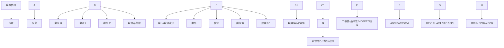
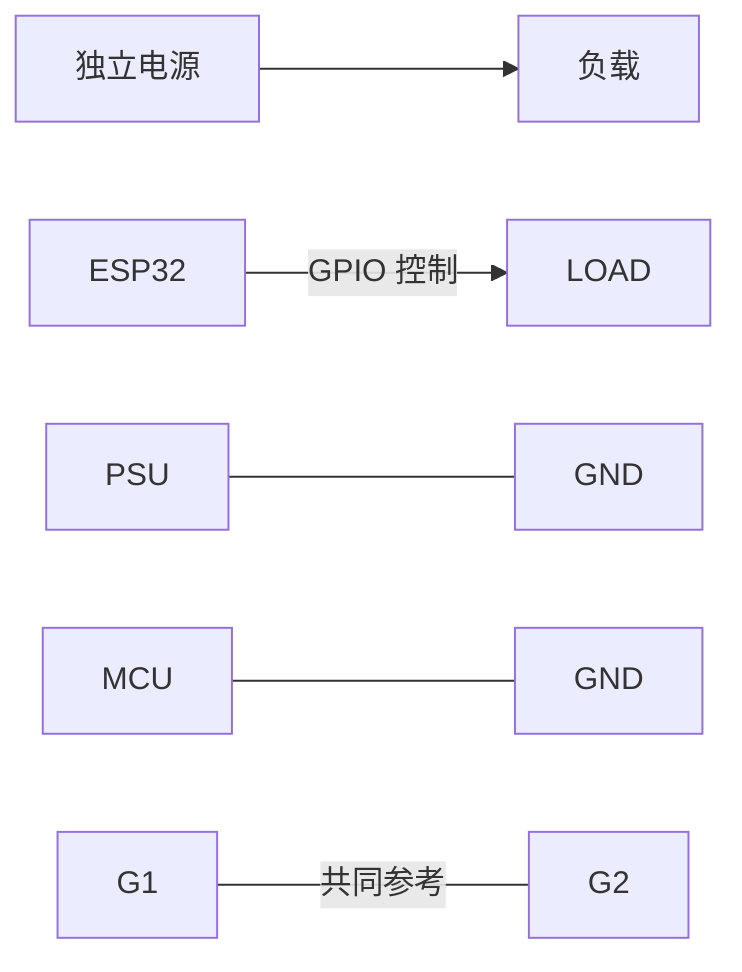
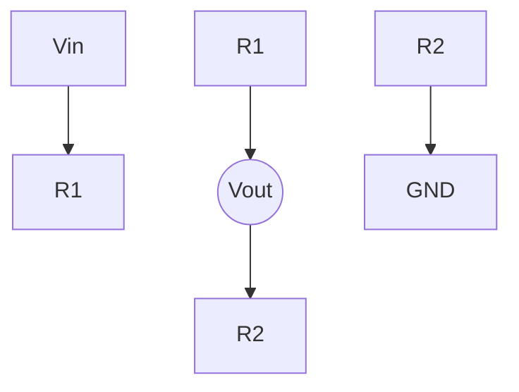
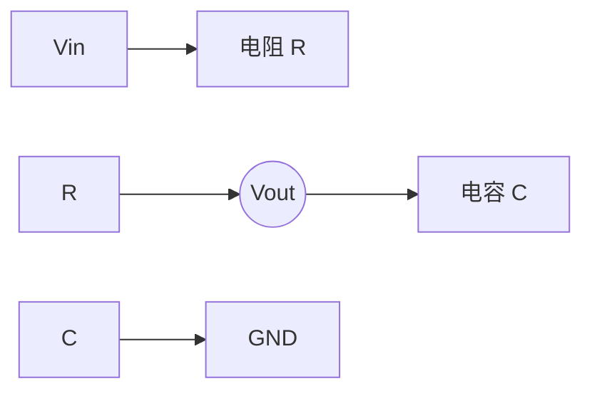
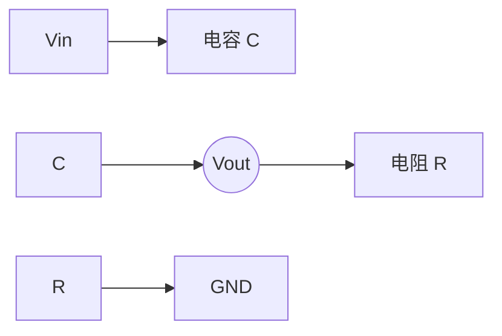
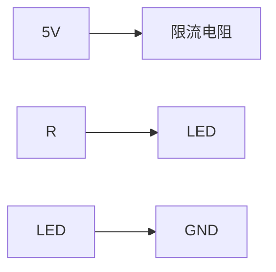
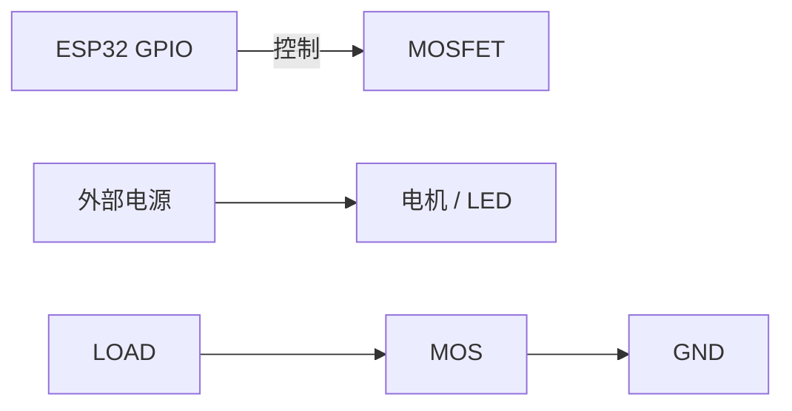
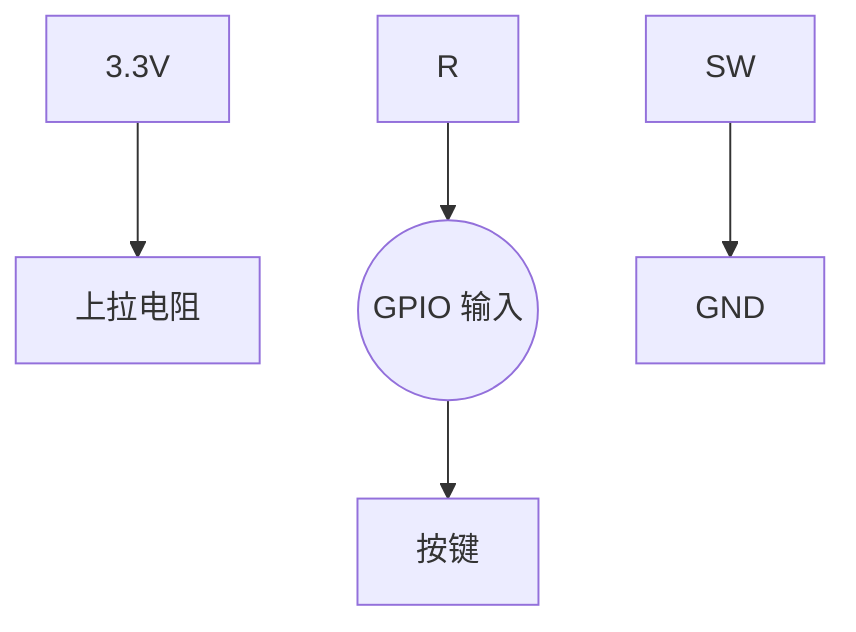
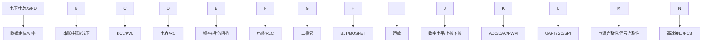

# 基础电路学习手册：从欧姆定律到 ESP32

> 适合“以前学过电路，但现在基本只记得 \\\\(U=IR\\\\)”的人。  
> 这份文档不以考试为目标，而是从物理直觉出发，重新建立一套能看懂真实原理图、能用万用表/示波器验证、能继续学习 PCB、ESP32、电机和数字通信的知识体系。

\---

## 0\. 先建立整张知识地图

大学课程经常把《电路》《模电》《数电》《信号与系统》《通信原理》分开讲，但真实硬件里它们是连在一起的。

以后看到任何陌生电路，先问四个问题：

1. **能量从哪里来？**
2. **电流的完整回路在哪里？**
3. **哪个节点的电压代表信息？**
4. **这个器件是在处理能量、处理信息，还是两者都有？**

\---

# 第一部分：电压、电流、电阻与功率

## 1\. 电荷是什么

物质内部存在带电粒子。电子带负电。

在金属导线中，可以先粗略理解为：

* 金属内部本来就有大量可以移动的电子；
* 电源建立电场；
* 电场推动电子产生有方向的整体漂移；
* 电荷的有方向运动形成电流。

工程上一般不会追踪“某一个电子去了哪里”，而是关心节点电压、支路电流和功率。

\---

## 2\. 电压是什么

### 2.1 电压永远是“两点之间”的量

完整地说，“A 点是 3.3V”其实表示：

> A 点相对于某个参考点的电压是 3.3V。

数学上：

\[
U\_{AB}=V\_A-V\_B
]

所以所谓“3.3V GPIO”，隐含条件通常是：

\[
V\_{GPIO}-V\_{GND}=3.3V
]

### 2.2 为什么需要 GND

GND 首先是**人为选择的电压参考点**，不是什么“电流消失的地方”。

如果两个设备没有共同参考，那么 ESP32 说“我的 GPIO 是 3.3V”，另一个设备未必知道这 3.3V 是相对什么而言。

这就是“共地”的核心。

\---

## 3\. 电流是什么

电流表示单位时间通过某个截面的电荷量：

\[
I=\\frac{Q}{t}
]

其中：

* (I)：电流，单位 A
* (Q)：电荷量，单位 C
* (t)：时间，单位 s

常见换算：

* 1A = 1000mA
* 1mA = 1000μA

### 一个重要直觉

电流不是“流过一个器件以后被器件吃掉了”。

在一条没有分叉的串联支路上，每个位置的电流都相同。

\---

## 4\. 电阻与欧姆定律

你还记得的：

\[
U=IR
]

这就是重新学习电路最好的入口。

另外两个形式：

\[
I=\\frac{U}{R}
]

\[
R=\\frac{U}{I}
]

### 例子：5V 加在 1kΩ 电阻上

\[
I=\\frac{5V}{1000\\Omega}=5mA
]

如果换成 10kΩ：

\[
I=\\frac{5V}{10000\\Omega}=0.5mA
]

同样的电压下，电阻越大，电流越小。

### 电阻的常见用途

* 限流
* 分压
* 上拉 / 下拉
* 设置偏置
* 电流采样
* 设置运放增益
* 与电容组成滤波器
* 高速电路中的终端匹配

\---

## 5\. 功率：电路真正消耗多少能量

\[
P=UI
]

结合欧姆定律：

\[
P=I^2R
]

\[
P=\\frac{U^2}{R}
]

### 例子：1kΩ 电阻直接接 5V

\[
P=\\frac{5^2}{1000}=0.025W=25mW
]

如果使用额定 0.25W 的普通电阻，25mW 很安全。

但如果电阻消耗超过额定功率，就可能发热、漂移甚至烧坏。

\---

# 第二部分：串联、并联、分压、KCL、KVL

## 6\. 串联

几个器件首尾相连，中间没有电流分叉，就属于串联。

核心性质：

> \\\*\\\*同一串联支路中的电流相同。\\\*\\\*

电阻串联：

\[
R\_{total}=R\_1+R\_2+\\cdots
]

\---

## 7\. 并联

几个器件的两端分别连接到相同两个节点，就是并联。

核心性质：

> \\\*\\\*并联器件两端电压相同。\\\*\\\*

两个电阻并联：

\[
R\_{eq}=\\frac{R\_1R\_2}{R\_1+R\_2}
]

并联后的总电阻一定小于其中最小的那个电阻。

\---

## 8\. 分压器

输出：

\[
V\_{out}=V\_{in}\\frac{R\_2}{R\_1+R\_2}
]

如果：

* Vin = 5V
* R1 = 10kΩ
* R2 = 10kΩ

则：

\[
V\_{out}=2.5V
]

### 为什么分压器不能随便拿来当电源

一旦在 Vout 后面接负载，负载会改变原来的电阻关系。

例如再接一个 10kΩ 到 GND，相当于它和 R2 并联：

\[
10k\\Omega \\parallel 10k\\Omega=5k\\Omega
]

于是 Vout 不再是 2.5V。

这叫**负载效应**。

\---

## 9\. KCL：基尔霍夫电流定律

KCL 中文叫：

> \\\*\\\*基尔霍夫电流定律\\\*\\\*

核心：

\[
\\sum I\_{流入}=\\sum I\_{流出}
]

本质是**电荷守恒**。

例如某节点流入 10mA，两个支路分别流出 3mA 和 2mA，那么第三个支路必须流出：

\[
10-3-2=5mA
]

\---

## 10\. KVL：基尔霍夫电压定律

KVL 中文叫：

> \\\*\\\*基尔霍夫电压定律\\\*\\\*

沿一个闭合回路走一圈：

\[
\\sum U=0
]

可以把它理解成能量守恒。

例如一个 5V 电源串联两个器件，如果第一个器件压降 2V，那么第二个器件必须承担剩余的 3V。

\---

# 第三部分：电容

## 11\. 电容到底是什么

最基本的电容由两块相互靠近、但中间绝缘的导体组成。

当电源把电子堆到其中一块极板，同时从另一块极板移走电子时：

* 一边电子过多；
* 另一边电子不足；
* 两块极板之间建立电场；
* 能量被存储在电场中。

### 电子并没有正常穿过电容的绝缘层

理想情况下，两块极板之间没有直流导电通路。

外部看到的电流来自电容**充电和放电时导线中的电荷重新分布**。

\---

## 12\. 电容量 C

\[
Q=CU
]

C 越大，表示在相同电压下能够储存越多电荷。

单位：

* F：法拉
* μF：微法
* nF：纳法
* pF：皮法

常见关系：

* 1μF = 1000nF
* 1nF = 1000pF

常见贴片/瓷片标记：

* 104 = 100nF = 0.1μF
* 103 = 10nF
* 102 = 1nF
* 101 = 100pF

\---

## 13\. 电容最重要的直觉

> \\\*\\\*理想电容两端的电压不能瞬间改变。\\\*\\\*

电容电流关系：

\[
I=C\\frac{dU}{dt}
]

不用马上死记公式，只看含义：

> 想让电容电压变化得越快，就需要越大的充放电电流。

如果要求电压在“零时间”内瞬间跳变，就意味着需要无限大的电流，真实世界做不到。

\---

## 14\. RC 充电

最重要的一点：

> \\\*\\\*Vout 就是电容上端相对于 GND 的电压，也就是电容两端电压。\\\*\\\*

假设 Vin 突然从 0V 变成 5V：

* Vin 可以由理想开关突然改变；
* 电容原来是 0V；
* 电容不能突然变成 5V；
* 电源通过 R 向 C 充电；
* Vout 才逐渐从 0V 上升到 5V。

充电规律：

\[
V\_C(t)=V\_{in}(1-e^{-t/RC})
]

重要的是理解趋势，不是背公式。

\---

## 15\. 时间常数

\[
\\tau=RC
]

(\\tau) 叫时间常数。

例如：

* R = 1kΩ
* C = 1μF

则：

\[
\\tau=1ms
]

大约：

* 1τ：达到最终值约 63%
* 2τ：约 86%
* 3τ：约 95%
* 5τ：约 99%

所以 R 越大、C 越大，电容变化越慢。

\---

# 第四部分：交流、频率与相位

## 16\. “交流”不只是家里的 220V

只要电压或电流随时间变化，就可以从时变信号的角度分析。

例如：

* 正弦波
* 方波
* PWM
* 音频
* SPI 时钟
* 无线载波

都是随时间变化的电信号。

\---

## 17\. 频率与周期

频率表示一秒重复多少次：

\[
f=\\frac{1}{T}
]

例如：

* 1Hz：每秒 1 次
* 1kHz：每秒 1000 次
* 1MHz：每秒 100 万次
* 1GHz：每秒 10 亿次

1kHz 的周期：

\[
T=1ms
]

\---

## 18\. 相位是什么

两个同频率信号即使频率和幅度一样，也可能在时间上“错开”。

这种相对时间位置常用**相位**描述。

一个完整周期是：

\[
360^\\circ
]

半个周期是：

\[
180^\\circ
]

四分之一周期是：

\[
90^\\circ
]

相位在交流、电容、电感、滤波、通信、高速信号中都很重要。

\---

# 第五部分：什么是阻抗

## 19\. 为什么只有“电阻”还不够

理想电阻的阻碍作用基本不随频率变化。

但是电容和电感不是这样。

所以交流分析引入更一般的概念：

> \\\*\\\*阻抗 Impedance：可以先理解为交流世界中的“广义电阻”。\\\*\\\*

符号：

\[
Z
]

它不只是描述电流“有多难通过”，还描述电压和电流之间的相位关系。

\---

## 20\. 电阻的阻抗

理想电阻：

\[
Z\_R=R
]

不会因为频率变化而大幅改变。

\---

## 21\. 电容的阻抗

电容阻抗的大小：

\[
|Z\_C|=\\frac{1}{2\\pi fC}
]

从这个式子只需要看趋势：

> \\\*\\\*频率越高，电容阻抗越小。\\\*\\\*

直觉原因：

* 输入变化慢，电容慢慢充完以后就几乎不再有持续电流；
* 输入变化快，电容不停充放电；
* 导线中因此持续出现更明显的交流电流。

完整表达：

\[
Z\_C=\\frac{1}{j\\omega C}
]

其中：

\[
\\omega=2\\pi f
]

现在不用深入 (j) 的复数含义，只要知道它用于同时描述幅值和相位。

\---

# 第六部分：RC 滤波器

## 22\. RC 低通为什么能滤掉高频

之前最容易误解的地方是：

> “Vout 明明从电阻后面取，信号又没有穿过电容，为什么会被电容处理？”

答案是：

> \\\*\\\*电路不是一条“信号流水线”；Vout 是一个节点，而这个节点的电压由所有连接到它的支路共同决定。\\\*\\\*

这里 Vout 本身就是电容两端电压。

### 输入变化很慢

电容有时间跟着充放电：

\[
V\_{out}\\approx V\_{in}
]

低频变化保留下来。

### 输入变化很快

电容自身电压来不及快速改变，于是 Vout 的快速变化被压小。

所以：

* 低频通过；
* 高频衰减。

这就是低通滤波。

\---

## 23\. 截止频率

一阶 RC 低通：

\[
f\_c=\\frac{1}{2\\pi RC}
]

例如：

* R = 1kΩ
* C = 1μF

则：

\[
f\_c\\approx159Hz
]

注意：

> 截止频率不是一堵墙。

不是 158Hz 完全通过、160Hz 完全消失，而是从附近开始逐渐衰减。

\---

## 24\. RC 高通

把电容放到串联位置、把电阻放到地：

低频时：

* 电容阻抗较大；
* 信号难以传过去。

高频时：

* 电容阻抗较小；
* 高频更容易到达输出。

所以这是高通。

\---

# 第七部分：电感

## 25\. 电感是什么

电感常见形式就是线圈。

电流通过线圈会产生磁场。

当电流变化时，磁场也变化，并产生反向作用。

最重要的直觉：

> \\\*\\\*电容不喜欢电压突变；电感不喜欢电流突变。\\\*\\\*

公式：

\[
U\_L=L\\frac{dI}{dt}
]

想让电感中的电流变化得越快，就需要越大的电压。

\---

## 26\. 电感的阻抗

\[
|Z\_L|=2\\pi fL
]

趋势：

> \\\*\\\*频率越高，电感阻抗越大。\\\*\\\*

和电容正好相反：

|器件|频率升高时|
|-|-|
|电阻|基本不变|
|电容|阻抗下降|
|电感|阻抗上升|

\---

## 27\. 为什么电机/继电器关断时会产生高压

电机和继电器里都有线圈。

当 MOSFET 突然关断时：

* 原来有电流；
* 电感不允许电流瞬间变成 0；
* 它会主动产生一个很高的电压试图维持原电流。

这个高压可能击穿 MOSFET。

所以直流线圈负载旁边常见**续流二极管**。

\---

# 第八部分：二极管与 LED

## 28\. 二极管

最基础直觉：

> 二极管主要允许电流朝一个方向流。

真实二极管还有：

* 正向压降
* 反向漏电
* 最大电流
* 最大反向耐压
* 开关速度

不同用途有不同二极管：

* 整流二极管
* 肖特基二极管
* 稳压二极管
* TVS
* LED

\---

## 29\. LED 为什么需要限流电阻

假设：

* 电源 = 5V
* LED 正向压降约 = 2V
* 希望电流 = 10mA

电阻两端：

\[
U\_R=5-2=3V
]

于是：

\[
R=\\frac{3V}{0.01A}=300\\Omega
]

可选择常见标准值 330Ω。

\---

# 第九部分：BJT 与 MOSFET

## 30\. 为什么 MCU 还需要晶体管

ESP32 GPIO 虽然能输出 3.3V，但它不能直接提供很大的功率。

不能直接把大功率负载接 GPIO，例如：

* 直流电机
* 大功率 LED
* 加热器
* 大继电器

所以需要晶体管作为中间控制器。

\---

## 31\. “放大”没有违反能量守恒

晶体管并不是凭空创造能量。

更准确的理解：

> \\\*\\\*用小信号控制另一个电源中的大能量。\\\*\\\*

负载真正获得的能量来自外部电源。

\---

## 32\. BJT

BJT 可以先粗略理解成：

> 用基极相关的输入控制更大的集电极电流。

三个端子：

* B：Base 基极
* C：Collector 集电极
* E：Emitter 发射极

BJT 可以工作在：

* 截止
* 放大区
* 饱和区

做开关时，主要关心截止和饱和。

\---

## 33\. MOSFET

MOSFET 更适合先理解成：

> \\\*\\\*电压控制的电子开关。\\\*\\\*

端子：

* G：Gate 栅极
* D：Drain 漏极
* S：Source 源极

关键控制量：

\[
V\_{GS}=V\_G-V\_S
]

这也解释了为什么 ESP32 和独立电机电源通常需要共地：

> 只有共同参考，GPIO 的 3.3V 才能正确形成 MOSFET 所需要的 \\\\(V\\\_{GS}\\\\)。

### Logic-Level MOSFET

用 3.3V MCU 驱动时，应关注 datasheet 是否在较低 (V\_{GS}) 下就有足够低的导通电阻。

不能只看一个模糊的“开启阈值”。

\---

# 第十部分：运算放大器

## 34\. 运放是什么

运算放大器有两个输入：

* (V\_+)：同相输入
* (V\_-)：反相输入

以及一个输出。

开环关系：

\[
V\_{out}=A(V\_+-V\_-)
]

其中 A 很大。

实际电路里通常通过**负反馈**使用。

\---

## 35\. 负反馈为什么有用

运放输出通过某种方式反馈到反相输入后，运放会不断调节输出，使两个输入尽量接近：

\[
V\_+\\approx V\_-
]

这是常见的“虚短”近似。

理想运放输入电流近似为零：

\[
I\_+\\approx I\_-\\approx0
]

称为“虚断”。

注意：

> 虚短不是两个输入真的短接；虚断也不是里面真的断路。

它们是理想负反馈条件下的分析近似。

\---

## 36\. 电压跟随器

将输出直接反馈到反相输入，输入信号接同相输入：

\[
V\_{out}\\approx V\_{in}
]

虽然电压增益约为 1，但它可以：

* 提供高输入阻抗；
* 提供较低输出阻抗；
* 隔离前后电路；
* 减轻负载效应。

\---

# 第十一部分：模拟信号与数字信号

## 37\. 模拟信号

模拟信号的数值可以连续变化。

例如温度传感器可能：

* 20°C → 0.8V
* 25°C → 1.0V
* 30°C → 1.2V

此时电压幅值本身携带信息。

\---

## 38\. 数字信号也是真实电压

数字世界中的 0 和 1，并不是脱离物理电路的抽象符号。

真实 PCB 上仍然是电压：

* 某个低电压范围代表逻辑 0；
* 某个高电压范围代表逻辑 1。

具体阈值必须看芯片 datasheet。

因此：

> \\\*\\\*数字电路本质上仍是模拟电路，只是我们只关心某些电压范围所代表的逻辑状态。\\\*\\\*

\---

## 39\. 什么是上拉和下拉

一个数字输入如果完全悬空，它可能被环境噪声影响而随机跳变。

### 上拉

按键松开：

* GPIO 通过电阻被拉到高电平。

按键按下：

* GPIO 被直接拉到 GND，成为低电平。

### 为什么不能直接把 GPIO 接 3.3V

因为按键按下时如果又直接连接 GND，就会把：

\[
3.3V \\rightarrow GND
]

直接短路。

上拉电阻限制了电流。

\---

# 第十二部分：ADC、DAC、PWM

## 40\. ADC

ADC：Analog to Digital Converter，模数转换。

作用：

> 把模拟电压转换成数字值。

12 位 ADC 有：

\[
2^{12}=4096
]

个理论量化等级。

如果范围 0\~3.3V：

\[
\\frac{3.3}{4095}\\approx0.806mV
]

实际精度还受：

* 噪声
* 参考电压
* 非线性
* 采样时间
* 前端阻抗

影响。

\---

## 41\. DAC

DAC：Digital to Analog Converter。

作用：

> 将数字值转换为模拟电压或电流。

它是真正意义上的数字到模拟转换。

\---

## 42\. PWM

PWM 并不是 MCU 随意输出 1.37V、2.14V。

它实际上高速切换：

* 0V
* 3.3V

改变高电平时间比例，称为**占空比**。

例如：

* 0%：始终低
* 25%：四分之一时间高
* 50%：一半时间高
* 100%：始终高

如果 PWM 后面接 RC 低通，就可以得到比较平滑的平均电压。

\---

# 第十三部分：电源、去耦与旁路

## 43\. 为什么芯片电源脚旁边经常有 100nF

数字芯片内部可能有大量晶体管在极短时间同时翻转。

它们会突然需要一股电流。

真实 PCB 走线有：

* 电阻
* 电感

远处电源无法在无限短时间内完美响应。

所以在芯片电源脚附近放电容：

> 让它充当一个非常靠近芯片的“小型局部电荷仓库”。

常见：

* 100nF：高频局部去耦
* 1μF / 10μF：更大的局部储能

设计时不仅“有没有电容”重要，**距离芯片电源脚多远**也很重要。

\---

## 44\. 电源的 5V / 2A 到底是什么意思

一个标称 5V / 2A 的电源通常表示：

> 在正常设计范围内，它能够把输出维持在约 5V，允许负载最多取约 2A。

它不会无条件“把 2A 灌进设备”。

一个只需要 100mA 的正常负载，就只会取大约它需要的电流。

这和：

> 电压源提供条件，负载决定实际电流

有关。

\---

# 第十四部分：万用表、示波器、逻辑分析仪

## 45\. 万用表

万用表适合：

* 直流电压
* 电阻
* 通断
* 稳定电流
* 粗略检查电源

它通常给你一个数。

\---

## 46\. 示波器

示波器显示：

> \\\*\\\*电压随时间的变化。\\\*\\\*

横轴：时间  
纵轴：电压

所以可以直接看到：

* 方波
* PWM
* 电容充放电
* 毛刺
* 振铃
* 电源纹波
* UART
* SPI
* I²C

### 示波器探头测的是什么

\[
V\_{probe}-V\_{ground}
]

所以地夹不是装饰。

很多台式示波器的地夹通过保护地连接大地，错误夹到不应该接地的节点可能造成短路。

\---

## 47\. 逻辑分析仪

逻辑分析仪重点不在精确测量模拟电压，而是判断：

* 什么时候是 0
* 什么时候是 1

然后按协议解码。

例如：

* UART → 字节
* I²C → 地址/读写/ACK/数据
* SPI → MOSI/MISO 数据

它其实是在“数字化地理解波形”。

\---

# 第十五部分：真实导线和 PCB 不是理想的

## 48\. 导线也有 R、L、C

真实 PCB 走线具有：

* 电阻
* 电感
* 对附近导体的电容

低频时，这些寄生效应可能非常小，可以忽略。

频率升高后：

> \\\*\\\*走线本身会成为电路的一部分。\\\*\\\*

这就是高速电路为什么会出现：

* 特性阻抗
* 反射
* 终端匹配
* 回流路径
* 差分对
* 眼图
* 信号完整性

\---

## 49\. 为什么高速接口大量使用串行

低速时代可以同时用很多根并行数据线。

但速度越来越高后，多根线很难做到：

* 完全同时到达
* 延时一致
* 串扰可控
* 引脚数量可接受

高速 SerDes 使用少量高速差分串行链路，降低引脚数并方便时钟恢复。

这就是 PCIe、SGMII、10G/25G Ethernet 等高速接口的基础思路之一。

\---

# 第十六部分：电机和舵机

## 50\. 电机为什么比 LED 难驱动

电机不是纯电阻负载。

它同时存在：

* 绕组电阻
* 绕组电感
* 反电动势
* 启动大电流
* 机械惯量
* 电磁噪声

所以通常需要：

* 独立电源
* MOSFET / H 桥
* 续流路径
* 电源大电容
* 去耦
* 共地
* 合理布线

\---

## 51\. 舵机为什么会让电源电压掉下来

舵机内部通常包含：

* 小电机
* 减速齿轮
* 位置传感器
* 控制电路

启动或堵转时电流会明显增加。

如果两个舵机同时动作，而电源限流较低，就可能：

* 电压下降
* 电源进入恒流模式
* ESP32 重启
* 舵机抖动

所以不能只看舵机“额定电压”，还要看瞬时电流能力。

\---

# 第十七部分：通信协议如何落到真实电路上

## 52\. UART

UART 常见：

* TX
* RX
* GND

本质是高低电平随时间变化。

协议规定：

* 空闲电平
* 起始位
* 数据位
* 校验
* 停止位
* 波特率

逻辑分析仪只是把这些电压变化重新解释成字节。

\---

## 53\. I²C

常见两根信号：

* SDA
* SCL

I²C 常使用开漏输出。

设备主要负责把总线拉低，而高电平依靠**上拉电阻**恢复。

所以你学习的“上拉电阻”会直接出现在真实通信总线上。

\---

## 54\. SPI

常见：

* SCLK
* MOSI
* MISO
* CS

SPI 规定：

* 哪根线传什么
* 哪个时钟边沿有效
* 谁是主机
* 比特顺序
* 时钟极性与相位

本质仍然是：

> 数字电压波形 + 时间规则。

\---

# 第十八部分：用现有设备做实验

## 55\. 实验 1：验证欧姆定律

准备：

* 5V 电源
* 1kΩ 电阻
* 万用表

理论：

\[
I=5mA
]

测量电压、电流，并计算：

\[
R=\\frac{U}{I}
]

看看是否接近 1kΩ。

\---

## 56\. 实验 2：验证分压和负载效应

准备：

* 5V
* 10kΩ × 2

先测中点：

\[
V\_{out}\\approx2.5V
]

然后在 Vout 和 GND 之间再并联一个 10kΩ。

重新测量。

这个实验能非常直观地理解：

> “输出端接东西”本身就可能改变原电路。

\---

## 57\. 实验 3：真正看见电容充放电

准备：

* ESP32 / Arduino
* R = 1kΩ
* C = 1μF
* 示波器

GPIO 输出低频方波。

示波器：

* CH1 看输入
* CH2 看电容电压

你会看到：

* 输入边沿很陡；
* 电容电压不是瞬间改变；
* 而是弯曲地上升和下降。

然后分别改变 R、C、频率。

\---

## 58\. 实验 4：观察低通滤波

继续使用 RC。

逐步提高输入频率。

你会看到输出：

1. 低频时基本跟随；
2. 频率提高后边沿变圆；
3. 再提高，振幅开始变小；
4. PWM 很快时，输出接近一个平均值。

此时“低通滤波器”就不再只是公式。

\---

## 59\. 实验 5：LED + MOSFET

先不要急着驱动大电机。

用：

* ESP32
* 逻辑电平 MOSFET
* LED
* 限流电阻
* 外部电源

观察：

> GPIO 提供的是控制信息，真正给负载提供能量的是外部电源。

\---

# 第十九部分：拿到原理图应该怎么看

## 60\. 第一步：先找电源树

寻找：

* VIN
* 12V
* 5V
* 3V3
* 1V8
* 1V0
* GND

搞清楚：

* 外部电源从哪里进来；
* 经过哪些 DC-DC / LDO；
* 分出了哪些电压轨。

\---

## 61\. 第二步：找核心芯片

例如：

* CPU
* MCU
* FPGA
* PHY
* DDR
* Flash
* PMIC
* ADC
* 运放

先知道整块板“谁是主角”。

\---

## 62\. 第三步：先看功能块，不要追每根线

例如把板分成：

* 电源
* 时钟
* 复位
* CPU
* DDR
* Ethernet
* PCIe
* SPI Flash
* JTAG
* 风扇/传感器

先建立模块关系，再追细节。

\---

## 63\. 第四步：最后看单根信号

这时再问：

* 这是什么电压域？
* 谁驱动谁？
* 有没有上拉？
* 有没有串联电阻？
* 有没有 AC 耦合电容？
* 是单端还是差分？
* 时钟在哪里？
* 回流路径在哪里？

这样看大规模原理图会比从第一页第一根线开始容易得多。

\---

# 第二十部分：20 条必须形成肌肉记忆的直觉

1. 电压一定是两点之间的差。
2. GND 首先是参考节点。
3. 电流必须有完整回路。
4. 电阻把电压和电流联系起来。
5. (U=IR) 是基本关系之一。
6. 功率 (P=UI) 决定发热和能量消耗。
7. 串联支路电流相同。
8. 并联器件两端电压相同。
9. KCL 本质是电荷守恒。
10. KVL 本质是能量守恒。
11. 电容储存电场能量。
12. 电容两端电压不能瞬间改变。
13. 电感储存磁场能量。
14. 电感中的电流不能瞬间改变。
15. 阻抗是交流电路中的广义电阻。
16. 频率越高，理想电容阻抗越低。
17. 频率越高，理想电感阻抗越高。
18. 晶体管不创造能量，只控制能量。
19. 数字信号本质仍然是真实模拟电压。
20. 频率越高，PCB 走线越不能被当作理想导线。

\---

# 第二十一部分：推荐的重学顺序

不要重新按大学教材顺序一次背完。

更有效的方法是：

> \\\*\\\*每学一个概念，都用面包板 + 万用表/示波器把它变成一个真实现象。\\\*\\\*

\---

# 附录 A：常用单位

|物理量|单位|常见子单位|
|-|-|-|
|电压|V|mV、μV|
|电流|A|mA、μA|
|电阻|Ω|kΩ、MΩ|
|电容|F|μF、nF、pF|
|电感|H|mH、μH、nH|
|频率|Hz|kHz、MHz、GHz|
|功率|W|mW、kW|

|前缀|符号|数量级|
|-|-:|-:|
|giga|G|(10^9)|
|mega|M|(10^6)|
|kilo|k|(10^3)|
|milli|m|(10^{-3})|
|micro|μ|(10^{-6})|
|nano|n|(10^{-9})|
|pico|p|(10^{-12})|

\---

# 附录 B：现阶段最值得掌握的公式

欧姆定律：

\[
U=IR
]

功率：

\[
P=UI
]

分压：

\[
V\_{out}=V\_{in}\\frac{R\_2}{R\_1+R\_2}
]

电容：

\[
Q=CU
]

\[
I\_C=C\\frac{dU}{dt}
]

电感：

\[
U\_L=L\\frac{dI}{dt}
]

RC 时间常数：

\[
\\tau=RC
]

RC 截止频率：

\[
f\_c=\\frac{1}{2\\pi RC}
]

电容阻抗：

\[
|Z\_C|=\\frac{1}{2\\pi fC}
]

电感阻抗：

\[
|Z\_L|=2\\pi fL
]

不要一次死记这些公式。

正确学习顺序应该是：

> \\\*\\\*先看见现象 → 建立直觉 → 再看公式如何准确描述这个现象。\\\*\\\*

\---

# 附录 C：接下来可以继续学什么

当这份基础真正熟悉后，再继续：

* 戴维南等效
* 诺顿等效
* 叠加定理
* 一阶和二阶系统
* 拉普拉斯变换
* 复数阻抗
* 相量
* 波特图
* RLC 谐振
* 运放反馈理论
* BJT / MOSFET 小信号模型
* LDO 与 DC-DC
* 传输线
* 特性阻抗
* 反射
* 终端匹配
* S 参数
* 差分信号
* SerDes
* 眼图
* 信号完整性 SI
* 电源完整性 PI
* EMI / EMC

这些内容不是突然冒出来的新世界。

它们都是从：

> \\\*\\\*电压、电流、能量、时间变化、频率和真实器件的非理想特性\\\*\\\*

一步一步发展出来的。

\---

# 结语

重新学电路，真正值得重建的是这一条逻辑：

> \\\*\\\*电源建立电压 → 电压推动电流 → R/C/L 等元件决定电压和电流怎样变化 → 波形携带信息 → 二极管、晶体管、运放对能量或信号进行处理 → ADC / 数字电路把波形变成数字信息 → MCU 按协议理解这些信息。\\\*\\\*

以后遇到陌生电路，先回到三个问题：

1. **电源在哪里？**
2. **电流完整回路在哪里？**
3. **我关心的节点电压随时间到底怎样变化？**

把这三个问题问清楚，大量复杂电路都会开始变得可解释。

