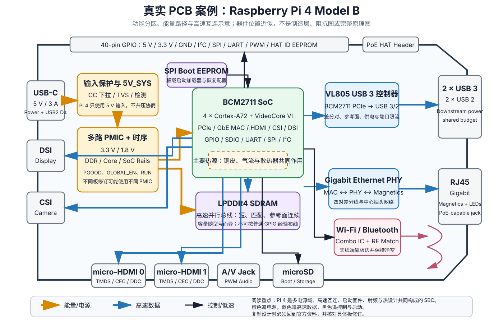

# 真实 PCB 案例补充：Raspberry Pi 4 Model B

> **证据状态：`DOCUMENTED`**  
> 本文分析已经量产并由 Raspberry Pi 官方公开文档支持的 Raspberry Pi 4 Model B。分析依据官方产品规格、Rev 4.0 精简原理图、处理器与启动文档整理。本文没有把本仓库中某一块实体 Pi 4 的全部电源轨、高速总线和温升逐项复测，因此不标记为 `HARDWARE_VERIFIED`。
>
> 相关文档：[《真实、可工作的 PCB 案例拆解》](真实PCB案例拆解.md)、[《常用电路组件与功能模块手册》](常用电路模块手册.md) 和 [Raspberry Pi 4 工程目录](../../raspberry-pi-4/README.md)。

---

## 目录

1. [为什么单独拆 Raspberry Pi 4](#1-为什么单独拆-raspberry-pi-4)
2. [先看整板功能分区](#2-先看整板功能分区)
3. [系统架构：它不是一块“大号 MCU 板”](#3-系统架构它不是一块大号-mcu-板)
4. [电源入口与多路电源树](#4-电源入口与多路电源树)
5. [上电、复位与启动 EEPROM](#5-上电复位与启动-eeprom)
6. [BCM2711 与 LPDDR4](#6-bcm2711-与-lpddr4)
7. [USB：PCIe、VL805 与四个端口](#7-usbpcie-vl805-与四个端口)
8. [千兆以太网与 PoE](#8-千兆以太网与-poe)
9. [双 HDMI、CSI、DSI 与音频](#9-双-hdmi-csi-dsi-与音频)
10. [Wi-Fi、Bluetooth 与射频布局](#10-wi-fibluetooth-与射频布局)
11. [GPIO、HAT ID 与外设供电](#11-gpiohat-id-与外设供电)
12. [电源完整性、热设计和机械设计](#12-电源完整性热设计和机械设计)
13. [真实故障如何映射回 PCB](#13-真实故障如何映射回-pcb)
14. [建议实测路线](#14-建议实测路线)
15. [可以借鉴什么，不能照抄什么](#15-可以借鉴什么不能照抄什么)
16. [与前四个案例放在一起比较](#16-与前四个案例放在一起比较)
17. [官方资料与版本说明](#17-官方资料与版本说明)

---

# 1. 为什么单独拆 Raspberry Pi 4

Arduino UNO、ESP32-DevKitC 和 RP2040 最小系统仍然可以用“MCU + 外围”理解。Raspberry Pi 4 已经属于完整的单板计算机，板上同时存在：

- 多核应用处理器；
- LPDDR4 高速内存；
- 多路开关电源和电源时序；
- 板载启动 EEPROM；
- microSD 存储接口；
- PCIe 内部互连；
- USB 3.0 控制器和 USB Hub；
- 千兆以太网 PHY 与网络变压器；
- 双 HDMI、CSI、DSI 等高速接口；
- Wi-Fi / Bluetooth 射频系统；
- Linux 启动链、固件和设备树；
- 明显的热设计和系统功耗问题。

它适合回答一个很关键的问题：

> 当 PCB 从“控制板”升级为“计算机主板”以后，原来学过的 RC、去耦、稳压、复位和差分线，是怎样扩展成一个完整系统的？

Pi 4 也能帮助区分三种完全不同的复杂度：

| 层次 | 典型内容 | 是否适合初学者直接复制 |
|---|---|---|
| 功能模块 | TVS、PMIC、EEPROM、PHY、连接器 | 可以理解并局部借鉴 |
| 板级系统架构 | 电源树、启动链、PCIe→USB、MAC→PHY | 可以按模块学习 |
| SoC + LPDDR4 完整实现 | BGA 逃线、长度匹配、阻抗、时序、SI/PI | 不应仅凭精简原理图照抄 |

因此本文的目标不是教你“复刻一块 Pi 4”，而是让你学会看懂它的板级结构，并知道自己的机器人或嵌入式产品何时应该使用 Compute Module。

---

# 2. 先看整板功能分区



这张图按照功能重新绘制，并不表示精确器件坐标或铜层结构。阅读时沿三类路径追踪：

- **橙色：能量路径**，从 USB-C 的 5 V 进入 PMIC，再分配给 SoC、内存和接口；
- **蓝色：高速信息路径**，例如 PCIe、USB 3、LPDDR4、HDMI、CSI、DSI 和千兆以太网；
- **黑色：控制与启动路径**，例如 SPI Boot EEPROM、复位、GPIO 和无线控制。

先不要逐个认电阻电容。先回答：

1. 5 V 从哪里进入？
2. 谁生成核心电压和内存电压？
3. CPU 从哪里取得第一段启动代码？
4. 四个 USB 口为什么还要一颗 VL805？
5. 网口为什么不直接接 SoC 引脚？
6. 哪些接口属于受控阻抗差分线？
7. 哪些区域既是电源完整性问题，也是热问题？

---

# 3. 系统架构：它不是一块“大号 MCU 板”

Pi 4 的中心是 BCM2711。它不仅包含 CPU，还集成 GPU、多媒体、内存控制器以及大量 I/O 控制器。

从板级视角，可以把整板分成六大域：

| 域 | 主要器件或接口 | 核心问题 |
|---|---|---|
| 计算域 | BCM2711、LPDDR4 | 高速并行总线、供电、散热 |
| 启动域 | SPI EEPROM、microSD | 上电顺序、Bootloader、恢复 |
| 电源域 | USB-C、保护、PMIC、辅助稳压 | 多电源轨、时序、瞬态和压降 |
| 高速有线域 | VL805、USB、GbE PHY、HDMI、CSI、DSI | 阻抗、回流、串扰、ESD |
| 无线域 | Wi-Fi/BT Combo、匹配网络、天线 | 净空、射频回流、认证 |
| 扩展域 | 40-pin GPIO、HAT ID、PoE Header | 电平、负载、供电预算和误接保护 |

最重要的整体认识是：

> Linux 能不能启动，并不只由 BCM2711 决定。电源、EEPROM、SDRAM、存储、时钟和固件中的任何一个环节失败，表现都可能只是“没有画面”。

---

# 4. 电源入口与多路电源树

## 4.1 USB-C 输入不是笔记本式高压 PD 输入

Pi 4 Model B 的推荐供电为 5 V、3 A，官方电源标称 5.1 V、3 A，用略高的输出补偿线缆和连接器压降。

这里要避免一个常见误区：

> USB-C 只是连接器形式，不代表设备一定协商 9 V、12 V 或 20 V。

Pi 4 以 5 V 作为系统输入，不应向板子直接施加更高电压。官方文档也明确指出 Raspberry Pi 设备不支持 USB-PPS。

## 4.2 先区分“电源额定”与“板上实际电压”

电源端输出 5.1 V，不代表 Pi 板上仍有 5.1 V。真实路径包含：

- 电源内部阻抗；
- USB-C 线缆电阻；
- 连接器接触电阻；
- PCB 铜箔和过孔阻抗；
- 瞬态负载造成的压降。

压降近似：

$$
\Delta V=I R
$$

假设供电路径总电阻为 0.15 Ω，瞬时电流为 2.5 A：

$$
\Delta V=2.5\times0.15=0.375\text{ V}
$$

即使电源空载测得正常，负载突变时也可能触发欠压。

## 4.3 5V_SYS 不是所有芯片的直接工作电压

5 V 进入后，PMIC 和辅助稳压器生成多个电源域。官方精简原理图能看到诸如：

- 3V3；
- 1V8；
- 1V1_DDR；
- VDD_CORE；
- 1V0_SOC / 1V05_VLI 一类低压轨；
- 音频和 HDMI 等局部供电。

不同 Pi 4 板修订可能使用不同 PMIC，具体器件型号和外围不能跨版本机械照抄。但系统目标不变：

1. 把 5 V 转换成多组低压；
2. 按规定顺序上电；
3. 产生 Power-Good；
4. 在掉电和故障时使系统进入确定状态；
5. 支持动态电压和频率调整。

## 4.4 为什么使用开关电源而不是多个 LDO

若把 5 V 线性降到 1.0 V，电流为 2 A：

$$
P_{loss}=(5-1)\times2=8\text{ W}
$$

这显然不可接受。因此核心和内存电源必须使用高效率开关转换。LDO 只适合局部低噪声或小电流场景。

## 4.5 电感、电容与 PMIC 是一个动态系统

PMIC 周围的电感和电容不是“按容量凑数”。它们共同决定：

- 电感纹波电流；
- 输出纹波；
- 负载阶跃响应；
- 环路稳定性；
- 饱和和温升；
- EMI；
- 多路电源之间的耦合。

布局时最关键的是缩小高 $di/dt$ 开关回路，而不是把器件排列得整齐。

## 4.6 从 GPIO 5 V 引脚供电意味着什么

Pi 4 官方规格允许从 5 V GPIO 引脚供电，但这要求外部电源本身：

- 电压准确；
- 能提供足够电流；
- 有合适限流和故障保护；
- 不会和 USB-C 电源互相倒灌；
- 接线极性绝对正确。

这种方式绕过了 USB-C 连接器和 CC 识别路径。它不是“随便找个 5 V 模块接上去”那么简单。

---

# 5. 上电、复位与启动 EEPROM

## 5.1 Pi 4 的第一段启动代码不在 microSD 中

Pi 4 与早期 Raspberry Pi 的一个重要区别是：

> 板上有独立 SPI EEPROM，存放可更新的 Bootloader。

microSD、USB 存储和网络设备负责提供后续启动文件或操作系统，但 Bootloader 本身位于板载 EEPROM。

这带来几个工程好处：

- 可以修复和升级启动逻辑；
- 可以配置启动顺序；
- 可以支持 USB、网络和 SD 等多种启动路径；
- 存储介质损坏时仍有独立恢复机制。

同时也带来新的故障类型：

- EEPROM 内容损坏；
- EEPROM 版本太旧；
- Boot Order 不符合预期；
- EEPROM 写保护或恢复配置问题。

## 5.2 简化启动链

可以把正常启动抽象为：

> 5 V 稳定 → PMIC 生成各电源轨 → Power-Good / Reset 释放 → BCM2711 Boot ROM → SPI EEPROM Bootloader → 选择 SD/USB/网络 → 加载固件、设备树和内核 → Linux

这里每个箭头都可能失败。

| 失败位置 | 常见表现 |
|---|---|
| 5 V 或 PMIC | PWR LED 异常、反复重启、完全无响应 |
| EEPROM | ACT LED 特定闪烁、找不到启动介质 |
| microSD / USB 存储 | Bootloader 工作但系统文件不可读 |
| SDRAM 初始化 | 很早阶段停止，没有正常内核日志 |
| 内核/设备树 | 彩虹屏后卡住、外设异常、Kernel Panic |
| 文件系统 | 启动慢、只读、服务失败 |

## 5.3 RUN 与 GLOBAL_EN 不是同一个信号

官方精简原理图特别标注：

- `RUN` 属于 3.3 V 逻辑域；
- `GLOBAL_EN` 属于 5 V 系统控制域。

它们的作用和电压域不同，不能随意短接或用未知电压驱动。

这说明读取原理图时不能只看到“都是复位相关引脚”，还必须核对：

- 电压域；
- 有效电平；
- 是否允许外部驱动；
- 复位范围是 SoC 还是整个电源系统。

## 5.4 EEPROM 相关检查命令

在 Raspberry Pi OS 中常用：

```bash
sudo rpi-eeprom-update
vcgencmd bootloader_version
```

第一条检查 Bootloader EEPROM 更新状态，第二条读取当前 Bootloader 版本。命令输出应与所用 Raspberry Pi OS 和 EEPROM 包版本一起解释。

---

# 6. BCM2711 与 LPDDR4

## 6.1 为什么内存放得离 SoC 很近

LPDDR4 不是普通 SPI 外设。它包含：

- 高速时钟；
- 命令/地址线；
- 多组数据与选通信号；
- 严格的时序窗口；
- 终端和参考电压要求；
- 多个电源域和大量去耦。

布局必须控制：

- 总线拓扑；
- 线长与组内匹配；
- 特性阻抗；
- 过孔数量；
- 参考面连续性；
- 串扰；
- 电源噪声和地弹。

所以 RAM 必须紧靠 SoC，并且在封装逃线阶段就开始做信号完整性设计。

## 6.2 为什么官方只公开“Reduced Schematics”很重要

官方 Pi 4 原理图明确标为 Reduced Schematics。它公开了连接器、电源和部分外围，但不会给出足以直接复制 BCM2711 + LPDDR4 主系统的全部实现细节。

因此你可以从中学习：

- 端口和电源结构；
- PMIC 输出轨；
- GPIO、PoE、HDMI、CSI、DSI 等外围；
- 测试点和系统控制信号。

但不能据此声称已经掌握：

- 完整 DDR 走线约束；
- BGA 扇出；
- 所有电源平面目标阻抗；
- SoC 封装级设计规则；
- 完整 SI/PI 仿真模型。

## 6.3 去耦不再只是“一颗 0.1 µF”

在应用处理器和 DDR 系统中，去耦通常形成多层次网络：

- 芯片引脚和 BGA 下方的小容量低 ESL 电容；
- 芯片周边的中等容量陶瓷电容；
- 电源转换器附近的输出电容；
- 5 V 入口和端口附近的储能；
- 电源平面自身的分布电容。

目标是让电源分配网络在一段频率范围内保持较低阻抗，而不是只计算总容量。

## 6.4 热源与内存可靠性

BCM2711 是主要热源，但热不会只停留在芯片封装上。热会通过：

- 焊球；
- PCB 铜层；
- 附近器件；
- 空气；
- 散热器和外壳；

扩散到整个系统。持续高温会增加电源损耗、改变器件参数，并影响存储和连接器的长期可靠性。

---

# 7. USB：PCIe、VL805 与四个端口

## 7.1 USB 端口不直接等于 SoC 内部 USB 控制器

Pi 4 的四个下行 USB 端口连接到 VL805 控制器。BCM2711 通过 PCIe 与 VL805 通信：

> BCM2711 PCIe → VL805 → USB 3.0 / USB 2.0 Hub → 四个外部端口

这很好地说明协议分层：

- 外部设备说 USB；
- 板内 SoC 到控制器走 PCIe；
- 控制器内部再管理 USB 2 Hub、USB 3 链路和端口电源。

## 7.2 为什么 USB 2 设备会共享带宽

官方文档说明，四个端口的 USB 2.0 线路连接到 VL805 内部的单个 USB 2.0 Hub。因此多个 USB 2.0 设备共享一条 USB 2.0 上行带宽。

这也是为什么“有四个口”不等于“有四条完全独立的总线”。

## 7.3 USB 端口还有电源预算

Pi 4 四个 USB 端口的外设供电总预算不是无限的。官方给出的总电流限制为 1.2 A，所有端口共享。

因此外接硬盘、SSD、4G 模块或多个高功耗设备时，必须同时考虑：

- 5 V 输入电源能力；
- 线缆压降；
- 板上端口限流；
- 启动浪涌；
- 设备同时启动；
- 是否应使用有源 USB Hub。

## 7.4 USB-C 上的数据线

Pi 4 的 USB-C 连接器除供电外还带有 USB 2.0 D+/D−，连接到早期型号所使用的 USB 控制器路径。官方说明该控制器在 Pi 4 的常规使用中默认关闭。

因此：

- USB-C 不是四个下行 USB 口的上行接口；
- 也不是视频输出接口；
- 标准使用中它主要承担供电；
- 是否启用 Gadget/OTG 模式属于启动配置和软件问题。

## 7.5 PCB 布局重点

PCIe 和 USB 3.0 都是高速差分链路，需要：

- 受控差分阻抗；
- 连续参考平面；
- 对内长度匹配；
- 低损耗材料和合理过孔；
- 避免长支线；
- 连接器、ESD 和共模器件造成的阻抗不连续最小化；
- 电源噪声不能耦合到收发器参考电源。

普通 10× 被动探头直接接在 USB 3.0 或 PCIe 差分线上，通常只会破坏信号，而不会得到可信测量。

---

# 8. 千兆以太网与 PoE

## 8.1 MAC、PHY 和网络变压器是三层不同功能

简化路径是：

> BCM2711 内部 GbE MAC → 外部 Ethernet PHY → 四对差分线 → 网络变压器 → RJ45

各自作用：

- **MAC**：处理以太网帧、DMA 和链路控制；
- **PHY**：把数字数据转换为双绞线上的物理电信号；
- **Magnetics**：隔离、共模抑制和与线缆耦合；
- **RJ45**：机械连接，并集成状态灯和可能的中心抽头连接。

这正是“协议层”和“电气物理层”不能混为一谈的例子。

## 8.2 千兆网不是两根线

1000BASE-T 使用四对双绞线，每对都双向工作。PCB 侧要关注：

- 四对差分阻抗；
- 对内匹配；
- PHY 到磁性器件距离；
- 中心抽头电源与滤波；
- 机壳地、数字地和屏蔽策略；
- ESD 和浪涌回流；
- RJ45 周围的爬电和机械应力。

## 8.3 PoE 为什么还需要 HAT

Pi 4 的 RJ45 和 PoE Header 支持把线缆中的 PoE 电源引出，但主板本身不直接完成完整 PoE 受电转换。

PoE HAT 还需要完成：

- 受电设备检测和分类；
- 高压输入；
- 隔离或规定拓扑的 DC-DC；
- 把 PoE 电压转换为 Pi 所需 5 V；
- 故障和浪涌处理。

不要把 PoE Header 当成普通低压 5 V 引脚。

---

# 9. 双 HDMI、CSI、DSI 与音频

## 9.1 双 micro-HDMI

每个 HDMI 口包含：

- 多组 TMDS 高速差分对；
- DDC I²C；
- Hot Plug Detect；
- CEC；
- 5 V 辅助电源；
- 屏蔽和地。

布局重点包括：

- 差分阻抗；
- 通道长度和偏斜；
- ESD 结电容；
- 连接器焊盘不连续；
- 两个 HDMI 口之间和与其他高速线之间的串扰。

## 9.2 CSI 和 DSI

摄像头和显示接口使用 MIPI 差分链路。除了高速数据线，还存在：

- I²C 控制；
- GPIO；
- 多种供电；
- FFC 连接器机械约束；
- 排线插反和接触不良风险。

看似“只有一条排线”，实际同时承载高速数据、控制和电源。

## 9.3 音频输出

3.5 mm A/V Jack 的模拟音频由 PWM 等数字信号经过缓冲和低通网络得到。

这是一个真实的“数字 PWM + 模拟滤波”应用：

> 高速 PWM → RC/有源滤波 → 模拟音频

因此音频质量与 PWM 频率、滤波器、参考地、电源噪声和输出负载都有关。

---

# 10. Wi-Fi、Bluetooth 与射频布局

## 10.1 无线区域不能按普通数字电路处理

Pi 4 支持双频 Wi-Fi 和 Bluetooth。无线部分包含：

- Combo 芯片；
- 射频电源去耦；
- 晶体/参考时钟；
- 匹配网络；
- 天线或天线连接结构；
- 数字控制总线。

射频路径的毫米级变化都可能改变阻抗和辐射性能。

## 10.2 天线附近为什么要净空

天线端应远离：

- 金属外壳；
- 大块铜皮；
- USB 3.0 高速线；
- HDMI 线；
- 电感和开关节点；
- 电池和排线；
- 手和安装螺柱。

错误的机械结构可能让裸板测试正常，装进外壳后距离和吞吐明显下降。

## 10.3 USB 3 与 2.4 GHz 干扰

USB 3.0 的宽频噪声可能落入 2.4 GHz 附近。实际系统中，USB 3 设备、线缆和未良好屏蔽的连接器都可能影响无线性能。

排查 Wi-Fi 变差时，不应只看软件：

1. 暂时拔掉 USB 3 设备；
2. 改用 USB 2 端口；
3. 改变线缆和设备位置；
4. 比较 2.4 GHz 与 5 GHz；
5. 检查金属外壳和散热片位置。

---

# 11. GPIO、HAT ID 与外设供电

## 11.1 40-pin 排针包含多类信号

排针上同时存在：

- 5 V；
- 3.3 V；
- 多个 GND；
- 3.3 V GPIO；
- I²C、SPI、UART、PWM 等复用功能；
- HAT ID EEPROM 专用引脚。

它不是“40 个普通 GPIO”。

## 11.2 GPIO 不能承受 5 V

BCM2711 GPIO 属于 3.3 V 逻辑。外部 5 V 信号需要电平转换、分压、开漏上拉或专用收发器。

每个 GPIO 的安全驱动电流也有限。官方文档给出的保守值是单脚不超过 16 mA，全部 GPIO 合计安全电流约 50 mA。大电流负载必须使用驱动器。

## 11.3 ID_SD / ID_SC 为什么不能随便用

官方原理图明确说明，HAT ID EEPROM 使用专用 I²C 引脚。启动时系统会读取 EEPROM，以自动识别扩展板并配置 GPIO 和驱动。

所以兼容 HAT 的设计应：

- 按 HAT 规范使用 EEPROM；
- 不把 ID 引脚当普通 I²C 任意占用；
- 考虑 EEPROM 上电状态和地址；
- 保证主板启动时不会被外设拉死总线。

## 11.4 外设供电预算

GPIO 排针的 5 V 和 3.3 V 不是无限电源。外设总功耗会影响：

- USB-C 输入电流；
- PMIC 温升；
- 3.3 V 稳压余量；
- USB 外设预算；
- 欠压与系统稳定性。

电机、舵机和大功率 LED 不应直接由 GPIO 电源轨随意供电。

---

# 12. 电源完整性、热设计和机械设计

## 12.1 为什么 Pi 4 对电源线很敏感

CPU、GPU、内存、USB 和网络负载同时变化时，电流会快速波动。电源问题可能表现为：

- 随机重启；
- USB 设备掉线；
- microSD 写入损坏；
- CPU 降频；
- 屏幕闪烁；
- 网络不稳定；
- 只有高负载时失败。

官方低压检测电路会在输入低于约 4.63 V（带容差）时报告欠压。

## 12.2 温度与性能不是互不相关

Raspberry Pi 固件会根据温度和负载调整电压与频率。温度接近限制时，系统会逐步降频保护。

因此性能测试必须同时记录：

- SoC 温度；
- 频率；
- 欠压/节流标志；
- 环境温度；
- 外壳和风扇状态。

只记录“跑分”而不记录这些条件，结果没有可比性。

## 12.3 PCB 铜层也是散热结构

热量不仅通过顶部散热片离开，还会通过 BGA 焊球和 PCB 铜层扩散。布局时：

- 大芯片附近的铜和地平面提供热扩散；
- 过孔可以把热量传到其他层；
- 相邻高耗散器件会互相加热；
- 连接器会阻挡或引导气流；
- 外壳开孔决定自然对流。

## 12.4 连接器机械布局也是电气设计

Pi 4 把 USB、RJ45、HDMI、USB-C 和 FFC 放在板边，原因不仅是方便插线，还包括：

- 减少线缆进入板内的距离；
- 把 ESD 能量限制在边缘；
- 便于外壳开孔；
- 避免插拔应力传到 BGA 区域；
- 缩短 PHY/ESD/连接器链路。

---

# 13. 真实故障如何映射回 PCB

## 13.1 彩虹图标、欠压警告或随机重启

优先排查：

1. 电源输出能力；
2. USB-C 线缆压降；
3. GPIO 5 V 供电接线；
4. USB 外设启动浪涌；
5. HAT 和风扇负载；
6. 接触不良；
7. 板上短路或异常发热。

应在 Pi 的 5 V/GND 处测电压，而不是只在电源输出端测。

## 13.2 有电源灯但不启动

按启动链排查：

- EEPROM 是否有效；
- ACT LED 闪烁模式；
- microSD 是否可读；
- 启动分区文件是否完整；
- HDMI 是否插在预期端口；
- 是否能从 UART 看到早期日志；
- 外设是否拉坏 GPIO 或供电。

## 13.3 USB SSD 偶发掉线

可能原因包括：

- USB 端口总电流不足；
- SSD 盒启动浪涌；
- 线缆质量；
- USB 3 信号完整性；
- VL805 固件或软件；
- 电源掉压；
- 过热。

先使用独立供电 Hub 或有源硬盘盒验证，能快速区分“协议问题”和“电源问题”。

## 13.4 以太网只能协商到 100 Mb/s

检查：

- 网线是否支持四对；
- 水晶头压接；
- 交换机端口；
- PHY 驱动和协商；
- RJ45 是否受机械损伤；
- 附近是否有强共模干扰。

千兆网络需要四对线，任意一对异常都可能降级。

## 13.5 装入金属外壳后 Wi-Fi 明显变差

这是典型射频结构问题。检查：

- 天线方向；
- 金属外壳距离；
- 散热片尺寸；
- USB 3 设备和线缆；
- HAT 覆盖；
- 外壳是否形成屏蔽腔体。

## 13.6 高负载性能忽高忽低

同时执行：

```bash
vcgencmd measure_temp
vcgencmd get_throttled
```

`get_throttled` 返回 `0x0` 通常表示未记录欠压或节流；非零值需要结合位定义判断当前和历史状态。

---

# 14. 建议实测路线

## 14.1 实验一：测量供电压降

**设备**：可调直流电源或官方 5.1 V 电源、USB-C 电流表、万用表、示波器。

步骤：

1. 空载启动，测电源端和 GPIO 5 V 对 GND；
2. 运行 CPU 负载；
3. 加入 USB SSD 或摄像头；
4. 比较不同 USB-C 线缆；
5. 记录最低电压、平均电流和 `get_throttled`。

重点是把“电源端正常”与“板端正常”分开。

## 14.2 实验二：观察启动链

1. 读取 EEPROM 版本；
2. 拔掉 microSD，观察 LED 行为；
3. 制作官方恢复卡；
4. 配置 USB Boot；
5. 比较从 SD 与 USB SSD 启动；
6. 记录 Bootloader、固件和内核三层版本。

不要把 EEPROM 更新、OS 更新和重刷存储介质混成一件事。

## 14.3 实验三：USB 拓扑与带宽

```bash
lsusb -t
```

观察：

- VL805 下的 Hub 层级；
- 设备工作在 480M 还是 5000M；
- 多个 USB 2 设备是否共享带宽；
- 高功耗设备是否需要有源 Hub。

## 14.4 实验四：以太网物理层

```bash
sudo ethtool eth0
```

记录：

- 协商速率；
- 双工；
- Link detected；
- 错包和重协商；
- 不同网线下的差异。

## 14.5 实验五：热与降频

1. 记录待机温度；
2. 运行持续 CPU/GPU 负载；
3. 比较裸板、散热片、外壳和风扇；
4. 每分钟记录温度和 `get_throttled`；
5. 同时记录环境温度。

## 14.6 实验六：射频与 USB 3 干扰

1. 固定 AP、距离和信道；
2. 记录 Wi-Fi RSSI 和吞吐；
3. 插入 USB 3 SSD 并持续读写；
4. 改用 USB 2；
5. 改变 USB 线和外壳；
6. 比较 2.4 GHz 与 5 GHz。

## 14.7 哪些信号不要直接测

普通桌面示波器和被动探头不适合直接测：

- LPDDR4；
- PCIe；
- USB 3 SuperSpeed；
- HDMI TMDS；
- MIPI CSI/DSI。

原因包括：

- 探头电容严重加载；
- 地线引入反射；
- 带宽不足；
- 单端探测破坏差分共模；
- 地夹可能短接不同参考点。

入门阶段应通过协议状态、系统日志、误码、吞吐和电源波形间接定位。

---

# 15. 可以借鉴什么，不能照抄什么

## 15.1 可以借鉴

- 把电源树画成明确的多路结构；
- 把启动 EEPROM 与操作系统存储分开；
- 把 MAC、PHY、磁性器件和连接器分层理解；
- 把 PCIe、USB、HDMI、MIPI 都当作需要专门布局规则的差分链路；
- 把射频、热、机械和 PCB 一起设计；
- 在连接器边缘处理 ESD 和回流；
- 预留测试点、状态灯和恢复路径；
- 使用系统软件读取欠压、温度和启动状态。

## 15.2 不能照抄

- 不能凭精简原理图直接复刻 BCM2711 + LPDDR4；
- 不能不知道板修订就抄 PMIC 和器件型号；
- 不能把 5 V、3.3 V 和 GPIO 当成同一电压域；
- 不能用普通两层板经验处理 DDR、PCIe 和 HDMI；
- 不能把 GPIO 5 V 供电理解为有完整防呆和电源 OR-ing；
- 不能忽略无线认证、EMC、SI/PI 和热仿真；
- 不能用软件补救一个根本不稳定的供电或回流路径。

## 15.3 真正做产品时为什么更适合 Compute Module 4

若产品需要 Pi 4 的算力，通常更现实的做法是：

> Compute Module 4 + 自己设计 Carrier Board

Compute Module 已经完成：

- BCM2711；
- LPDDR4；
- 关键高速扇出；
- 可选无线与 eMMC；
- 大部分核心电源和启动基础。

你的 Carrier Board 主要处理：

- 输入电源；
- USB、Ethernet、HDMI、PCIe 等接口；
- 工业 I/O；
- 电机和传感器；
- 机械与散热；
- 保护和认证。

这比从裸 BCM2711 开始可靠得多，也更符合厂商提供的设计资料边界。

---

# 16. 与前四个案例放在一起比较

| PCB | 系统层级 | 最值得学习的内容 | 自制难度 |
|---|---|---|---|
| Arduino UNO R3 | 低速 MCU 板 | 多电源选择、USB-UART、自动复位 | 低到中 |
| ESP32-DevKitC V4 | 无线 MCU 模组底板 | 自动下载、LDO、天线净空 | 中 |
| RP2040 官方最小板 | MCU 芯片最小系统 | 两层布局、QSPI、晶体、原生 USB | 中 |
| Adafruit Motor Shield V2 | 功率扩展板 | I²C 控制与 H 桥能量路径 | 中 |
| Raspberry Pi 4 Model B | Linux SBC 主板 | PMIC、DDR、PCIe、GbE、HDMI、RF、热与启动固件 | 很高 |

## 16.1 电源复杂度

| PCB | 主要电源结构 |
|---|---|
| UNO R3 | USB / VIN 自动选择 + LDO |
| ESP32 DevKitC | 5 V → 3.3 V LDO |
| RP2040 最小板 | 5 V → 3.3 V，芯片内部生成核心电源 |
| Motor Shield | 逻辑电源与电机电源分开 |
| Pi 4 | 5 V 输入 + PMIC 多路电源 + 时序 + DVFS |

## 16.2 启动复杂度

| PCB | 启动关键点 |
|---|---|
| UNO R3 | RESET、Bootloader、UART/ICSP |
| ESP32 DevKitC | EN、绑带脚、UART Bootloader |
| RP2040 | RUN、BOOTSEL、QSPI、USB Boot |
| Motor Shield | 默认禁止输出，等待主控初始化 |
| Pi 4 | PMIC → Boot ROM → SPI EEPROM → 启动介质 → 固件 → Linux |

## 16.3 高速布局复杂度

| PCB | 关键高速网络 |
|---|---|
| UNO R3 | USB Full-Speed、16 MHz 时钟 |
| ESP32 DevKitC | USB Full-Speed、UART、射频模组边界 |
| RP2040 | USB Full-Speed、QSPI、12 MHz 晶体 |
| Motor Shield | PWM、电机开关回路、I²C |
| Pi 4 | LPDDR4、PCIe、USB 3、GbE、双 HDMI、MIPI、RF |

---

# 17. 官方资料与版本说明

## 17.1 官方资料

- [Raspberry Pi 4 Model B 官方规格](https://www.raspberrypi.com/products/raspberry-pi-4-model-b/specifications/)
- [Raspberry Pi 计算机硬件文档](https://www.raspberrypi.com/documentation/computers/raspberry-pi.html)
- [Raspberry Pi 4 Model B Rev 4.0 精简原理图](https://pip.raspberrypi.com/documents/RP-008345-DS)
- [BCM2711 处理器说明](https://www.raspberrypi.com/documentation/computers/processors.html#bcm2711)
- [Raspberry Pi 电源与 USB 文档](https://www.raspberrypi.com/documentation/computers/raspberry-pi.html#power-supply)
- [Raspberry Pi Bootloader / EEPROM 文档](https://www.raspberrypi.com/documentation/computers/raspberry-pi.html#raspberry-pi-boot-eeprom)
- [Raspberry Pi Compute Module 4 硬件文档](https://www.raspberrypi.com/documentation/computers/compute-module.html)

## 17.2 版本注意事项

Raspberry Pi 4 Model B 存在多个 PCB 修订和不同容量型号。不同修订可能改变：

- PMIC；
- 局部稳压器；
- USB-C 相关实现；
- 元件位号和封装；
- 内存器件；
- 测试点和布线细节。

因此任何器件级维修、逆向或改板工作，都应先确认实体板的 Revision Code、丝印和原理图版本。

可以用：

```bash
cat /proc/cpuinfo
cat /sys/firmware/devicetree/base/model
```

确认板型和修订信息。不要仅凭外观或网上一张照片判断。

## 17.3 许可说明

本文中的 SVG 是 QHardware 根据官方公开资料重新绘制的功能图，不包含厂商的完整制造层数据，也不能替代官方原理图、PCB 文件、认证报告或生产测试规范。

引用和修改 Raspberry Pi 官方文档时，应遵守其文档许可和商标要求。

---

# 结语

Raspberry Pi 4 最值得学习的不是“用了哪些芯片”，而是它把很多你已经见过的小模块组织成了一个完整系统：

- USB-C 5 V 输入和保护；
- PMIC、电感、电容组成的多路电源树；
- Power-Good、Reset 和 EEPROM 构成启动链；
- SoC 与 LPDDR4 构成高速计算域；
- PCIe 与 VL805 构成 USB 子系统；
- MAC、PHY、Magnetics 构成以太网物理链；
- HDMI、MIPI 和 USB 体现差分传输与回流；
- Wi-Fi/BT 体现射频、结构和 EMC；
- 铜层、散热器和固件 DVFS 共同处理热问题。

看懂这块板以后，你会更容易判断：

1. 哪些电路可以自己从零设计；
2. 哪些应从厂商参考设计开始；
3. 哪些应该直接使用模组或 Compute Module；
4. 一个故障究竟属于软件、供电、启动、信号完整性还是热设计。
