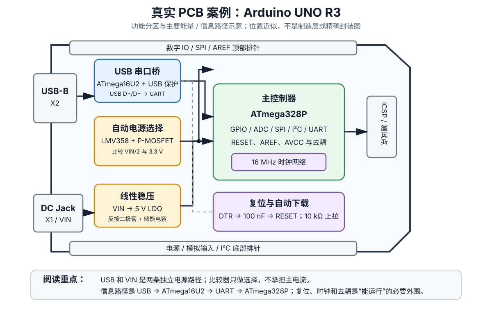
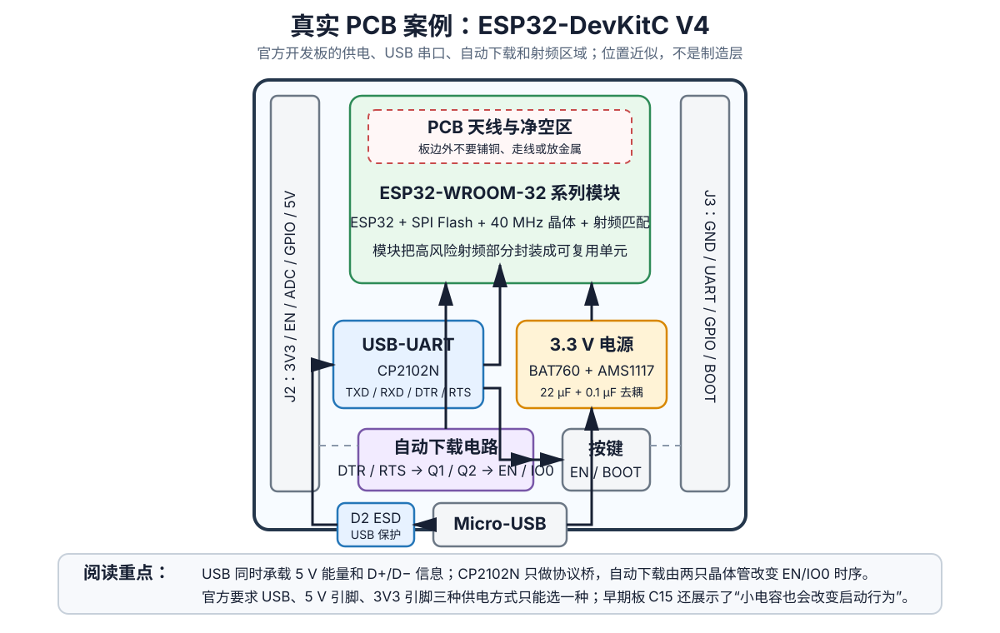
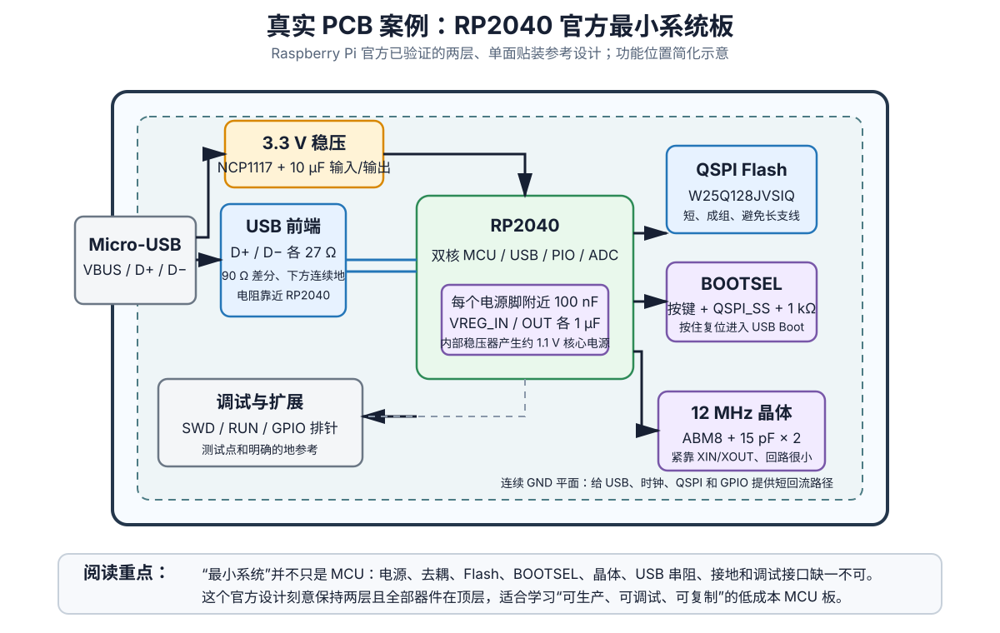
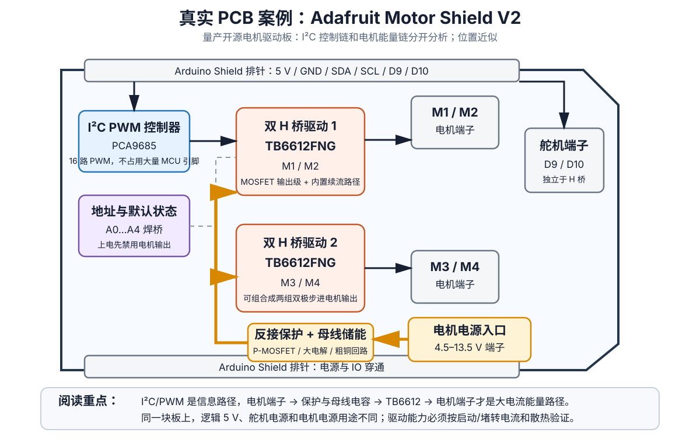

# 真实、可工作的 PCB 案例拆解

> **证据状态：`DOCUMENTED`**  
> 本章分析的是已经量产销售或由芯片厂商公开验证的真实 PCB，而不是凭空画出的概念电路。本文依据厂商公开的原理图、PCB Layout、数据手册和开源设计文件整理；本仓库尚未对这四块板逐项做独立硬件复测，因此不标记为 `HARDWARE_VERIFIED`。
>
> 前置阅读：[《常用电路组件与功能模块手册》](常用电路模块手册.md) 和 [《基础电路学习手册》](电路基础.md)。

---

## 目录

1. [为什么需要看真实 PCB](#1-为什么需要看真实-pcb)
2. [案例一：Arduino UNO R3](#2-案例一arduino-uno-r3)
3. [案例二：ESP32-DevKitC V4](#3-案例二esp32-devkitc-v4)
4. [案例三：RP2040 官方最小系统板](#4-案例三rp2040-官方最小系统板)
5. [案例四：Adafruit Motor Shield V2](#5-案例四adafruit-motor-shield-v2)
6. [四块板放在一起比较](#6-四块板放在一起比较)
7. [怎样把案例转化为自己的设计](#7-怎样把案例转化为自己的设计)
8. [建议实测路线](#8-建议实测路线)
9. [官方资料与许可说明](#9-官方资料与许可说明)

---

# 1. 为什么需要看真实 PCB

单独学习“RC 低通”“MOSFET 低边驱动”“USB 差分线”时，每个模块都很清楚。但真正的 PCB 必须同时解决：

- 电源从哪里进入，经过哪些保护和稳压；
- 数据如何进入 MCU；
- 上电、复位、下载和启动模式如何可靠工作；
- 去耦电容究竟放在哪里；
- 大电流与小信号怎样避免互相干扰；
- 连接器、测试点、焊桥和排针怎样服务于调试和生产；
- 原理图上同名的 `GND`，在 PCB 上是否拥有合理的回流路径。

本章选择四种具有代表性的板：

| PCB | 类型 | 最值得学习的内容 |
|---|---|---|
| Arduino UNO R3 | 经典 5 V MCU 开发板 | 双电源选择、USB-UART、自动复位、完整最小系统 |
| ESP32-DevKitC V4 | 无线 MCU 模组开发板 | USB-UART、自动下载、LDO、射频天线净空、启动脚 |
| RP2040 官方最小系统板 | 芯片厂商参考设计 | 2 层低成本布局、去耦、QSPI Flash、晶体、USB 差分 |
| Adafruit Motor Shield V2 | 电机功率扩展板 | I²C/PWM 控制与 H 桥功率路径、反接保护、母线储能 |

以后看任何真实板，都先画出四条链：

1. **能量输入链**：连接器 → 保护 → 变换/稳压 → 负载；
2. **信息输入链**：连接器/传感器 → 物理层 → MCU；
3. **启动链**：电源稳定 → Reset/Enable → 启动配置 → 时钟 → 执行代码；
4. **故障链**：反接、短路、浪涌、堵转或掉电时，能量流到哪里。

> 下面的彩色图是本仓库根据官方资料重新绘制的**功能位置图**，便于建立整体认识。它不是精确封装图、铜层图或生产文件。实际复制设计时必须回到厂商原理图和 Layout 文件。

---

# 2. 案例一：Arduino UNO R3

## 2.1 为什么选它

UNO R3 是非常成熟的量产开发板。它看起来只是“一颗 ATmega328P 加几个排针”，实际包含了：

- USB 接口与过流保护；
- 独立 USB-UART/USB 固件芯片 ATmega16U2；
- DC Jack、VIN、USB 三者之间的电源路径；
- 比较器控制的自动电源选择；
- 5 V 和 3.3 V 稳压；
- ATmega328P 最小系统；
- 时钟、复位、自动下载、LED、ICSP 和扩展排针。

这正好说明：一块“能长期稳定使用”的 MCU 板，外围电路往往比核心 MCU 更值得学习。

## 2.2 先追能量路径

### USB 供电

大致路径是：

> USB VBUS → 自恢复保险丝 → USB 5 V 开关路径 → `+5V` 电源网

保险丝应对 USB 侧的持续过流；它不是稳压器，也不能代替 ESD 保护。

### DC Jack / VIN 供电

大致路径是：

> DC Jack → 反接二极管 → `VIN` → 5 V LDO → `+5V`

这里能直接看到 LDO 的热问题：

$$
P_{LDO}\approx(V_{IN}-5\text{ V})I
$$

例如输入 12 V、负载 200 mA：

$$
P\approx(12-5)\times0.2=1.4\text{ W}
$$

这对小封装线性稳压器已经很热。因此“官方允许某个输入范围”不等于“整个范围内都能输出很大电流”。

### 自动电源选择

UNO R3 用 LMV358 的一部分比较 `VIN/2` 与 3.3 V 基准，并控制 USB 5 V 路径中的 P-MOSFET。关键直觉是：

- 比较器/运放只负责做决定；
- P-MOSFET 才是主电流开关；
- 外部 VIN 足够高时，USB 5 V 与板上 5 V 主电源被隔开；
- 这是“检测路径”和“能量路径”分离的典型例子。

## 2.3 再追信息路径

上传程序时：

> PC USB → USB D+/D− → ATmega16U2 → UART TX/RX → ATmega328P

ATmega16U2 不是主控制器，而是一个协议桥。它还参与自动复位，使 IDE 可以在正确时间进入 Bootloader。

这个结构比廉价板常见的单芯片 USB-UART 更复杂，但它展示了完整的 USB 设备、串口桥和固件升级思路。

## 2.4 Reset、时钟和最小系统

ATmega328P 周围至少要关注：

- VCC、AVCC 和 GND；
- 每个电源域附近的去耦；
- 16 MHz 时钟网络；
- RESET 上拉；
- DTR 通过电容产生的自动复位脉冲；
- AREF 的处理；
- ICSP 接口。

只把 MCU 电源接上，并不等于它能可靠下载和运行。

## 2.5 PCB 上值得观察的地方

1. USB、稳压、主 MCU 分成相对明确的功能区；
2. 连接器位于板边，机械受力不会直接传到细小器件；
3. 晶振/谐振器靠近对应 MCU；
4. 去耦靠近供电脚，而不是统一堆在电源入口；
5. 高电流路径与 UART/Reset 等小信号路径有不同的布线关注点；
6. ICSP、排针、LED 让板子易于生产测试和现场调试。

## 2.6 可以借鉴什么

- 双电源之间不要直接硬并联；
- 比较器 + MOSFET 可以完成自动电源选择；
- 下载链路、复位链路和主程序运行链路应分开理解；
- 预留明确的编程和恢复接口；
- 先算 LDO 最坏功耗，再谈输出电流。

## 2.7 不要盲目复制什么

- UNO 是 5 V、低速 AVR 平台，不代表其所有接口和布局适用于现代高速 MCU；
- USB 连接器、电源器件和保护方案已有年代特征；
- 不要因为 UNO 使用线性稳压器，就在高压差、大电流项目中照搬；
- 不要把扩展排针形式当成最佳 PCB 布局，只应把它视为生态兼容取舍。

## 2.8 建议测量

| 测量 | 仪器 | 观察内容 |
|---|---|---|
| USB 与 VIN 切换 | 万用表 + 示波器 | `+5V` 是否稳定、是否发生倒灌 |
| 自动复位 | 示波器 | 上传时 RESET 上的短脉冲 |
| UART | 示波器/逻辑分析仪 | ATmega16U2 与 ATmega328P 之间的数据 |
| LDO 温升 | 电源 + 温度计 | 不同 VIN、负载下的损耗 |
| 16 MHz 时钟 | ×10 探头 | 短地弹簧测量，避免探头电容导致不起振 |

官方资料：

- [Arduino UNO R3 产品与文档](https://docs.arduino.cc/hardware/uno-rev3)
- [Arduino UNO R3 官方原理图 PDF](https://docs.arduino.cc/resources/schematics/A000066-schematics.pdf)
- [Arduino UNO R3 官方数据手册 PDF](https://docs.arduino.cc/resources/datasheets/A000066-datasheet.pdf)

---

# 3. 案例二：ESP32-DevKitC V4

## 3.1 为什么选它

ESP32-DevKitC V4 是乐鑫官方开发板，它把无线 SoC 的高风险部分放进 ESP32-WROOM/WROVER 模组，同时在底板上实现：

- Micro-USB；
- USB ESD 保护；
- CP2102N USB-UART；
- USB/5 V 到 3.3 V 的电源路径；
- EN 和 BOOT 按键；
- DTR/RTS 自动下载电路；
- 模组天线净空；
- 两侧 GPIO 排针。

它很适合说明“使用模组”并不等于外围可以随便画。

## 3.2 USB 同时包含两条路径

### 信息路径

> Micro-USB D+/D− → ESD 阵列 → CP2102N → U0TXD/U0RXD → ESP32

USB 线首先经过低电容保护器件，再进入 USB-UART 桥。CP2102N 把 USB 协议转换为 ESP32 Bootloader 能处理的 UART 数据。

### 能量路径

> Micro-USB VBUS → 二极管/电源网络 → AMS1117-3.3 → ESP32 模组和外围

ESP32 在 Wi-Fi 发射时会出现快速电流变化。仅看平均电流会低估问题，必须同时关注：

- LDO 热损耗；
- 3.3 V 瞬态压降；
- 输入和输出电容；
- USB 线和连接器压降；
- 地回流和模组去耦。

## 3.3 自动下载电路

CP2102N 的 DTR 和 RTS 不直接连接 EN、IO0，而是经过 Q1/Q2 晶体管网络。它实现了特定逻辑关系：

- 控制 EN 产生复位；
- 在复位时控制 IO0；
- 让芯片进入普通启动或串口下载模式；
- 避免某些 DTR/RTS 组合把芯片长期保持在复位状态。

这是一个非常实用的“数字控制 + 模拟晶体管逻辑”案例。

## 3.4 启动脚不是普通 GPIO

ESP32 的 IO0、IO2、IO12 等引脚在复位时会参与启动配置。设计扩展板时必须先查启动绑带要求，再连接外设。

官方文档还专门指出，早期板上的 C15 可能：

- 让板子进入下载模式；
- 影响 GPIO0 输出时钟。

这说明一个看似无关紧要的小电容，也可能通过 RC 时间常数改变启动采样结果。

## 3.5 射频天线净空

模组天线端应尽量靠近主板边缘。天线附近和天线下方需要按模组数据手册留出净空，避免：

- 铜皮；
- 高速走线；
- 大型金属连接器；
- 电池、屏蔽罩和外壳金属；
- 紧贴的排线。

“ESP32 能联网”与“射频性能稳定”是两件不同的事。错误布局可能表现为距离短、吞吐下降、方向性明显或发射时系统复位。

## 3.6 三种供电方式为何不能并用

官方说明列出 Micro-USB、5V/GND 排针、3V3/GND 排针三种供电方法，并要求只能使用其中一种。原因是开发板不是完整的多电源 OR-ing 系统：

- 从 3V3 直接供电会绕过板载稳压器；
- 5V 和 USB 5V 可能互相倒灌；
- 外部电源的精度、限流和时序可能与 USB 端不兼容。

这也是“引脚上写着 5V/3V3”不代表可以任意输入输出的例子。

## 3.7 可以借鉴什么

- 无线设计优先使用经过认证和验证的模组；
- USB 保护器件紧靠连接器；
- 自动下载应使用经过验证的晶体管逻辑；
- EN、BOOT 和 UART 测试点必须可访问；
- 天线净空必须在 PCB 和结构设计阶段同时保证；
- 给 Wi-Fi 电流脉冲保留电源和电容余量。

## 3.8 不要盲目复制什么

- AMS1117 简单但静态电流、压差和热性能并不适合所有电池项目；
- 不能把模组天线随意埋在大板中心；
- 不同 ESP32 模组的保留引脚不同，不能只抄排针表；
- USB-UART 自动下载电路必须核对晶体管方向和 DTR/RTS 真值关系；
- 不要同时接 USB 和未经管理的外部电源。

## 3.9 建议测量

| 测量 | 观察内容 |
|---|---|
| 3.3 V 电源 | Wi-Fi 扫描、发射时的最小电压和纹波 |
| EN 与 IO0 | 自动下载时两条波形的先后关系 |
| UART | 下载波特率、启动日志、是否有过冲 |
| USB 5 V 与 LDO | 输入压降、LDO 温升 |
| 天线环境 | 板边净空、连接线和金属外壳对信号的影响 |

官方资料：

- [ESP32-DevKitC V4 官方用户指南](https://docs.espressif.com/projects/esp-dev-kits/en/latest/esp32/esp32-devkitc/user_guide.html)
- [ESP32-DevKitC V4 官方原理图 PDF](https://dl.espressif.com/dl/schematics/esp32_devkitc_v4_sch.pdf)
- [ESP32-DevKitC V4 官方 PCB Layout PDF](https://dl.espressif.com/dl/schematics/esp32_devkitc_v4_pcb_layout.pdf)

---

# 4. 案例三：RP2040 官方最小系统板

## 4.1 为什么选它

Raspberry Pi 的《Hardware design with RP2040》不只给出原理图，还给出一块经过验证的最小系统 PCB。官方示例的价值在于：

- 两层板；
- 器件只放在顶层；
- 使用标准低成本板厂参数；
- 包含 USB、稳压、RP2040、外部 QSPI Flash、晶体、BOOTSEL、SWD 和 GPIO；
- 明确讲解布局和回流，而不是只给连接关系。

它特别适合第一次从“开发板用户”走向“自己画 MCU 板”的人。

## 4.2 3.3 V 和 1.1 V 两级电源

### 外部 3.3 V

官方最小设计使用 NCP1117 把 USB 5 V 转为 3.3 V，并在输入、输出使用相应储能电容。

### 内部核心电源

RP2040 内部稳压器通过 `VREG_IN` 产生约 1.1 V 的核心电源，并由 `VREG_VOUT` 输出给 DVDD。外围仍需要规定的电容。

所以不能只给 RP2040 接一个 3.3 V：必须按数据手册处理所有 IOVDD、ADC_AVDD、USB_VDD、VREG_IN、VREG_VOUT 和 DVDD 引脚。

## 4.3 去耦为什么要围着芯片放

官方建议在每个电源引脚附近布置 100 nF 去耦，并给内部稳压器相关引脚配置 1 µF 电容。目的不是“总容量够了”，而是缩小瞬态电流回路：

> 芯片电源脚 → 芯片内部开关电流 → 芯片地脚 → 去耦电容 → 芯片电源脚

如果把所有 100 nF 电容统一放在板边，原理图连接虽然相同，但高频电流必须经过更长走线和更大电感，效果完全不同。

## 4.4 外部 QSPI Flash

RP2040 没有片内程序 Flash，需要外部 QSPI Flash。官方最小设计使用 W25Q128JVSIQ 一类器件。

布局重点：

- Flash 靠近 RP2040；
- CLK、CS 和数据线短；
- 成组布线，避免长支线；
- 去耦紧靠 Flash；
- BOOTSEL 电路不能破坏正常 QSPI 通信。

这组线不是普通低速 SPI：它直接影响取指和启动可靠性。

## 4.5 BOOTSEL 电路

BOOTSEL 按键通过 QSPI_SS 让 Boot ROM 判断是否进入 USB 大容量存储下载模式，同时使用串联电阻隔离正常 Flash 片选路径。

这里的核心思想是：

- 同一个引脚在不同时间承担不同功能；
- 启动阶段与正常运行阶段的电路状态不同；
- 一个电阻可以同时承担隔离、限流和时序保护作用。

## 4.6 12 MHz 晶体

官方示例使用 12 MHz 晶体和匹配负载电容。布局要求：

- 晶体紧靠 XIN/XOUT；
- 两条线短、对称；
- 回路区域小；
- 避开 USB、开关电源、GPIO 快速边沿；
- 不要在晶体网络下方穿高速线。

负载电容不是固定抄 15 pF，而要结合晶体标称负载电容和 PCB 寄生计算。

## 4.7 USB D+/D−

官方最小设计在 D+、D− 上各使用 27 Ω 串联电阻，并要求：

- 电阻靠近 RP2040；
- 差分阻抗目标约 90 Ω；
- 两线并行、间距一致；
- 下方有连续参考地；
- 尽量避免过孔、支线和跨地缝。

这里再次说明：USB 是否可靠，取决于布局，而不只取决于“D+ 接 D+、D− 接 D−”。

## 4.8 两层板为什么仍能工作

两层板不是天然不适合 MCU。官方示例能工作，是因为它做了明确取舍：

- 板子功能简单；
- 器件紧凑；
- 底层尽量保持连续地；
- 高速回路短；
- 电源分配简单；
- 没有复杂 DDR、千兆 SerDes 或大规模并行总线。

复杂系统仍可能需要四层或更多层。不能把“RP2040 两层能工作”推广成“任何 MCU 都用两层就够”。

## 4.9 可以借鉴什么

- 第一次自制 MCU 板，先从厂商最小系统复制并删除不需要部分；
- 电源脚逐个核对，不要只看网络名；
- 把 USB、晶体、Flash 当成三个独立的关键布局区；
- 底层优先连续地，不要被低优先级信号切碎；
- 预留 SWD、RUN、BOOTSEL 和电源测试点；
- 先让最小系统工作，再加电机、传感器和高噪声负载。

## 4.10 建议测量

| 测量 | 观察内容 |
|---|---|
| 3.3 V 与 1.1 V | 上电顺序、稳态值和负载变化 |
| RUN | 复位动作和上拉是否可靠 |
| 12 MHz | 使用低电容探测，确认启动与幅度 |
| QSPI | 仅用合适带宽和短地探头观察，避免探头本身破坏信号 |
| USB | 枚举是否稳定、不同线缆下是否掉线 |
| BOOTSEL | 按键状态和 USB Boot 是否可重复进入 |

官方资料：

- [Hardware design with RP2040（官方 PDF）](https://datasheets.raspberrypi.com/rp2040/hardware-design-with-rp2040.pdf)
- [RP2040 数据手册](https://datasheets.raspberrypi.com/rp2040/rp2040-datasheet.pdf)
- [Raspberry Pi Pico 官方硬件文档入口](https://www.raspberrypi.com/documentation/microcontrollers/rp2040.html)

---

# 5. 案例四：Adafruit Motor Shield V2

## 5.1 为什么选它

前三块板主要处理数字控制和通信，这一块是真正把电机功率送出 PCB 的量产开源板。它包含：

- PCA9685 I²C PWM 控制器；
- 两颗 TB6612FNG 双 H 桥；
- 四路直流电机输出，或两路双极步进电机；
- 电机电源端子；
- 反接保护 MOSFET；
- 母线储能电容；
- I²C 地址焊桥；
- 舵机接口和 Arduino Shield 排针。

这块板最适合练习区分“控制信号”和“负载能量”。

## 5.2 信息路径

大致路径：

> Arduino SDA/SCL → PCA9685 → PWM / 方向控制 → TB6612FNG 输入

PCA9685 通过 I²C 接收控制命令，在本地持续输出 PWM，因此：

- MCU 不需要为每个电机占用独立 PWM 定时器；
- 多块 Shield 可通过地址焊桥共享总线；
- I²C 带宽与电机 PWM 生成相互解耦；
- 上电默认状态必须保证电机不会意外启动。

## 5.3 能量路径

大致路径：

> 外部电机电源端子 → 反接保护 → 母线电容与粗铜 → TB6612FNG H 桥 → 电机端子 → 电机

Arduino 的 GPIO 不给电机提供功率。它只控制驱动器。真正的大电流回路必须：

- 短；
- 宽；
- 远离 I²C 和复位等小信号；
- 在驱动器附近拥有低阻抗储能；
- 有明确的续流路径。

## 5.4 为什么用专用 H 桥芯片

TB6612FNG 集成了 MOSFET 输出级、控制逻辑和续流路径。相比用四只裸 MOSFET 自己搭 H 桥，专用芯片降低了：

- 上下管直通风险；
- 门极驱动难度；
- 死区与控制逻辑复杂度；
- PCB 面积；
- 入门阶段的故障概率。

这不表示它能驱动任意电机。仍需核对：

- 电机启动和堵转电流；
- 每通道连续与脉冲电流；
- 电源电压；
- 芯片和 PCB 散热；
- PWM 频率；
- 线材、端子和电源能力。

## 5.5 母线电容和电机噪声

电机 PWM 切换会让供电电流快速变化。板上的大电解负责较低频的能量缓冲，局部陶瓷电容处理更高频分量。

但板上电容不能解决所有电机噪声。电机电刷本身会产生火花和宽带干扰，实际项目还可能需要：

- 电机端子处的小电容；
- 电机外壳到端子的抑制电容；
- 双绞电机线；
- 减小大电流环路；
- 独立电源或更好的接地；
- 磁珠、共模抑制或屏蔽。

## 5.6 地址焊桥是怎样工作的

A0～A4 焊桥改变 PCA9685 的 I²C 地址，使多块 Shield 可堆叠。它是 0 Ω 配置网络的实际案例：

- 默认开路是一组地址；
- 焊锡短接代表二进制位为 1；
- 不需要更换固件或器件；
- 生产时可使用同一 PCB 支持多个配置。

## 5.7 舵机与电机不是同一功率域

板上的舵机接口使用 Arduino 的 D9/D10 控制信号，但舵机电源问题仍需单独评估。多舵机启动电流往往比预期大，不能因为接口在同一块板上，就认为板载逻辑 5 V 足以供电。

## 5.8 可以借鉴什么

- 用专用驱动器代替裸 MCU 直接带负载；
- 信息路径与功率路径分区；
- 电机电源入口靠近保护、储能和 H 桥；
- 地址焊桥、测试点和端子让同一设计更易配置；
- 按堵转电流而不是空载电流选驱动器和电源；
- 上电默认状态应让执行器保持安全。

## 5.9 不要盲目复制什么

- 1.2 A/channel 等额定值必须结合环境温度、PCB 散热和同时工作的通道数；
- 驱动小型玩具电机的方案不适用于大功率机器人电机；
- 电机电源与逻辑电源的连接方式必须按自己的系统重新分析；
- 端子和走线同样有电流与温升限制；
- 不要因为芯片内置续流路径，就忽略电源浪涌、线缆电感和 EMI。

## 5.10 建议测量

| 测量 | 观察内容 |
|---|---|
| 电机母线 | 启动、反转、制动时的压降与尖峰 |
| H 桥输出 | PWM、正反转、滑行和制动状态 |
| 电机电流 | 空载、负载、堵转和反转瞬间 |
| I²C | SDA/SCL 上升时间和地址配置 |
| 温升 | 两路或四路同时工作时的驱动器温度 |
| MCU 电源 | 电机动作时控制器是否发生 Brownout/Reset |

官方资料：

- [Adafruit Motor Shield V2 产品指南](https://learn.adafruit.com/adafruit-motor-shield-v2-for-arduino/overview)
- [Adafruit Motor Shield V2 PCB 开源仓库](https://github.com/adafruit/Adafruit-Motor-Shield-V2-PCB)
- [Adafruit Motor Shield V2.3 Eagle 原理图](https://github.com/adafruit/Adafruit-Motor-Shield-V2-PCB/blob/master/Adafruit%20Motor%20Shield%20v2.3.sch)
- [Adafruit Motor Shield V2.3 Eagle PCB](https://github.com/adafruit/Adafruit-Motor-Shield-V2-PCB/blob/master/Adafruit%20Motor%20Shield%20v2.3.brd)

---

# 6. 四块板放在一起比较

## 6.1 电源策略

| 板 | 输入 | 电源处理 | 最值得学习的点 |
|---|---|---|---|
| UNO R3 | USB、DC Jack、VIN | 保险丝、反接、LDO、自动选择 | 多电源不能直接并联 |
| ESP32-DevKitC V4 | USB、5 V 或 3.3 V | 二极管、LDO、局部储能 | 无线电流脉冲与互斥供电 |
| RP2040 最小板 | USB 5 V | 3.3 V LDO + 芯片内部 1.1 V | 每个电源脚与去耦回路 |
| Motor Shield V2 | 逻辑电源 + 电机电源 | 反接、母线储能、H 桥 | 控制电源与负载电源分离 |

## 6.2 接口策略

| 板 | 外部接口 | 中间物理层/桥接 | 核心器件 |
|---|---|---|---|
| UNO R3 | USB-B | ATmega16U2 USB-UART | ATmega328P |
| ESP32-DevKitC V4 | Micro-USB | ESD + CP2102N | ESP32 模组 |
| RP2040 最小板 | Micro-USB | 27 Ω 串联、原生 USB | RP2040 |
| Motor Shield V2 | I²C + 电机端子 | PCA9685 + TB6612 | 外部 Arduino/MCU |

## 6.3 启动与恢复

| 板 | 正常启动 | 下载/恢复入口 |
|---|---|---|
| UNO R3 | Reset 后执行 Bootloader/应用 | DTR 自动复位、ICSP |
| ESP32-DevKitC V4 | EN + 启动绑带 | DTR/RTS 自动下载、EN/BOOT 按键 |
| RP2040 最小板 | RUN 释放后从 QSPI 启动 | BOOTSEL + USB Boot、SWD |
| Motor Shield V2 | 控制器初始化后使能输出 | I²C 地址焊桥、输出默认禁用 |

## 6.4 布局优先级

| 板 | 第一优先级 | 第二优先级 |
|---|---|---|
| UNO R3 | 电源选择和稳压散热 | USB、时钟、复位分区 |
| ESP32-DevKitC V4 | 天线净空和 3.3 V 瞬态 | USB-UART 与自动下载 |
| RP2040 最小板 | 连续地、去耦、QSPI | USB 差分与晶体 |
| Motor Shield V2 | H 桥大电流回路 | I²C/逻辑远离电机噪声 |

---

# 7. 怎样把案例转化为自己的设计

不要直接复制整块板。按下面顺序提取可复用模块。

## 7.1 先写系统约束

至少列出：

- 输入电压范围；
- 平均、峰值、启动和堵转电流；
- MCU 和接口电平；
- 需要哪些通信接口；
- 是否需要 USB 下载；
- 是否有电机、舵机、继电器等噪声源；
- PCB 层数、尺寸、成本；
- 预期环境温度；
- 失败时应当关闭、复位还是继续工作。

## 7.2 再选择参考模块

例如做一个 ESP32 电机控制板：

- 从 DevKitC 学 USB-UART、自动下载、EN/BOOT；
- 从 ESP32 模组指南学天线净空；
- 从 Motor Shield 学电机电源入口、储能和 H 桥分区；
- 从 RP2040 示例学连续地和去耦回路；
- 从 UNO 学多电源选择，但不要原样复制其 LDO。

这比“找一张看起来差不多的原理图整板照抄”可靠得多。

## 7.3 对每个模块做五项检查

1. **电气兼容**：电压、电流、逻辑阈值、共模范围；
2. **动态行为**：启动、复位、边沿、采样、PWM、瞬态；
3. **功率和热**：稳态损耗、脉冲、SOA、铜皮散热；
4. **布局回路**：去程和回流是否短，关键器件是否靠近；
5. **故障行为**：短路、反接、掉电、热插拔时会发生什么。

## 7.4 保留可调试性

至少预留：

- 每条电源轨测试点；
- GND 测试点；
- Reset/Enable/Boot；
- UART/SWD/JTAG；
- 关键 PWM、栅极和 H 桥输出；
- 0 Ω 隔离位；
- 电流测量跳线或分流电阻；
- 可替换 RC、端接和 Snubber 封装。

---

# 8. 建议实测路线

## 8.1 UNO R3

1. 只用 USB 供电，记录 5 V、3.3 V；
2. 逐步加入 7～9 V DC 输入，观察 USB 电源路径是否被断开；
3. 上传程序，同时测 RESET、TX、RX；
4. 改变 VIN 和负载，记录 LDO 温升。

## 8.2 ESP32-DevKitC V4

1. 测 USB 5 V 和 3.3 V 空载值；
2. 运行 Wi-Fi 扫描或持续发送，观察 3.3 V 最小值；
3. 自动下载时同时观察 EN 和 IO0；
4. 用不同 USB 线比较压降；
5. 在不触碰天线的前提下，比较金属和排线靠近天线时的 RSSI。

## 8.3 RP2040 最小板或 Pico

1. 测 VSYS/3V3/核心电源；
2. 观察 RUN 与 BOOTSEL；
3. 测试 USB Boot 和 SWD 恢复；
4. 对照 PCB 确认去耦、晶体和 Flash 的真实位置；
5. 不熟悉高速探测时，不直接长地夹测 USB/QSPI。

## 8.4 Motor Shield V2

1. 先不接电机，只验证逻辑和 I²C 地址；
2. 使用限流电源接一个小电机；
3. 观察低占空比、高占空比和反转时的母线与输出；
4. 测量启动和堵转电流，但只做极短、受控测试；
5. 两路同时运行，记录芯片、端子和线材温升；
6. 同时监测 MCU 电源，确认电机不会导致复位。

---

# 9. 官方资料与许可说明

本章的四张 SVG 是 QHardware 根据公开资料制作的简化功能图，使用本仓库许可证；它们不包含厂商制造层数据，也不能替代官方生产文件。

上游资料的权利和许可证仍归各自项目所有：

- Arduino UNO R3：以 Arduino 官方文档和相应开源硬件许可为准；
- ESP32-DevKitC V4：以 Espressif 文档的版权和免责声明为准；
- RP2040 最小系统：以 Raspberry Pi 官方文档中的许可说明为准；
- Adafruit Motor Shield V2：开源 PCB 仓库注明 Creative Commons Attribution-ShareAlike，使用或再分发原始设计时应保留相应署名和许可文本。

真正复制或修改上游 PCB 文件前，应再次检查仓库中的最新许可证、版本号和硬件勘误。

---

# 结语

看真实 PCB 时，不要停留在“这颗芯片是什么”。应该能逐步回答：

1. 主电流从哪里进、从哪里回；
2. 信号经过了哪些保护、桥接和电平转换；
3. 芯片如何复位、选启动模式和获得时钟；
4. 哪些电容处理高频瞬态，哪些处理较慢的能量变化；
5. 哪些网络必须短、成对、连续参考或远离噪声；
6. 哪些器件只传递信息，哪些器件真正承担功率；
7. 出现反接、堵转、掉电或通信失败时，应该在哪些测试点测量。

能把这四块板完整拆成这些功能模块之后，再看大多数 MCU、传感器和机器人控制板，原理图就不会再是一堆互不相关的符号。
